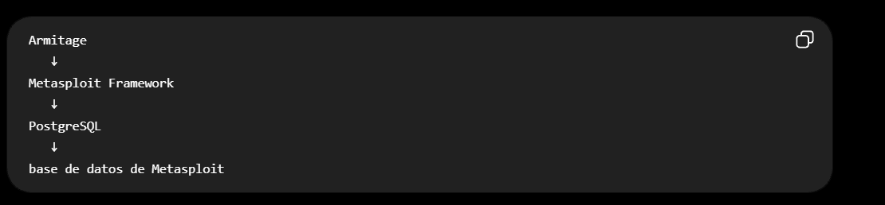
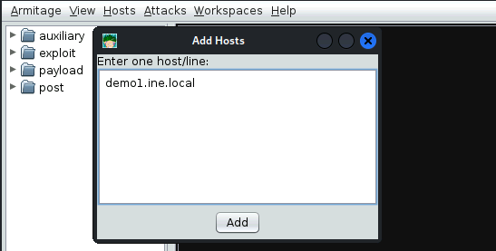
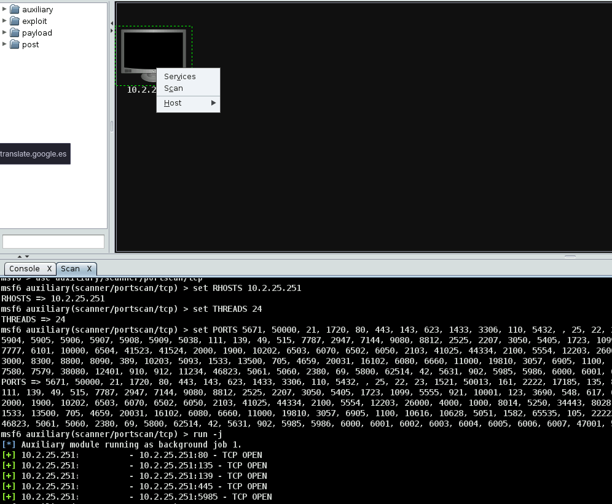
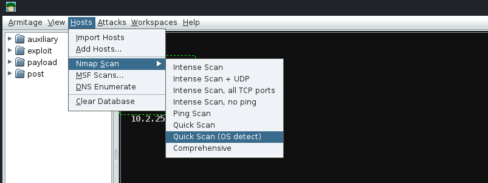
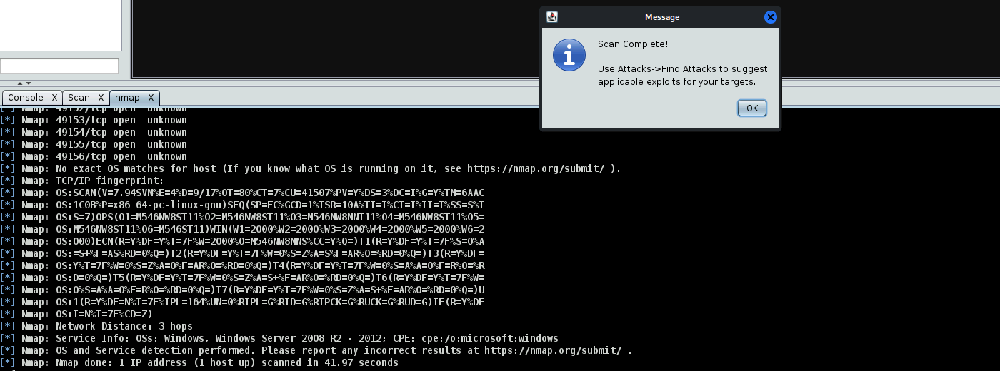

# Port Scanning and Enumeration with Armitage

**Armitage**

**Objective:** Enumerate the target machine and perform port scanning using Armitage.

Levantamos el servicio de *postgresql*
```bash
service postgresql start
service postgresql status
```



Corremos armitage con los parámetros default
```bash
armitage
```

Añadimos host en *Hosts*



Escaneamos el host



Nos muestra los puertos abiertos

Hacemos un scan con nmap



Añadimos el host demo1.ine.local


