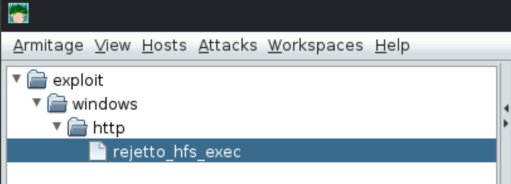
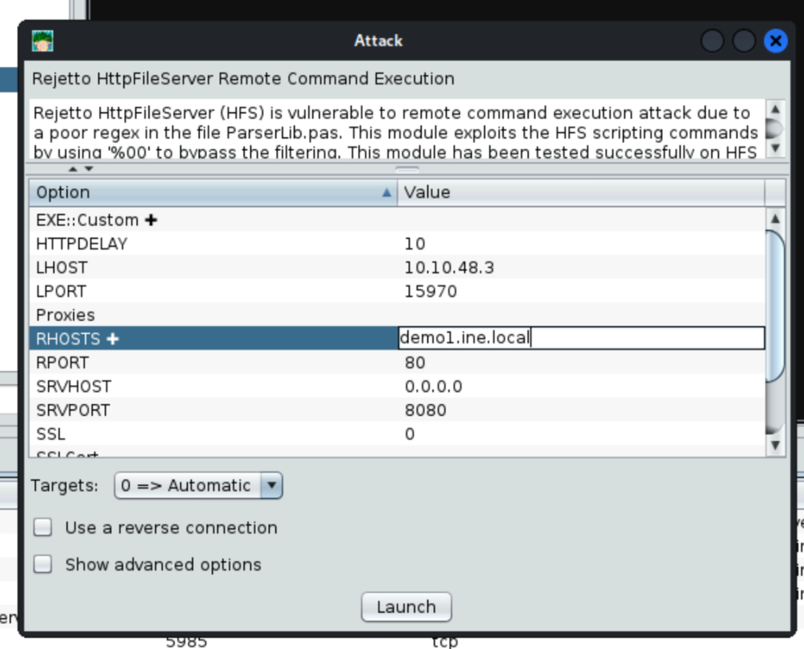
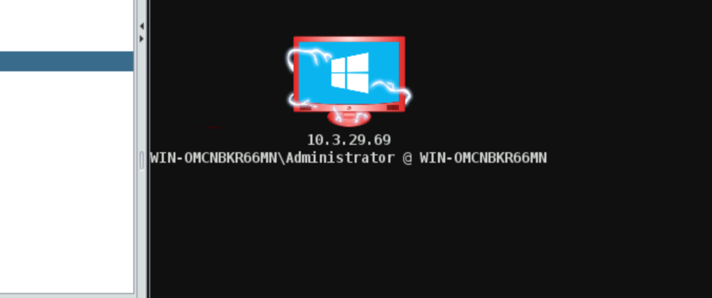
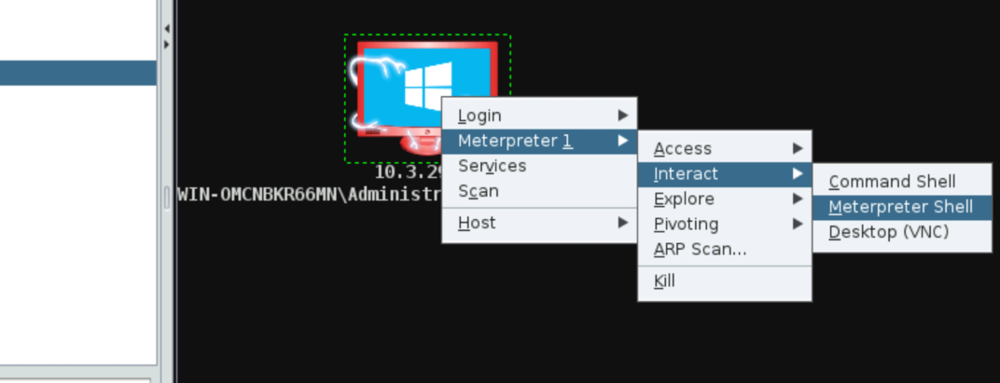
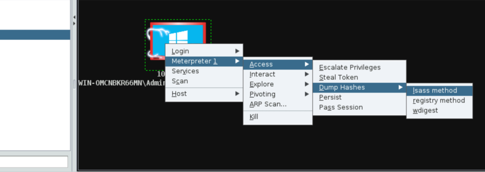
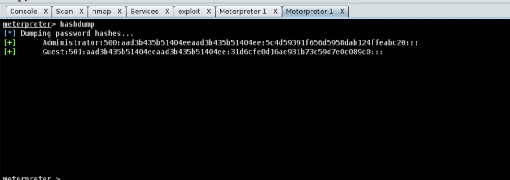

# Exploitation and Post-Exploitation with Armitage

**Objective:** Perform exploitation and post-exploitation on the target machine with Armitage.

BUscamos en la pestaña de la izquierda por hfs

Configuramos el exploit

Nos aparece que la máquina ha sido vulnerada

Cargamos el meterpreter para poder interactuar con él

Dumpeamos hashes

