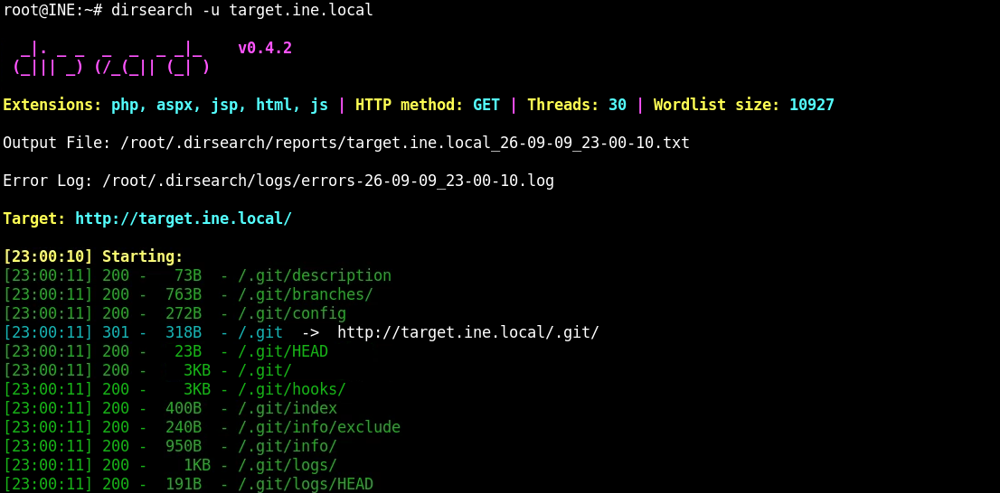
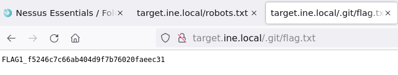
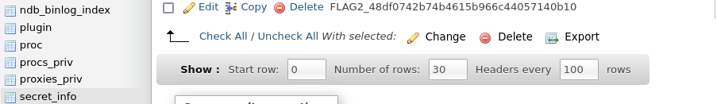
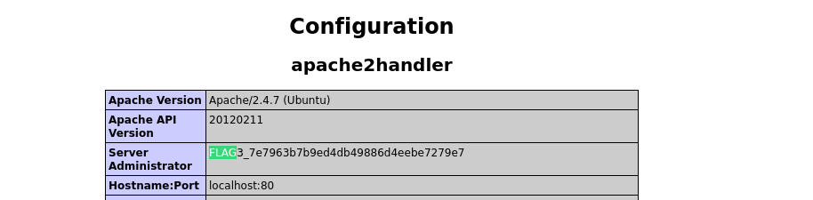
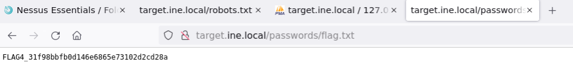

# Vulnerability Assessment CTF 1

- FLAG1
Usamos **dirsearch** para fuzzear el servidor web
```bash
dirsearch -u target.ine.local
```

Encontramos un .git





- FLAG2

En */phpmyadmin*, tabla **secret_info**



- FLAG3

Encontramos la flag en */phpinfo.php*



- FLAG4

Descubrimos por *robot.txt* un directorio */passwords/flag.txt*


