# The Metasploit Framework CTF 1

- FLAG1

Nos piden que ganemos acceso al MSSQLSERVER en la máquina objetivo

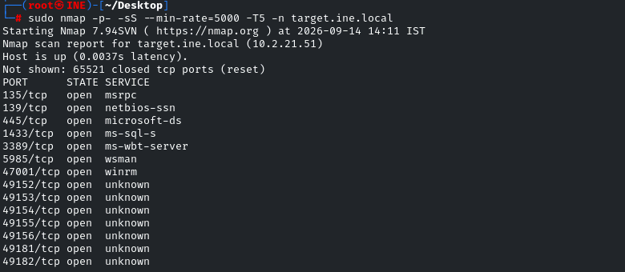

Enumeramos más información sobre el puerto 1443

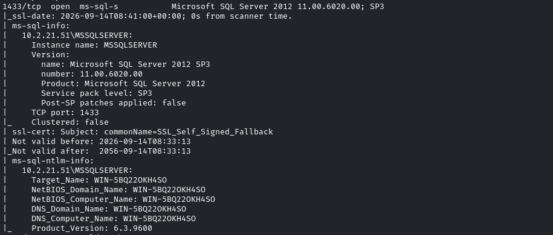

Vemos que es un *Microsof SQL Server 2012*, intentaremos usar algún exploit

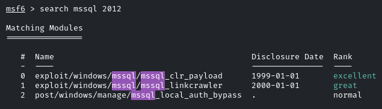

Nos dará un error en el payload ya que el que se establece por defecto es x86 y el sistema nos pide un x64. Buscamos un payload de *reverse_tcp* por defecto para esta arquitectura
```bash
search payload windows x64 meterpreter
```

**windows/x64/meterpreter/reverse_tcp**

Ajustamos  las opciones del exploit

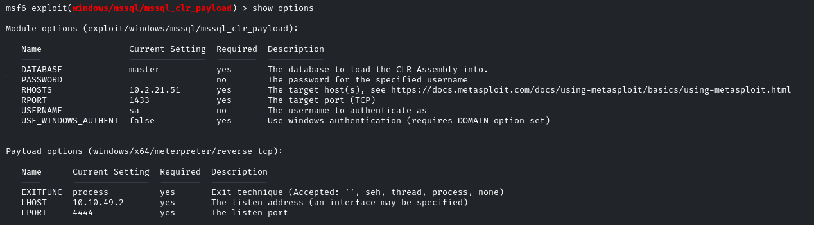

Ganamos acceso al sistema

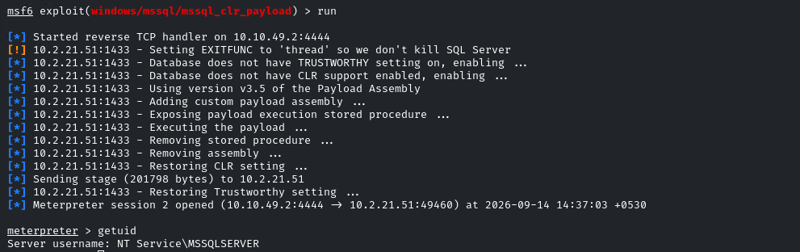

NT Service\MSSQLSERVER

En la raiz encontramos la primera flag

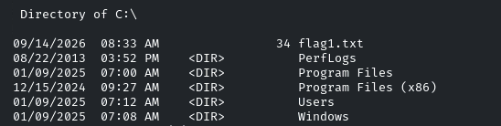

- FLAG2

Nos dicen que la flag está en el directorio de configuración de Windows -> Probablemente *C:\\Windows\system32*

Buscamos dentro de */system32* por archivos que empiecen por "flag"
```bash
dir /s /b flag*
```

El output es muy grande por lo que vamos a filtrar solo directorios
```bash
dir /a:d
```

Vemos un directorio **config** que cuadra con lo que nos dice el enunciado

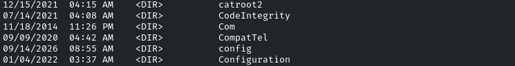

No tenemos permiso para acceder

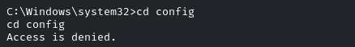

Intentaremos elevar privilegios con

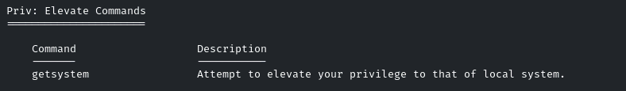

```bash
getsystem
```

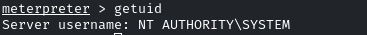

NT AUTHORITY\SYSTEM

Intentamos acceder ahora

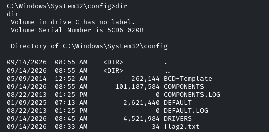

Encontramos la flag2

- FLAG3

Se nos dice que busquemos en el directorio system para encontrar la flag3 y una pista que nos ayudará a encontrar la flag4

No encontramos nada buscando por flag
```bash
dir /b /s "flag3.txt"
```

Vamos a buscar por archivos de texto
```bash
dir /b /s "*.txt"
```

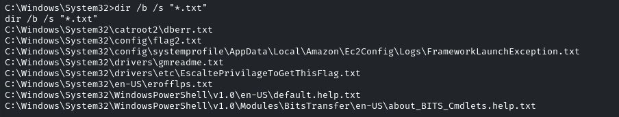

Encontramos un archivo *EscalatePrivilageToGetThisFlag.txt* en *C:\Windows\System\drivers\etc* que resulta ser la propia flag, ya que hemos escalado privilegios anteriormente con **getsystem**

- FLAG4

Vamos al escritorio del usuario Administrator y vemos la flag

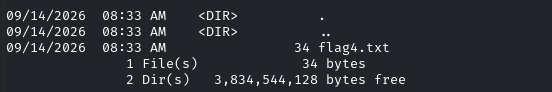
