# The Metasploit Framework CTF 2

Existen **target1** y **target2** ambas accesibles desde nuestra máquina

- FLAG1

Se nos dice que enumeremos los puertos abiertos con Metasploit e inspeccionemos el banner de RSYNC

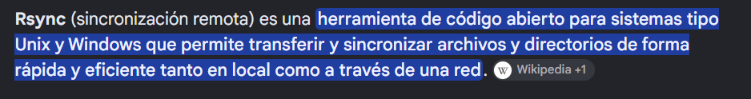

En principio nmap no nos da información ni de versión ni de scripts por defecto para RSYNC

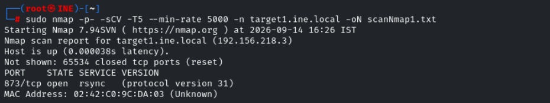

Usaremos la herramienta **rsync** para conectarnos al servicio e inspeccionar el banner
```bash
rsync rsync://target1.ine.local
```

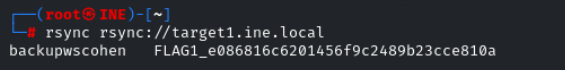

- FLAG2

Escaneamos el directorio expuesto
```bash
rsync rsync://target1.ine.local/backupwscohen
```

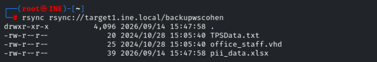

Descargaremos los archivos, consultando el manual con la opción -avz
```bash
rsync -avz rsync://target1.ine.local/backupwscohen/TPSData.txt .
rsync -avz rsync://target1.ine.local/backupwscohen/office_staff.vhd
rsync -avz rsync://target1.ine.local/backupwscohen/pii_data.xlsx .
```

No vemos nada en el .txt

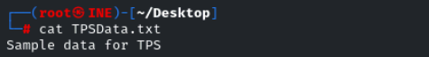

Encontramos la flag en el archivo excel

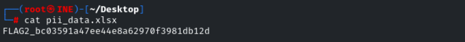

- FLAG3

Apuntaremos ahora hacia el target2

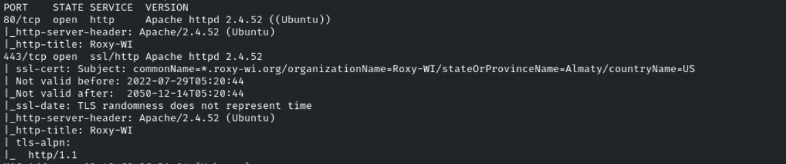

- Puerto 80
Encontramos una web que parece redirigirnos pero no hace nada

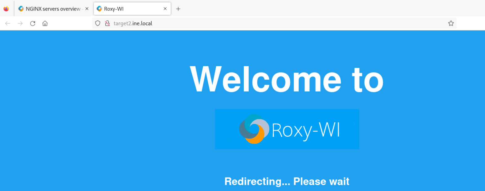

- Puerto 443
Encontramos una portal de login, al cual podemos acceder con admin:admin

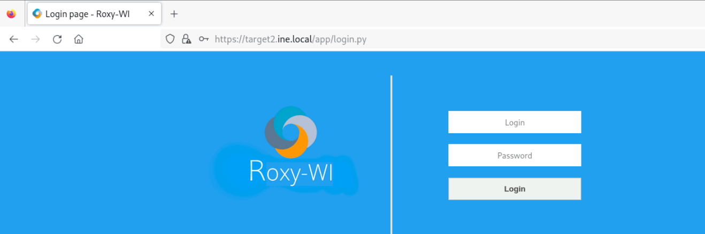

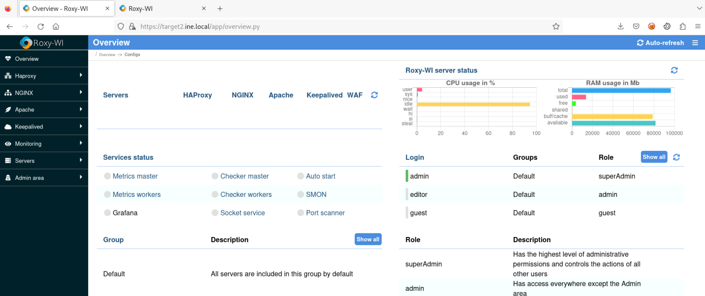

Buscaremos exploit para **Roxy-WI**

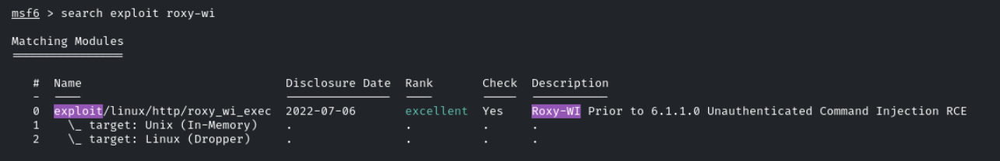

Ajustaremos los parámetros

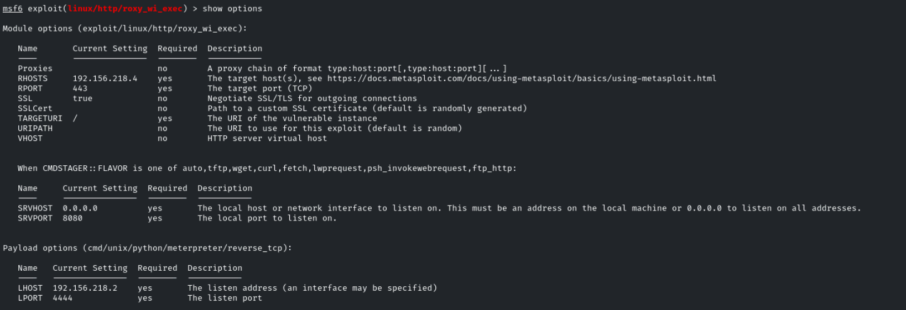

Ganamos acceso

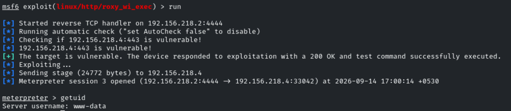

www-data

Encontramos la flag en */*

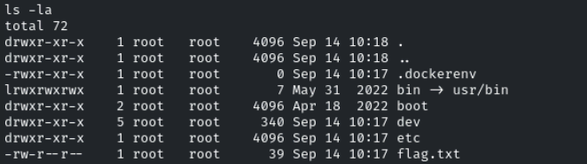

- FLAG4

Las tareas automatizadas y trabajos programados nos pueden dar pistas

Buscaremos en el directorio típico de cron */etc/cron.d*

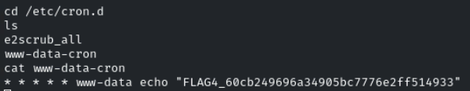
