# Post-Exploitation CTF 1

**Escalation**

Two machines are accessible at **http://target1.ine.local** and **http://target2.ine.local**

- FLAG1
The file that stores user account details is worth a closer look. (target1.ine.local)

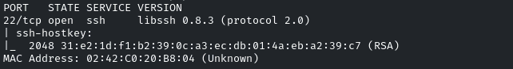

Buscamos exploits para **libssh 0.8.3**

Usaremos *scanner/ssh/libssh_auth_bypass*

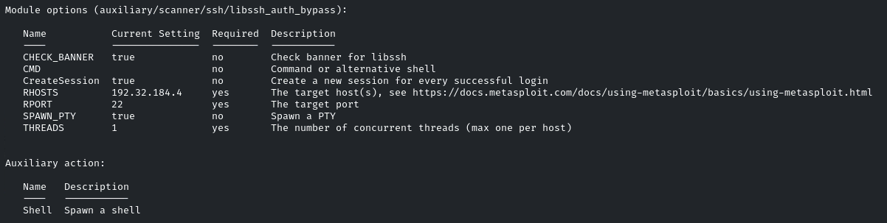

```bash
set SPAWN_PTY true
```

-> importante si no no funciona el exploit

Ganamos acceso

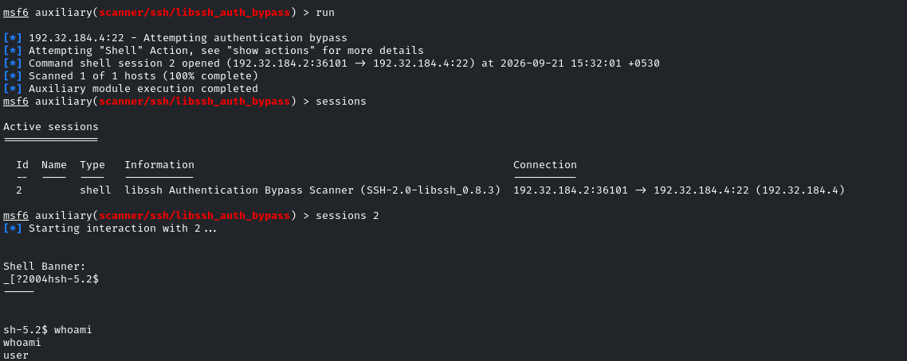

user

Vemos la flag1 en */etc/passwd*

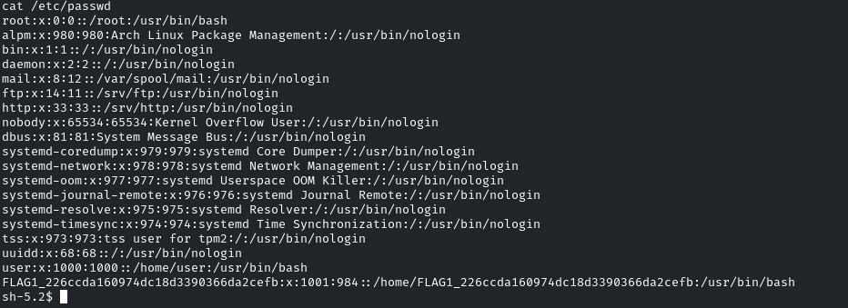

- FLAG2
User groups might reveal more than you expect.

```bash
cat /etc/group
```

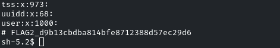

- FLAG 3
Scheduled tasks often have telling names. Investigate the cron jobs to uncover the secret.

```bash
ls /etc/cron.d
```

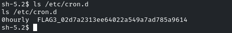

- FLAG4
DNS configurations might point you in the right direction. Also, explore the home directories for stored credentials.

Vamos al directorio */home/user*

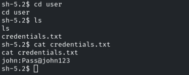

john:Pass@john123

Consultamos el archivo donde se aplican los DNS */etc/hosts*

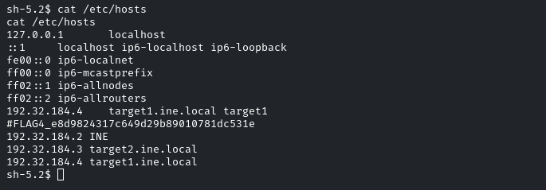

- FLAG5
Use the discovered credentials to gain higher privileges and explore the root's home directory on target2.ine.local.

Escaneamos el host target2

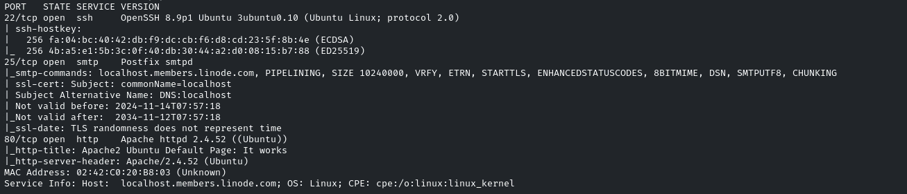

Conseguimos conectarnos por ssh
```bash
ssh john@target2.ine.local
```

Pass@john123
john

Vemos que hay un proceso que ejecuta */home/start.sh* script al cual tenemos acceso de escritura

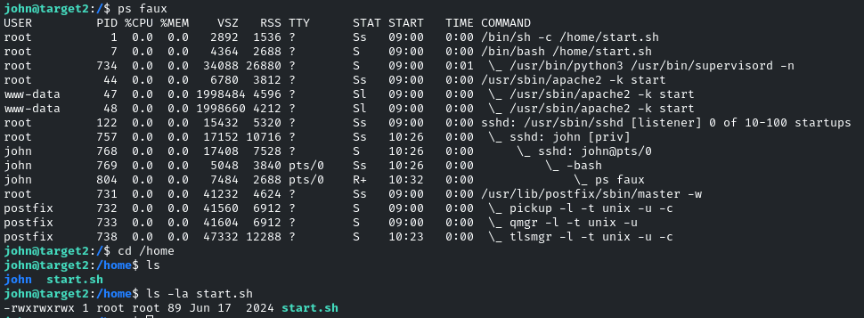

Modificamos el contenido esperando que sea una tarea cron, pero no es el caso

intentaremos enumerar archivos con premiso de escritura para otros
```bash
find / -not -type l -perm -o+w
```

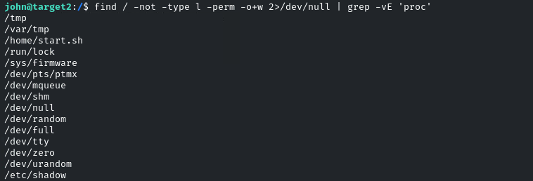

Podemos modificar */etc/shadow*

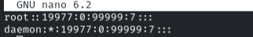

Eliminamos el * de la contraseña de root

Accedemos al usuario root sin contraseña

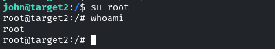

root

Vemos la flag en */root*
