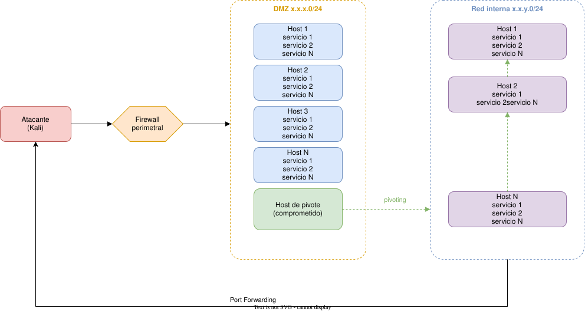

# eJPT

Apuntes y writeups de los laboratorios del curso **eJPT** (INE), organizados por módulos.

## Esquema de red

Este es el **esquema principal a tener en cuenta para la certificación**: una arquitectura típica con DMZ, host de pivote y red interna, sobre la que se apoya toda la metodología.

## Módulos

### Assessment Methodologies

- [Information Gathering CTF 1](assessment-methodologies/01-information-gathering-ctf-1/)
- [Footprinting and Scanning CTF 1](assessment-methodologies/02-footprinting-and-scanning-ctf-1/)
- [Enumeration CTF 1](assessment-methodologies/03-enumeration-ctf-1/)
- [Vulnerability Assessment CTF 1](assessment-methodologies/04-vulnerability-assessment-ctf-1/)

### Host & Network Penetration Testing

- [System-Host Based Attacks CTF 1](host-network-pentest/01-system-host-based-attacks-ctf-1/)
- [System-Host Based Attacks CTF 2](host-network-pentest/02-system-host-based-attacks-ctf-2/)
- [Network-Based Attacks CTF 1](host-network-pentest/03-network-based-attacks-ctf-1/)
- [The Metasploit Framework CTF 1](host-network-pentest/04-metasploit-ctf-1/)
- [The Metasploit Framework CTF 2](host-network-pentest/05-metasploit-ctf-2/)
- [Exploitation CTF 1](host-network-pentest/06-exploitation-ctf-1/)
- [Exploitation CTF 2](host-network-pentest/07-exploitation-ctf-2/)
- [Exploitation CTF 3](host-network-pentest/08-exploitation-ctf-3/)
- [Post-Exploitation CTF 1](host-network-pentest/09-post-exploitation-ctf-1/)
- [Post-Exploitation CTF 2](host-network-pentest/10-post-exploitation-ctf-2/)

### Windows Post-Exploitation

- [Windows Post-Exploitation](windows-post-exploitation/01-windows-post-exploitation/)
- [Exploiting SMB With PsExec](windows-post-exploitation/02-exploiting-smb-with-psexec/)
- [Enabling Remote Desktop](windows-post-exploitation/03-enabling-remote-desktop/)
- [File and Keylogging](windows-post-exploitation/04-file-and-keylogging/)
- [Pivoting](windows-post-exploitation/05-pivoting/)

### Linux Post-Exploitation

- [Post-Exploitation Lab I](linux-post-exploitation/01-post-exploitation-lab-i/)
- [Privilege Escalation - Rootkit Scanner](linux-post-exploitation/02-privilege-escalation-rootkit-scanner/)
- [Post-Exploitation Lab II](linux-post-exploitation/03-post-exploitation-lab-ii/)
- [Establishing Persistence on Linux](linux-post-exploitation/04-establishing-persistence-on-linux/)

### Armitage

- [Port Scanning and Enumeration with Armitage](armitage/01-port-scanning-and-enumeration-with-armitage/)
- [Exploitation and Post-Exploitation with Armitage](armitage/02-exploitation-and-post-exploitation-with-armitage/)

