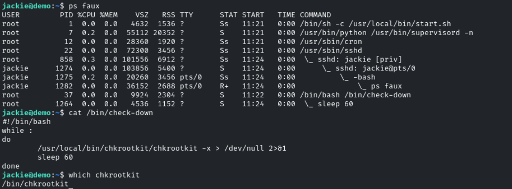
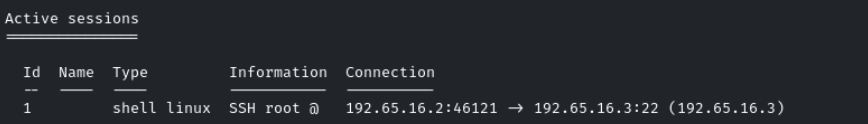
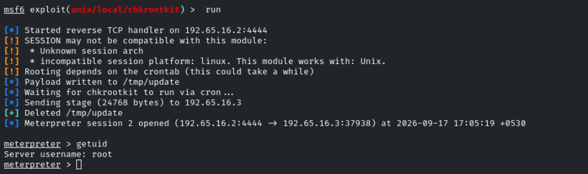
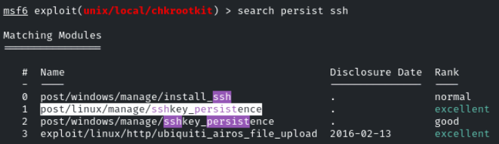
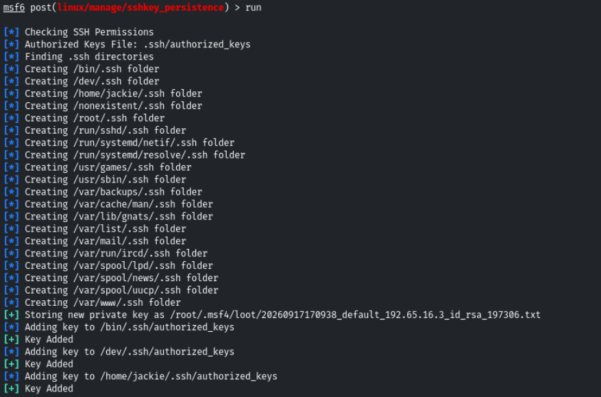
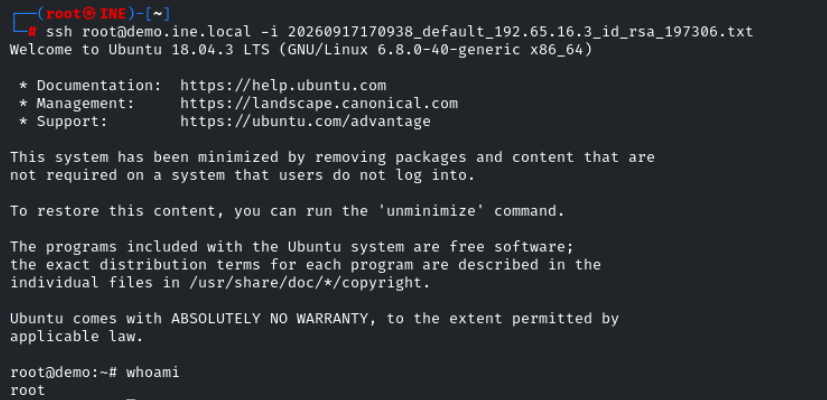

# Establishing Persistence on Linux

**Objective:** Escalate to the root user on the target machine and retrieve the flag!
| Username | Password | | jackie | password |

Comprobamos que hay un proceso corriendo el binario /bin/chrootkit



jackie

Creamos una sesión con *scanner/ssh/ssh_login*



Usamos exploit de chkrootkit para escalar privilegios



- Ahora tendremos que crear la persistencia de la que habla el ejercicio

Usaremos el módulo *post/linux/manage/sshkey_persistence*



Importante poner **CREATESSHFOLDER** a true
```bash
set CREATESSHFOLDER true
```



Ahora se habrá añadido la pubkey de nuestro usuario en kali al *authorized_keys* de root en la máquina víctima

Nos copiamos la private key de root
```bash
cp /root/.msf4/loot/20260917170938_default_192.65.16.3_id_rsa_197306.txt .
chmod 600 /root/.msf4/loot/20260917170938_default_192.65.16.3_id_rsa_197306.txt
```

Accedemos como root de manera persistente
```bash
ssh root@demo.ine.local -i /root/.msf4/loot/20260917170938_default_192.65.16.3_id_rsa_197306.txt
```



root
