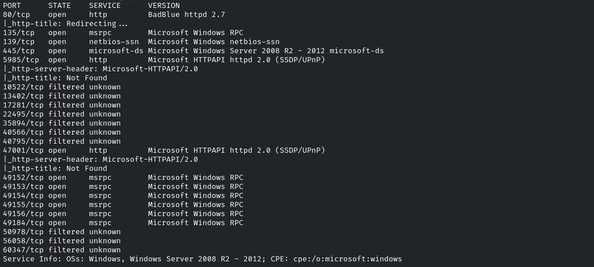
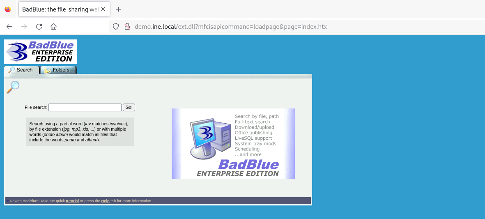
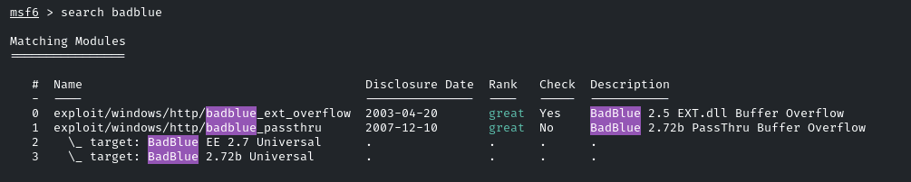
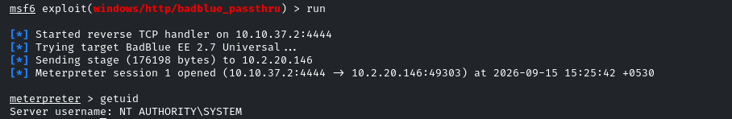
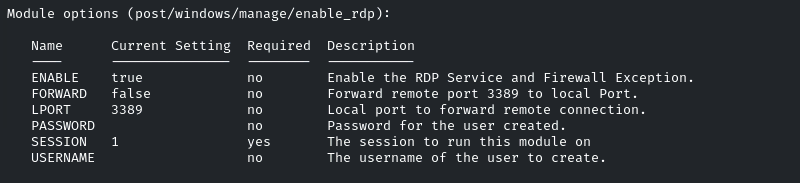
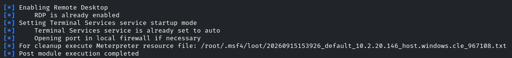
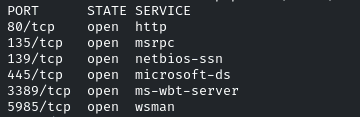
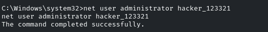
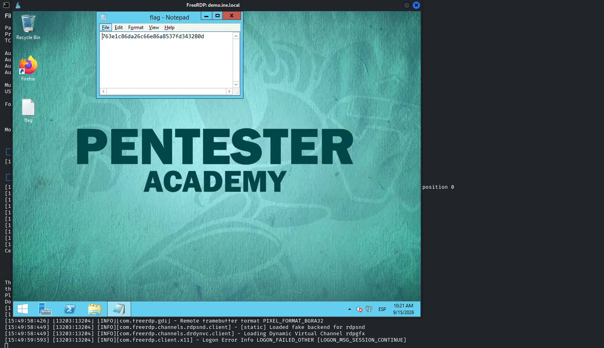

# Enabling Remote Desktop

**Objective:** Your task is to find and exploit the vulnerable application and get the RDP session to find the flag!



Encontramos un servicio BadBlue en el puerto 80



Buscamos exploits



Usamos *exploit/windows/http/badblue_passsthru*



NT AUTHORITY\SYSTEM

- Lo que nos pide ahora el lab es activar el RDP en el sistema para conectarnos con la tool xfreerdp

Usaremos el módulo de explotación *post/windows/manage/enable_rdp*



Lo runeamos y en teoría debería abrir el puerto 3389 para conectarnos por RDP



Lanzamos de nuevo el nmap para comprobar que el exploit haya abierto el servicio



Vemos que lo ha abierto

Nos conectamos con *xfreerdp*, para esto necesitaremos credenciales de un usuario, como no conocemos las del usuario Administrator, cambiaremos su contraseña
```powershell
net user administrator hacker_123321
```



La contraseña tiene que cumplir con los requerimientos de la política de contraseñas

Accederemos ahora al rdp con la tool
```bash
xfreerdp  /u:administrator /p:hacker_123321 /v:demo.ine.local
```

En el Desktop del usuario Administrator encontramos la flag


