# File and Keylogging

**Objective:** Your task is to exploit the application using an appropriate Metasploit module and complete the below-mentioned objectives.

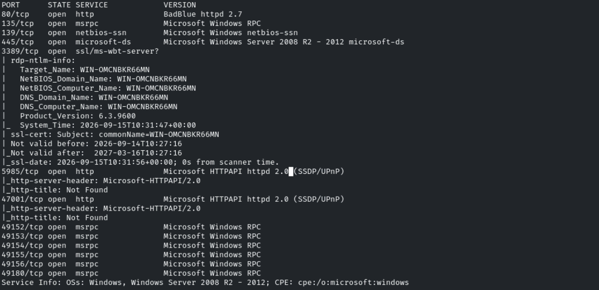

Vemos de nuevo BadBlue en el servicio http

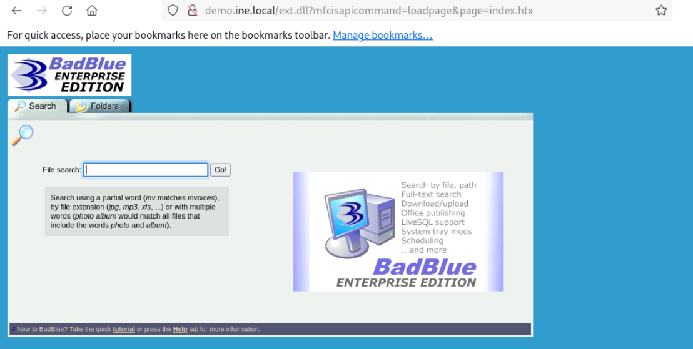

Usamos el exploit *exploit/windows/http/badblue_passsthru*

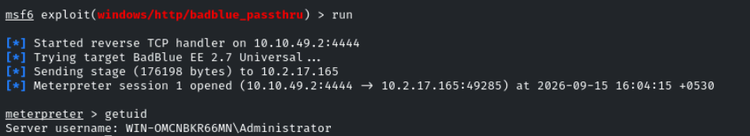

WIN-OMCNBKR66MN\Administrator

Encontramos la flag en la raiz *C:\*

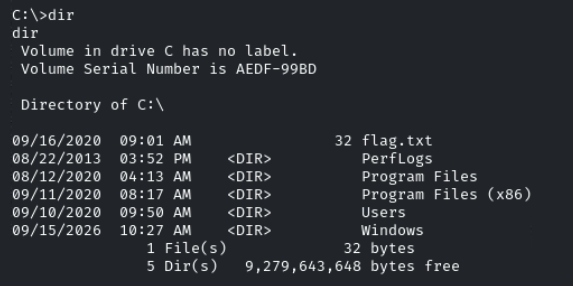

Creamos una archivo
```bash
echo "You have been "
```

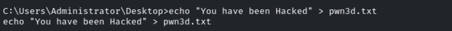

Abrimos el archivo con la herramienta notepad desde metasploit

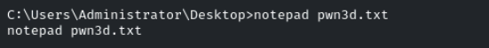

Comprobamos el resultado desde la máquina víctima

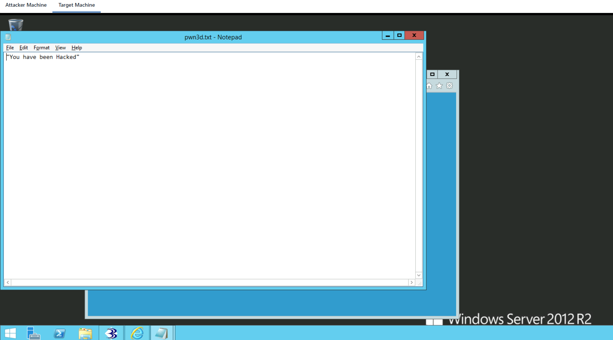

Se abre el notepad correctamente

Migramos el proceso actual a *explorer.exe* con PID 2272

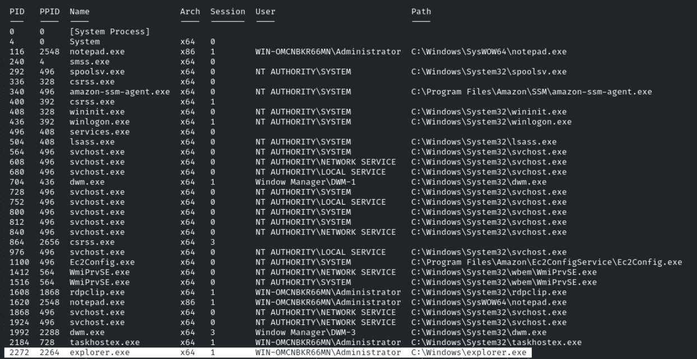

```powershell
migrate 2272
```

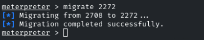

Lanzaremos el
```powershell
keyscan_start
```

que es un keylogger

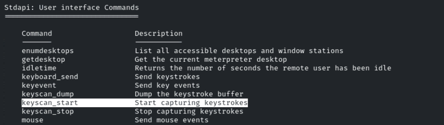

Escribimos en la máquina víctima y vemos el resultado con
```bash
keyscan_dump
```

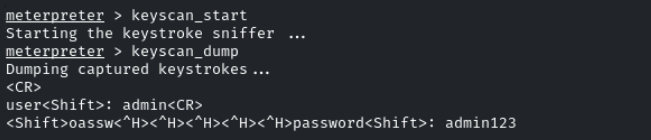

Vemos lo que habría escrito el usuario
