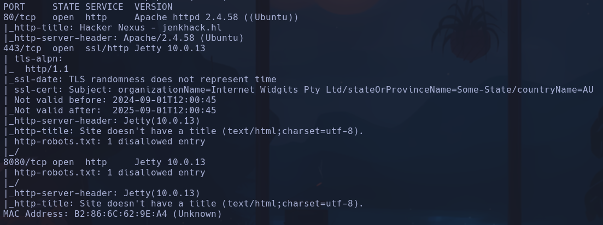
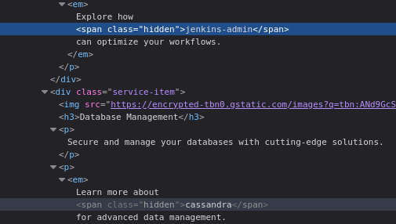
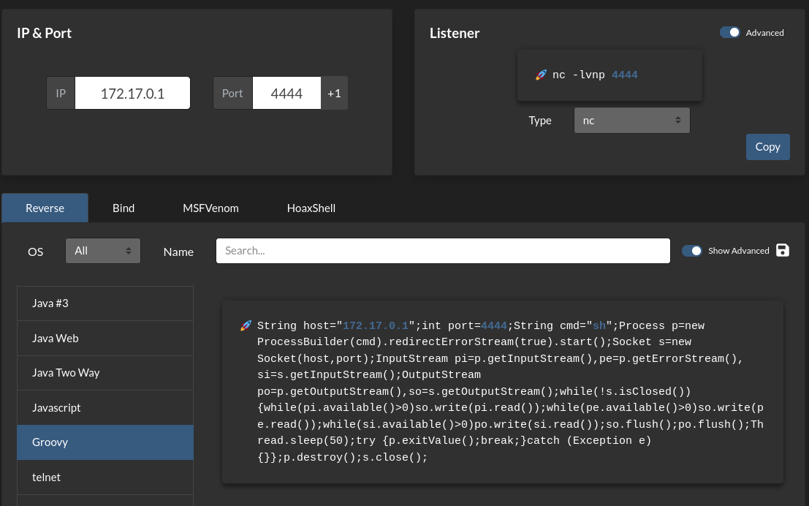
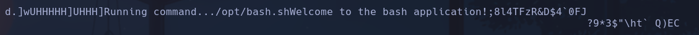
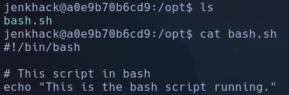
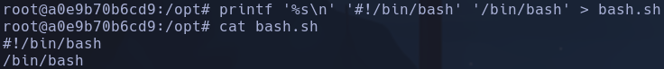

# JenkHack

Vemos que robots.txt no tiene ninguna info relevante.
Gobuster tampoco ofrece info
Metasploit no parece hacer nada con auxiliary de login

Nos conectamos al puerto *8080* http://172.17.0.2:8080, accedemos al portal de acceso de Jenkins
En el codigo de la web del puerto 80 vemos unas posibles credenciales en unas clases ocultas:

**jenkins-admin:cassandra**

Entramos al panel de administración. Buscamos como explotar Jenkins, encuentro ->
https://elhacker.info/manuales/Hacking%20y%20Seguridad%20informatica/jenkins.pdf
Tendremos que ir a Manage Jenkins -> Script Console -> inyectar un código en lenguaje *Groovy script* un código que permita darnos una revshell

**jenkins**

## Escalada

Vemos un archivo llamado secret.key
ef41dfd385c5e0ba1fbe6204a8e9e64e38d9e0a2f3f962ff48b65354449ad5e3

Dentro de /etc/passwd vemos que existe un usuario *jenkhack*
Busco en directorio /var/www/jenkhack y veo un archivo *note.txt*
*jenkhack:C1V9uBl8!'Ci*`uDfP*
Pasandolo por Cybercheff, me recomienda que lo decodifique de base85, el resultado es:
**jenkinselmejor**
**jenkhack**

*(ALL : ALL) NOPASSWD: /usr/local/bin/bash*

Resulta que es un script, no el proceso de shell
- Intentamos meterle un comando que ejecute una shell con permiso de sudoer pero no tenemos permiso
Vemos como el archivo ejecuta otro script en /opt/bash.sh

El script en /opt:

Lo modificamos -> no nos deja
Lo eliminamos y creamos otro nuevo dandole permisos de ejecución
`rm /opt/bash.sh`
`printf '%s\n' '#!/bin/bash' '/bin/bash' > bash.sh`

*(%s pilla como parámetro lo que le pases después en '')*
`chmod u+s /opt/bash.sh`
`sudo /usr/local/bin/bash`
**root**
