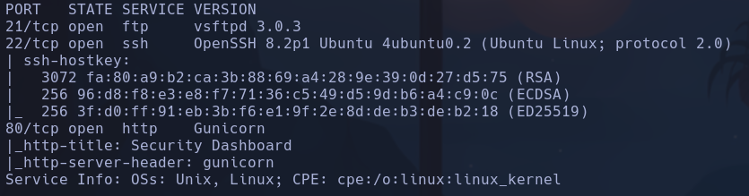
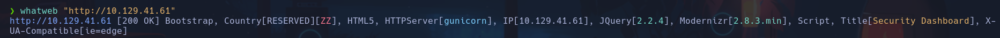
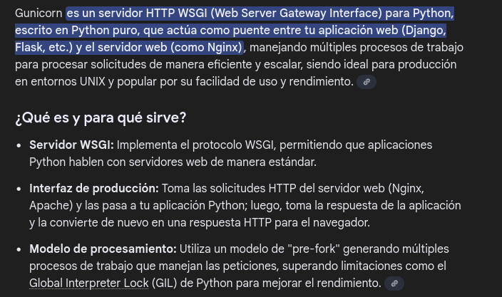
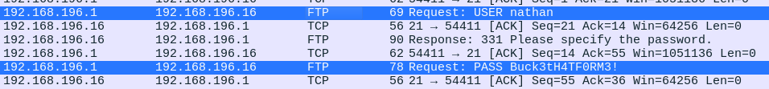
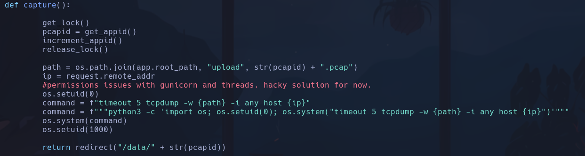
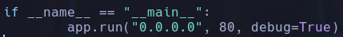
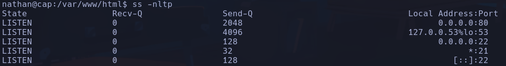
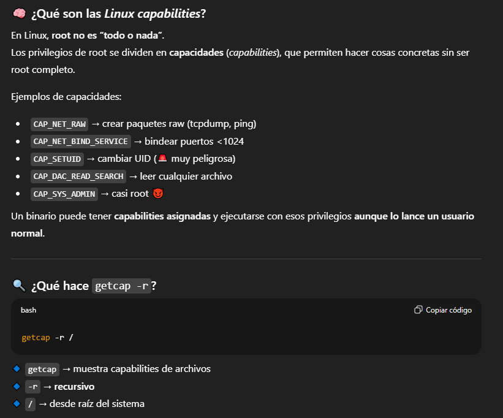
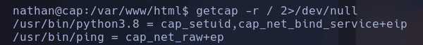

# Cap

```bash
nmap -p- --open -T5 -sCV --min-rate 5000 -n -Pn 10.129.41.61 -oN scan_nmap.txt
```



launchpad OpenSSH 8.2p1 -> Sid

```bash
ftp 10.129.41.61
```

> No se puede acceder de forma anónima

```bash
whatweb "http://10.129.41.61"
```



Se usa gunicorn -> es un servidor http escrito en python



Viendo la dirección **10.129.41.61/data/1**
Probamos un IDOR, y cambiando por **10.129.41.61/data/0** y podemos ver y descargar el dashboard de paquetes que han tramitado para los números tanto **0**, como **3** y **5**.

Buscando en el archivo *wireshark* ***0.pcap***, encontramos credenciales que se han tramitado mediante ftp



nathan:Buck3tH4TF0RM3!

Intentamos entrar por ssh y accedemos
**nathan**

## Escalada

En /var/www/html/app.py vemos que hay un script que literalmente dice que eleva los privilegios que tiene gunicorn porque no saben cómo ejecutar una serie de comandos. Aprovecharemos para incrustar nuestro código de escalada



Hemos introducido una SUID para la bash, intentaremos ejecutar el programa
Nos da error asique miraremos qué hay corriendo en el puerto 80





Nada

Buscamos capabilities ->



```bash
getcap -r / 2>/dev/null
```

Encontramos una capabilitie llamada **cap_setuid** asociada al binario *python3.8* lo cual nos permite cambiarnos el setuid a 0, que es el de root, y ejecutar el comando que queramos usando ese binario



```python
python3.8 -c "import os; os.setuid(0); os.system('/bin/bash')"
```

**root**
