# Delivery

```bash
nmap -p- --open -T5 -sCV --min-rate 5000 -n -Pn 10.129.57.131 -oN scan_nmap.txt
```

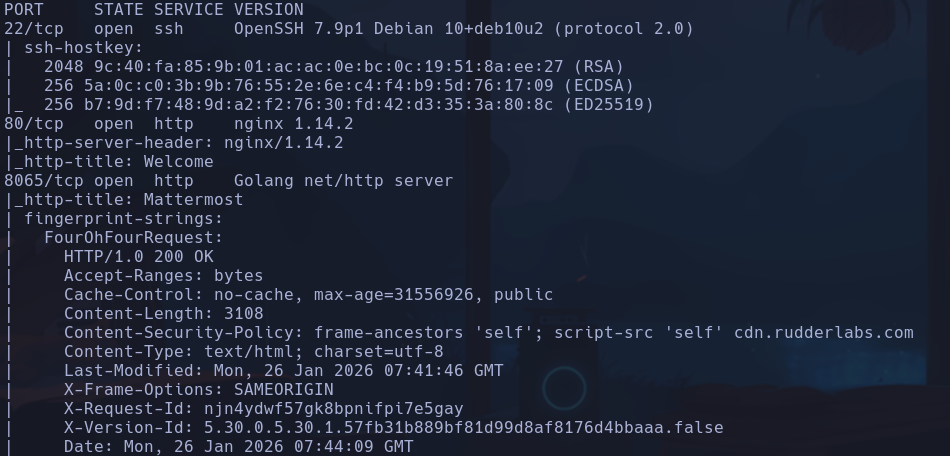

- Mucho texto -> Reducimos
```bash
nmap -p- --open -T5 --min-rate 5000 -n -Pn 10.129.57.131 -oN scan_nmap.txt
```

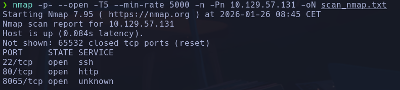

Launchpad -> Sid
- ¿Qué es Golang net/http server?

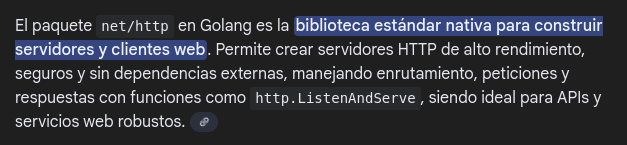

```bash
whatweb "http://10.129.57.131:8065"
```

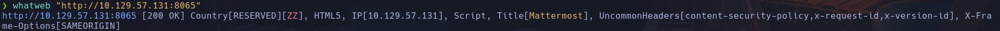

```bash
whatweb "http://10.129.57.131"
```

-> nginx

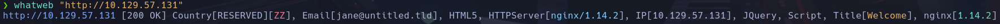

- Encontramos de primeras un dominio *delivery.htb* (redirige al puerto 8065) y un subdominio *helpdeks.delivery.htb*

- En helpdesk.delivery.htb, parece haber un sistema de apertura y traza de tickets con un sistema llamado **osTicket**

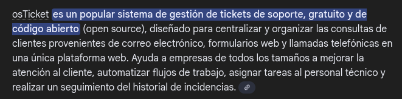

- En delivery.htb encontramos un sistema de login con **Mattermost**

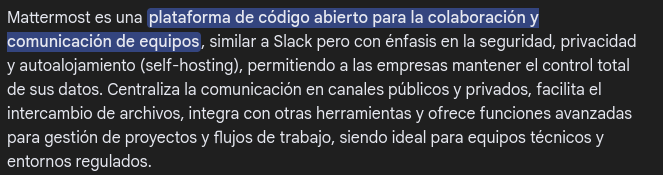

- Con gobuster escaneamos ambos puertos
🟧 (osTicket) Para delivery.htb no encontramos nada interesante
🟦 (Mattermost) Para helpdesk.delivery.htb escaneamos muchas direcciones, algunas interesantes
- avatar.htb

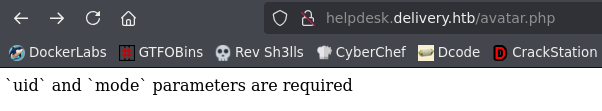

Si le pasamos como ejemplo uid=0 y mode=0
http://helpdesk.delivery.htb/avatar.php?uid=0&mode=0
- nos devuelve una imagen -> /images/mystery-oscar.png


Parece que aunque cambiemos los números sigue devolviendo el mismo avatar
- manage.php

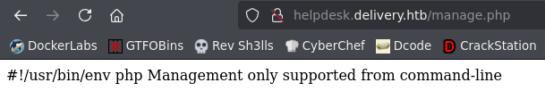

No veo una vía potencial de acceso buscando en internet por este mensaje
- scp -> nos lleva a un login de *osTicket*

🟧 Encontramos posibles versiones vulnerables de osTicket < 1.14.8 or 1.15.x < 1.15.4 a XSS
Intentaremos enumerar la versión
- Probaremos un repo de github https://github.com/Legoclones/pentesting-osTicket.git
Le damos permisos de ejecución
```bash
python3 ostVersionScanner.py http://helpdesk.delivery.htb
```

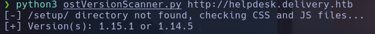

1.15.1 // 1.14.5
Hay una tabla en la que aparecen las posibles vulnerabilidades

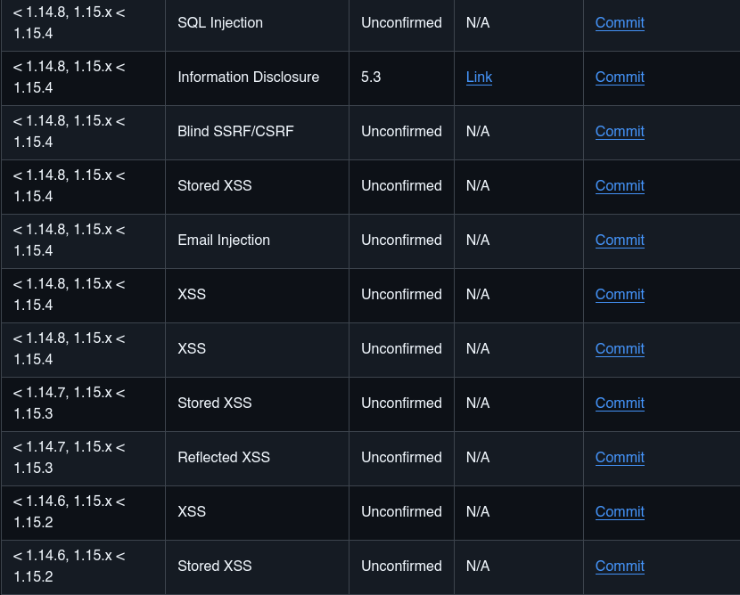

- Intentaremos explotar alguna de ella, para eso necesitaremos que algún administrador abra o ejecute nuestro XSS payload

Existe un apartado de crear ticket en el que podremos subir un archivo,  nos devolverán un ticket ID y podremos consultar más tarde la respuesta. Comprobaremos si alguien nos contesta

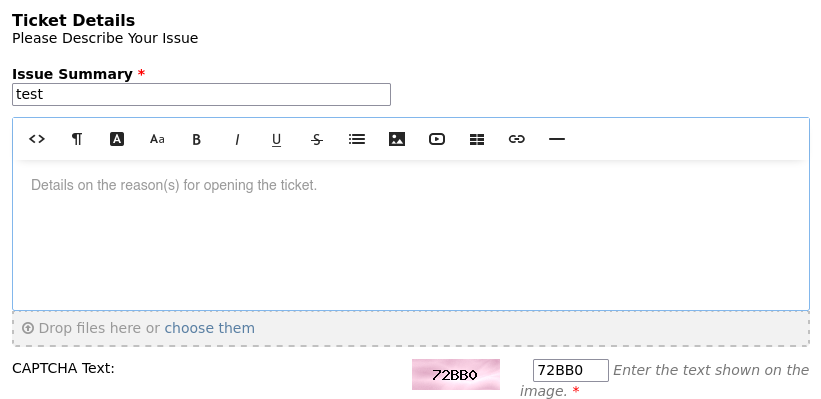

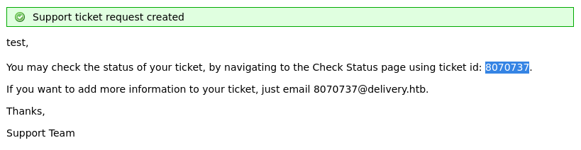

8070737

- Vamos al apartado de Ckeck Ticket Status y al introducir el id veremos si algún admin ha atendido nuestra petición, en ese caso podremos subir un archivo malicioso en el cuerpo del ticket y a ver si alguien lo abre.

Enviaremos un archivo .md con un ping hacia nuestra máquina para comprobar si alguien abre el doc -> NO conseguimos que nadie pinche

- Vemos que cuando abrimos un ticket, nos sale una dirección de un mail temporal que se crea con el id del ticket id@delivery.htb
Con esto intentaremos registrarnos logearnos en Mattermost. *La cosa es que las máquinas no tienen conexión a internet, entonces cuando envían el código de verificación de mail, nunca llega.* Como el hilo que se abre cuando reportamos un ticket, parece una bandeja de entrada a la dirección de correo temporal id@delivery.htb, intentaremos que el mail de verificación llegue ahí por conexión local de los dos sistemas.

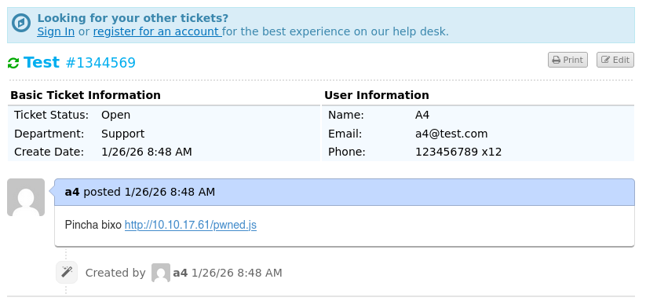

Este es el ticket que he creado para probar peticiones antes. nos quedaremos con el id de la petición y registraremos el correo en Mattermost -> 1344569
Luego el correo será

1344569@delivery.htb : Qarlg12345.

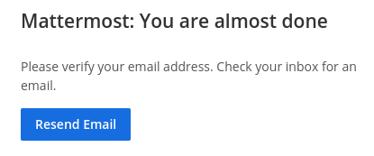

Si consultamos en *osTicket* la bandeja de entrada ahora podemos ver que el mensaje llega por algún tipo de comunicación interna que tienen o resolución de ip al mail temporal creado

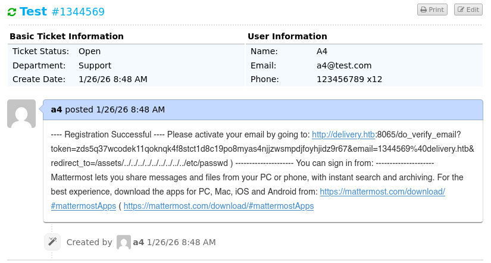

Parece que este es el enlace de verificacion de correo
http://delivery.htb:8065/do_verify_email?token=zds5q37wcodek11qoknqk4f8stct1d8c19po8myas4njjzwsmpdjfoyhjidz9r67&email=1344569%40delivery.htb&redirect_to=/assets/../../../../../../../../../etc/passwd
Entramos y
Jeje ->

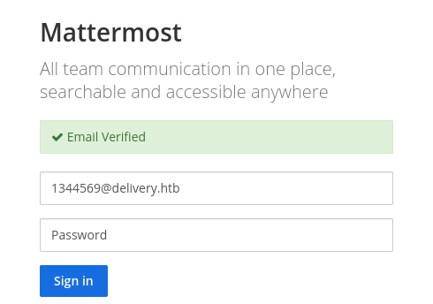

Estamos dentro:

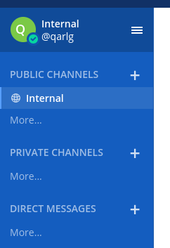

Vemos esta información de contraseñas para lo que aprece que es osticket

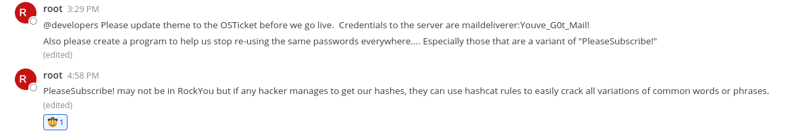

maildeliverer:Youve_G0t_Mail!

- Vamos al portal que encontramos en http://helpdesk.delivery.htb/scp
Estamos dentro

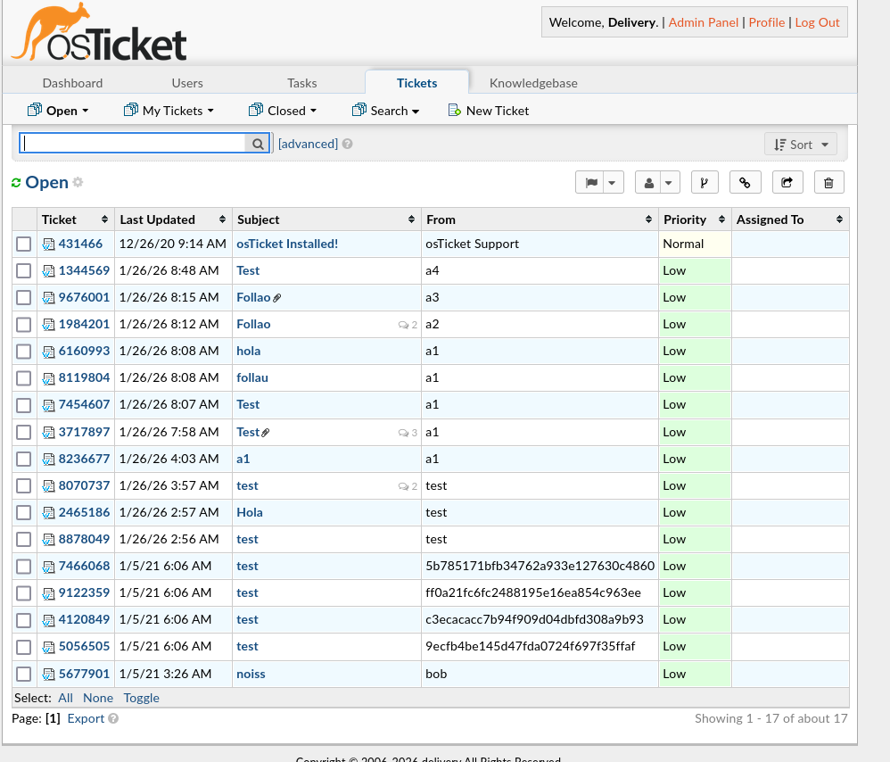

Vemos todos los correos que han llegado

- Me da por probar a conectarme por ssh con **maildeliverer:Youve_G0t_Mail!**
maildeliverer

## Escalada

- Cambiamos ip porque la máquina va lentísima al acceder
_Cambio IP -> 10.129.57.247_
Sigue yendo lento de narices xd

```bash
sudo -l
find / -perm -4000 2>/dev/null
getcap -r / 2>/dev/null
```

No encontramos nada

```bash
ss -nltp
```

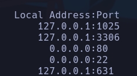

Encontramos varios puertos abiertos en local que no sabemos de qué son

- vemos un usuario mattermost -> buscando por los procesos que tiene
```bash
ps -eo user,command | grep mattermost
```

Encontramos un directorio donde opera este usuario y encontramos un archivo de configuración en */opt/mattermost/config/config.json* con lo que parecen credenciales de sql en uno de los puertos en local reportados anteriormente
*"mmuser:Crack_The_MM_Admin_PW@tcp(127.0.0.1:3306)/mattermost?charset=utf8mb4,utf8\u0026readTimeout=30s\u0026writeTimeout=30s"*

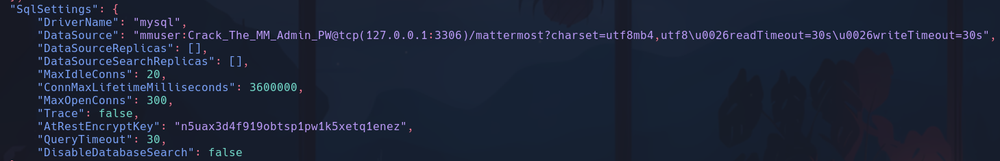

Vemos lo que parece una conexión a sql con credenciales mmuser:Crack_The_MM_Admin_PW

- el 1025 parece un servicio smtp

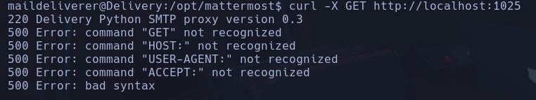

- En el 631 parece haber una web de CUPS 2.2.10
```bash
curl -X GET http://localhost:631
```

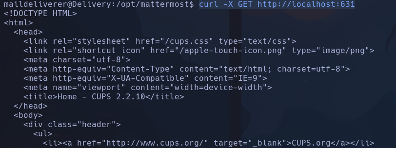

Podría haber entrado hace media hora, vaya tela con los parámetros de mysql
```bash
mysql -u mmuser -p
```

**Crack_The_MM_Admin_PW**
MariaDB

```sql
show databases;
use mattermost;
show tables;
```

```sql
describe Users;
```

->

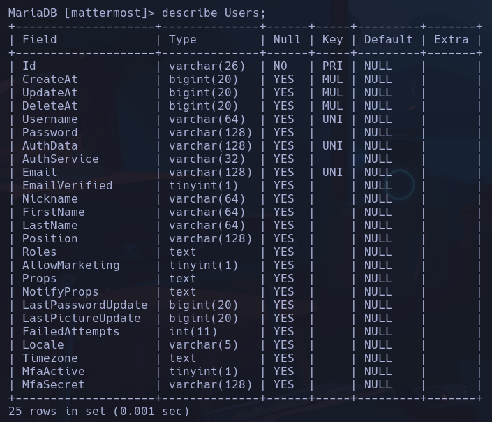

```sql
select Username,Password from Users;
```

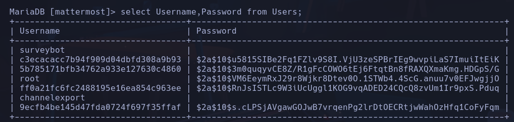

Vamos a intentar crackear la contraseña de root con alguna pista que nos han dado en *Mattermost*


Nos dice que hay muchas contraseñas variantes de **PleaseSubscribe!**

- Usaremos las reglas de *hashcat* para hacer variaciones de esa contraseña y ver si encontramos la pass
- Metemos el hash en un arhivo
- Comprobamos de qué tipo es con
```bash
hashid -m hash
```

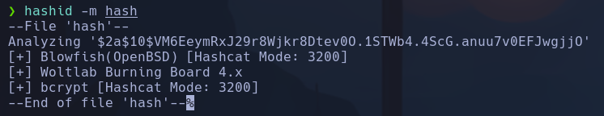

- bcrypt
- Usaremos las regla de hashcat para formar un diccionario de variantes de la pass **PleaseSubscribe!**
Están en el directorio
```bash
ls /usr/share/hashcat/rules
```

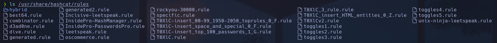

Usaremos *best64.rule* ya que hace un poco de todo, añade símbolos, números reversea la cadena, entre otras modificaciones
- Metemos la contraseña en un archivo *password*
```bash
hashcat --stdout -r /usr/share/hashcat/rules/best64.rule password
```

Copiamos las variantes y la metemos en el archivo *passwords*
- Usamos el archivo *passwords* como diccionario para crackear el hash de root
```bash
hashcat hash passwords -m 3200
```

**PleaseSubscribe!21**

```bash
su root
```

root
